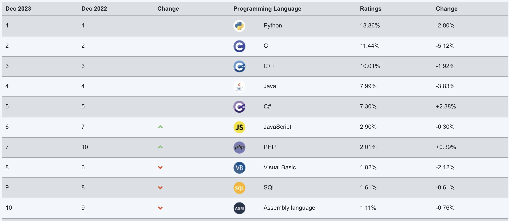
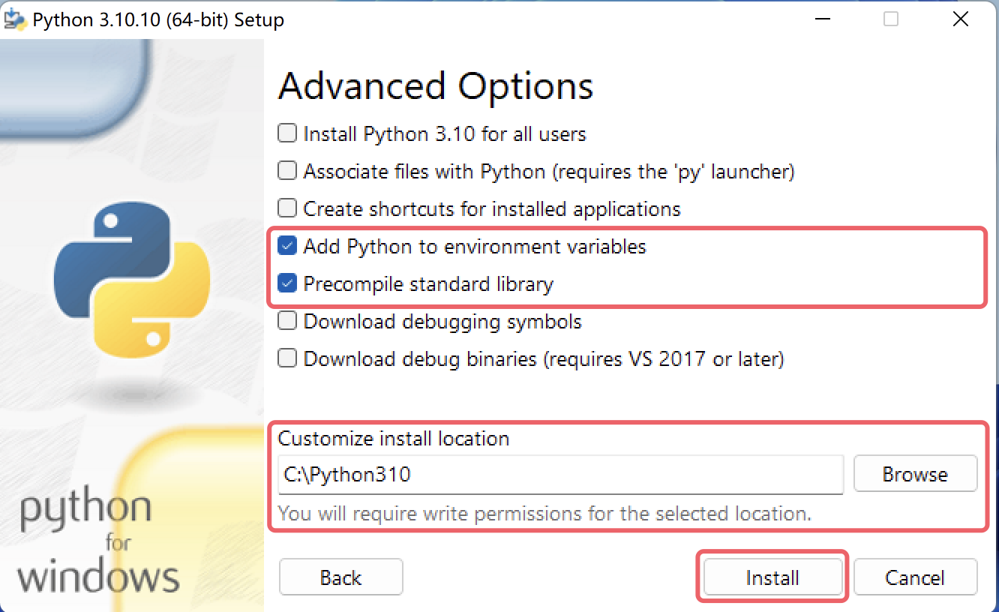
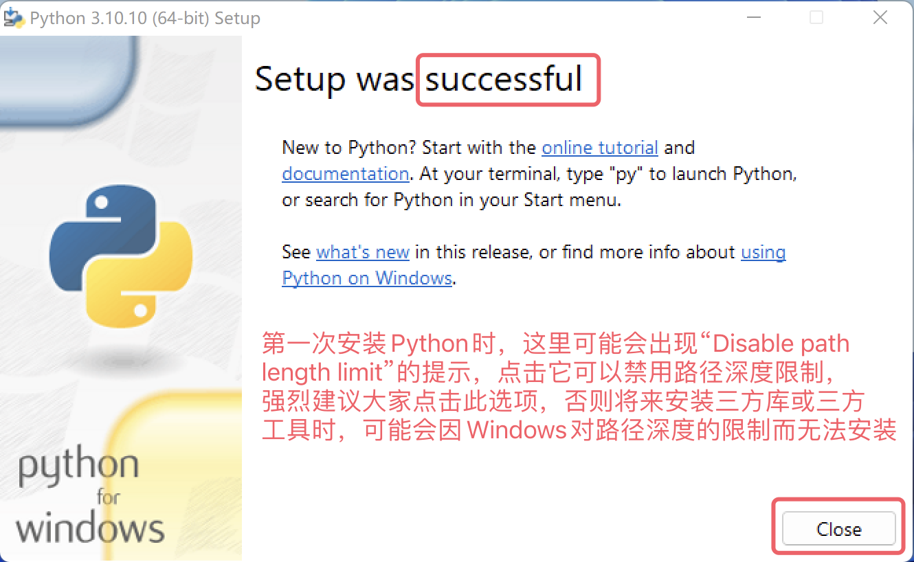
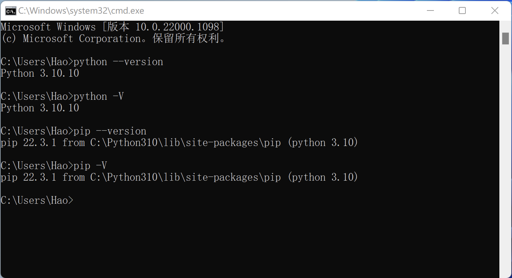

## Getting to Know Python

### An Introduction to Python

Python (UK pronunciation: `/ˈpaɪθən/`; US pronunciation: `/ˈpaɪθɑːn/`) is a programming language invented by Guido van Rossum in the Netherlands. It is currently one of the most popular programming languages in the world and has one of the largest user bases. Python emphasizes readability and concise syntax. Compared with influential languages such as C, C++, and Java, Python allows developers to express their intent with less code. The following images show Python's ranking in several well-known programming language indexes. The first chart comes from the TIOBE Index and the third from IEEE Spectrum. The second chart is also noteworthy because it shows language popularity on GitHub, the world's largest code hosting platform, where Python has held the top position for the last four years.

#### A Brief History of Python

Here are several important milestones in Python's development:

1. December 1989: Guido van Rossum decided to develop a new scripting language and interpreter during the Christmas holiday. The new language would inherit ideas from ABC and would mainly be used to replace Unix shell scripts and C for system management tasks. Because Guido was a fan of the BBC series *Monty Python's Flying Circus*, he chose the name Python.
2. February 1991: Guido published the initial Python interpreter code on the `alt.sources` newsgroup as version `0.9.0`.
3. January 1994: Python `1.0` was released.
4. October 2000: Python `2.0` was released, making the development process more transparent and helping the ecosystem gradually take shape.
5. December 2008: Python `3.0` was released. It introduced many modern language features, but it was not fully backward compatible.
6. April 2011: `pip` was released for the first time, giving Python its own package manager.
7. July 2018: Guido van Rossum announced that he was taking a "permanent vacation" from the role often described as the "BDFL" (Benevolent Dictator For Life), the person with final decision-making authority in the open-source community when disputes arise.
8. January 2020: After Python 2 and Python 3 coexisted for 11 years, official support and maintenance for Python 2 ended. Users were strongly encouraged to move to Python 3.
9. Today: Python is widely used in large language models, computer vision, recommendation systems, autonomous driving, speech recognition, data science, quantitative trading, automated testing, and automated operations. Its ecosystem is exceptionally rich and active.

> **Note**: Software version numbers usually have three parts in the form `A.B.C`. `A` is the major version and changes when the software is substantially rewritten or becomes backward incompatible. `B` is the feature version and increases when new features are added. `C` is the patch version and increases for small changes such as bug fixes.

#### Python's Advantages and Disadvantages

Python has many strengths. Here are several important ones:

1. It is **simple and elegant**, making it **easy to get started** with.
2. It lets you do more with less code, which **improves development efficiency**.
3. It is open source and backed by a **strong community and ecosystem**.
4. It is **extremely versatile** and can be adapted to many kinds of work.
5. It works well as a **glue language**, connecting software written in other languages.
6. As an interpreted language, it is easier to run **across multiple platforms**.

Python's biggest weakness is usually **runtime performance**, which is a common issue for interpreted languages. If raw execution speed matters most, C, C++, or Go may be a better fit.

### Installing Python

To start learning Python, you first need to install the Python environment on your computer, which basically means installing the Python interpreter required to run Python programs. We recommend the official Python 3 interpreter, which is written in C and is usually referred to as CPython. It is probably the best choice for most learners. First, go to the official [downloads page](https://www.python.org/downloads/) and choose an appropriate Python 3 installer for your operating system, as shown below.

After entering the download page, you may notice that some Python releases do not provide Windows or macOS installers and only offer source archives. If you are comfortable with Linux, you can build from source. For Windows and macOS users, however, we **strongly recommend** using the official installers. For example, if you want Python 3.10, releases such as `3.10.10` or `3.10.11` provide installers for Windows and macOS, while some other releases may offer source code only.

#### Windows

Using Windows 11 as an example, here is how to install Python on Windows. Double-click the installer you downloaded from the official site to launch the setup wizard.

First, make sure to check the option labeled `Add python.exe to PATH`. It adds the Python interpreter to the Windows `PATH` environment variable. Also check `Use admin privileges when installing py.exe`, which allows the installer to use administrator permissions when needed. Then choose `Customize Installation` instead of `Install Now`. The custom installation path gives you more control and is the better option.

Next, the wizard will ask you to choose the `Optional Features`. You can simply select them all. One especially important item is `pip`, Python's package manager, which is used to install third-party libraries and tools. After selecting the options, click `Next`.

Then you will see the `Advanced Options`. We recommend checking `Add Python to environment variables` and `Precompile standard library`. The first helps configure environment variables automatically, while the second precompiles the standard library into `.pyc` files so Python does not need to compile them on demand later. We also **strongly recommend** changing `Customize install location` to your own installation path. The path should not contain Chinese characters, spaces, or other special characters. That small decision can save you many unnecessary problems in the future. After that, click `Install`.

If the installation succeeds, you will see a screen containing the word `successful`. If it fails, it will say `failed`.

After installation, open Command Prompt or PowerShell and run `python --version` or `python -V` to verify that Python was installed correctly. These commands display the interpreter version. We also recommend checking whether `pip` is available by running `pip --version` or `pip -V`.

> **Note**: If installation fails, your Windows system may be missing some DLL files or required build tools. In that case, you can download the `Visual Studio 2022 Build Tools` from the [Microsoft website](https://visualstudio.microsoft.com/zh-hans/downloads/) and use them to fix the issue, as shown below.
>
> 
>
> The `Visual Studio 2022 Build Tools` require an internet connection to run. After launching them, choose the options shown below to repair the environment. The repair process downloads the required packages and may take some time. You might also be asked to restart your system afterward.
>
> 

#### macOS

Installing Python on macOS is simpler than on Windows. The installer downloaded from the official site is a `.pkg` file. Double-click it and keep clicking `Continue` until the installation finishes. In most cases, you do not need to change any settings.

After installation, open the Terminal app on macOS and run `python3 --version` to verify the installation. Note that the command is `python3`, not `python`. Then run `pip3 --version` to check the package manager.

#### Other Installation Options

Some people recommend that beginners install [Anaconda](https://www.anaconda.com/download/success) directly, because it installs the Python interpreter together with a set of commonly used third-party libraries and some convenient tools. I do not personally recommend it. Installing Anaconda often brings in many packages you may not need, consumes a large amount of disk space, and modifies your terminal or command prompt behavior by automatically activating environments. That does not align well with the principle of least surprise. If you really want to use that toolchain, Miniconda is a better option and is available on the same download page.

Some beginners also ask: "If I want to write Python programs, can't I just install PyCharm?" Not exactly. PyCharm is a tool for writing Python code, but it is not what executes your programs. Running Python code depends on the interpreter you installed earlier. Some versions of PyCharm can detect that Python is missing and prompt you to download it automatically when you create a project, but PyCharm itself is not the interpreter. We will cover PyCharm installation and usage in the next lesson.

### Summary

Let's recap:

1. Python is a powerful language that can be used for many kinds of work, so it is worth learning.
2. Before writing Python code, you need to install the Python environment, which mainly means installing the interpreter.
3. On Windows, you can use `python --version` in Command Prompt or PowerShell to verify the installation. On macOS, use `python3 --version` in Terminal.
