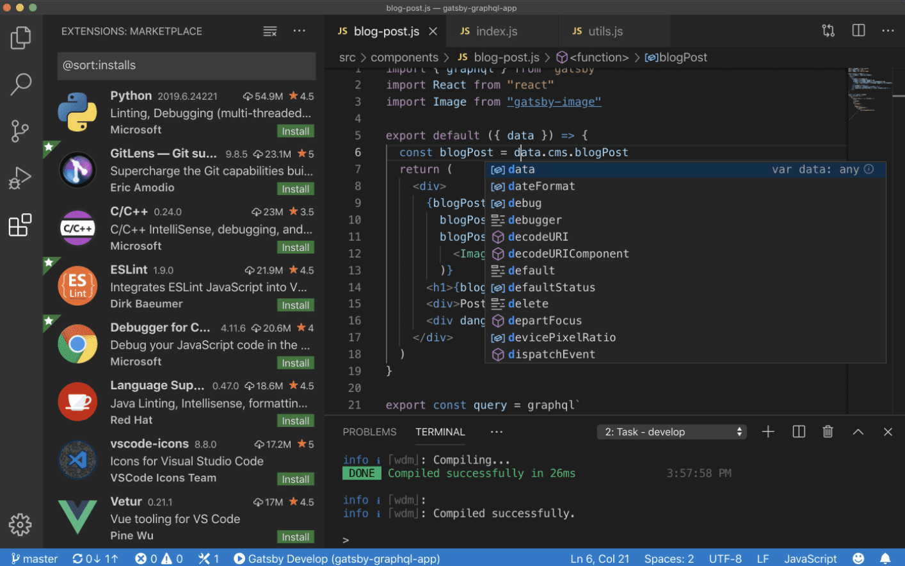
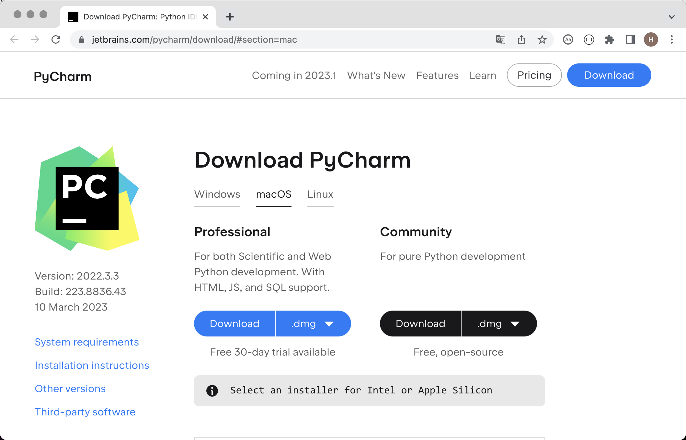

## Your First Python Program

In the previous lesson, we learned a little about the past and present of Python, and we prepared the interpreter environment needed to run Python programs. I am sure everyone is already eager to begin the Python programming journey, but a new question appears: where should we write Python programs, and then how do we run them?

### Tools for Writing Code

Below we will explain several tools that can be used to write and run Python code. You can choose the right tool according to your own needs. Of course, for beginners, I personally recommend PyCharm, because it does not need too much configuration and it is also very powerful, so it is quite friendly to newcomers. If you have also heard of or already like PyCharm, you can directly skip the introduction to the other tools below and fast-forward to the place that explains PyCharm.

#### The Default Interactive Environment

Open Windows Command Prompt or PowerShell, type `python`, and then press `Enter`. This command takes us into an interactive environment. A so-called interactive environment is one in which we enter a line of code and press `Enter`, and the code is executed immediately. If the code produces a result, the result is displayed in the window, as shown below.

```Bash
Python 3.10.10
Type "help", "copyright", "credits" or "license" for more information.
>>> 2 * 3
6
>>> 2 + 3
5
>>>
```

> **Note**: On macOS, open the Terminal app and use `python3` to enter the interactive environment.

If you want to leave the interactive environment, you can enter `quit()`, as shown below.

```Bash
>>> quit()
```

#### A Better Interactive Environment: IPython

The user experience of the interactive environment mentioned above is not very good, and you can feel that after using it for a moment. We can use IPython to replace it, because IPython provides much more powerful editing and interaction functions. We can use Python's package-management tool `pip` in Command Prompt or Terminal to install IPython, as shown below.

```bash
pip install ipython
```

> **Tip**: Before using the command above to install IPython, the original lesson suggested first switching the package index to a domestic mirror with `pip config set global.index-url https://pypi.doubanio.com/simple` or `pip config set global.index-url https://pypi.tuna.tsinghua.edu.cn/simple/`, otherwise the download and installation process might be very slow.

Next, you can use the command below to start IPython and enter the interactive environment.

```bash
ipython
```

> **Note**: There is also a web version of IPython called Jupyter. We will introduce it when we need it.

#### A Great Code Editor: Visual Studio Code

Visual Studio Code is a powerful code editor developed by Microsoft that can run on operating systems such as Windows, Linux, and macOS. It supports syntax highlighting, auto-completion, multi-cursor editing, running, debugging, and a series of convenient functions, and it can support many programming languages. If you want to choose an advanced text editing tool, Visual Studio Code is strongly recommended. Readers who are interested can study its [download](https://code.visualstudio.com/), installation, and usage by themselves.



#### An Integrated Development Environment: PyCharm

If you use Python to develop commercial projects, we recommend that you use the more professional tool PyCharm. PyCharm is an integrated development environment (IDE) for Python provided by a Czech company named [JetBrains](https://www.jetbrains.com/). A so-called integrated development environment usually means a development tool that provides a series of powerful functions and convenient operations such as writing code, running code, debugging code, analyzing code, and version control, so it is especially suitable for commercial project development. We can find the [download link](https://www.jetbrains.com/pycharm/download) for PyCharm on the official website of JetBrains, as shown below.



There are two official editions of PyCharm. One is the free `Community Edition`, which is relatively less powerful, but it is completely sufficient for beginners. The other is the paid `Professional Edition`, which is very powerful, but it requires payment by year or by month. New users can try it free for 30 days. Installing PyCharm is not difficult at all. Run the downloaded installer, and you can use the default settings for almost everything. For readers using Windows, one step can be configured as shown below by checking `Create Desktop Shortcut` and `Add "Open Folder as Project"` to the right-click menu.


When you run PyCharm for the first time, directly choose `Do not import settings` on the screen that asks whether you want to import PyCharm settings, and then you will see the welcome screen shown below. Here, we can first click `Customize` to make a few personalized settings for PyCharm.


Next, in the `Projects` section, you can click `New Project` to create a new project. Here, you can also open an existing project or get a project from a version control server (VCS), as shown below.


When creating a project, you need to specify the project path and create a virtual environment. We recommend that every Python project run in its own exclusive virtual environment. If your system still does not have a Python environment, PyCharm will provide a link to the official website, and when you click `Create` to create the project, it will download the Python interpreter over the internet, as shown below.


Of course, we do not recommend doing that, because we already installed the Python environment in the previous lesson. When the system already has a Python environment, PyCharm will usually find the location of the Python interpreter automatically and create a virtual environment on that basis, so the screen you see should look like the one below.


> **Note**: The screenshots above come from Windows. On macOS, the project path and interpreter path will look different.

After the project is created, the screen shown below will appear. We can right-click the project folder, choose `New`, and then select `Python File` to create a Python file. When naming the file, it is recommended to use a combination of English letters and underscores. The created Python file will open automatically and enter an editable state.


Next, we can write our Python code in the code window. After writing the code, we can right-click in the window and choose the `Run` menu item to run the code. The `Run` window below will display the execution result, as shown below.


At this point, our first Python program is already running. Very cool, right? By the way, PyCharm has a pop-up called `Tip of the Day` that teaches you a few small PyCharm tricks, as shown below. If you do not need it, just close it directly. If you do not want it to appear again, check `Don't show tips on startup` before closing it.


### Hello, World

According to industry convention, the first program we write when learning any programming language prints `hello, world`, because this line of code was the first code written by the great Dennis Ritchie (the father of C, who developed the Unix operating system together with Ken Thompson) and Brian Kernighan (the inventor of awk) in their immortal work *The C Programming Language*. Below is the corresponding Python version.

```python
print('hello, world')
```

> **Note**: The parentheses and quotes in the code above must be entered with an English keyboard layout. If you accidentally use full-width Chinese punctuation, you may get errors such as `SyntaxError: invalid character '（' (U+FF08)` or `SyntaxError: invalid character '‘' (U+2018)`.

The code above has only one statement. In this statement, we use a function named `print`, which can help us output the specified content. The `'hello, world'` inside the parentheses of the `print` function is a string, and it represents a piece of text content. In Python, we can use single quotes or double quotes to represent a string. Unlike programming languages such as C, C++, or Java, statements in Python code do not need semicolons to mark the end. In other words, if we want to write one more statement, we only need to press Enter and move to the next line, as shown below. In addition, Python code does not need to run by writing an entry function named `main`. Providing an entry function is something that must be done when writing executable C, C++, or Java code, and many programmers are already familiar with that, but in Python it is not necessary.

```python
print('hello, world')
print('goodbye, world')
```

Even without an IDE like PyCharm, you can run a Python program directly with the interpreter. Save the code above to a file named `example01.py`. On Windows, assuming the file is in `C:\code`, open Command Prompt or PowerShell and run:

```powershell
python C:\code\example01.py
```

On macOS, assuming the file is in `/Users/Hao`, run:

```Bash
python3 /Users/Hao/example01.py
```

> **Tip**: If the file path is long, you can drag the file into Command Prompt or Terminal and the full path will be inserted automatically.

You can try modifying the code above, for example by replacing `hello, world` inside the single quotes with something else or by writing several more statements like it, and then see what result it produces. One reminder: when writing Python code, it is best to put only one statement on each line. Although we can use `;` as a separator to put multiple statements on one line, doing so makes the code look very ugly and no longer gives it good readability.

### Comments in Code

Comments are an important part of programming languages. They are used to explain what code does inside the code itself, thereby improving code readability. Of course, we can also disable code that we do not want to run for the moment by adding comments to it. Then, when you need to use that code again, you can simply remove the comment markers. Put simply, **comments make code easier to understand, but they do not affect the execution result of the code**.

Python supports two common forms of comments:

1. Single-line comments: begin with `#` and a space, and can comment out the entire remainder of the line starting from `#`.
2. Multi-line comments: begin with triple quotes (usually double quotes) and end with triple quotes, and are usually used to add explanatory content spanning multiple lines.

```python
"""
Your first Python program - hello, world

Version: 1.0
Author: Luo Hao
"""
# print('hello, world')
print("Hello, world!")
```

### Summary

At this point, we have already run the first Python program. Does it feel very satisfying? As long as you keep studying, after a while we will be able to use Python to do more and cooler things. In today's world, programming is just like English. For many people, it is a skill that must be mastered.
