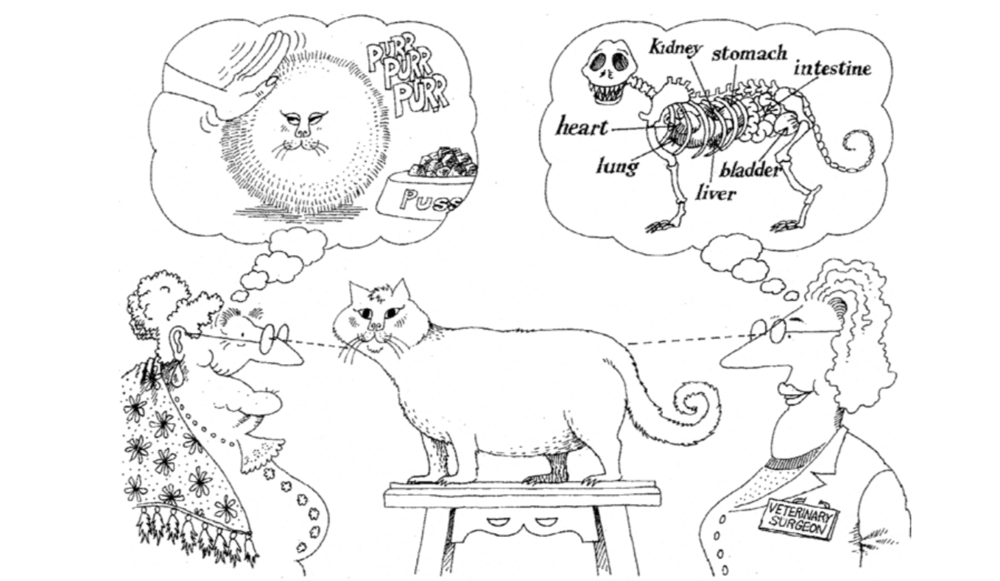

## Introduction to Object-Oriented Programming

Object-oriented programming is a very popular **programming paradigm**, that is, a methodology for program design. Simply speaking, it is how programmers understand programs and write code.

Earlier, we said that **a program is a collection of instructions**. When a program runs, its statements are turned into instructions executed by the CPU. To simplify program design, we introduced functions, which let us **package relatively independent and frequently reused code**. If a function becomes too large, we can split it into smaller functions to reduce complexity.

If you think about it, programming is really the person who writes the program controlling the machine through code according to the way the computer works. However, the way computers work is different from the normal way human beings think. This is not to say that we cannot write code according to the way computers work, but when we need to develop a complex system, this way will make the code too complex, and that in turn makes development and maintenance very difficult.

As software complexity increases, writing correct and reliable code becomes an extremely difficult task. This is also one reason many people firmly believe that "software development is the most complex of all human activities for transforming the world." So, how to use programs to describe complex systems and solve complex problems has become something every programmer must think about and face directly. The Smalltalk language, born in the 1970s, let software developers see hope, because it introduced a new programming paradigm called object-oriented programming. In the world of object-oriented programming, **the data in a program and the functions that operate on the data are one logical whole**, and we call that an **object**. **Objects can receive messages**, and the way to solve problems is to **create objects and send all kinds of messages to them**. Through message passing, multiple objects in a program can work together, and then build complex systems and solve real problems.

> **Note**: Many advanced programming languages we use today support object-oriented programming, but object-oriented programming is not the "silver bullet" for solving all problems in software development. In fact, there is still no so-called silver bullet in software development. If you are interested in this point, you can read Frederick Brooks's paper *No Silver Bullet* or the classic software engineering book *The Mythical Man-Month*.

### Classes and Objects

One concise description of object-oriented programming is this:

> **Object-oriented programming**: organize data and the methods that operate on it into **objects**, group objects with similar behavior into **classes**, hide internal implementation through **encapsulation**, specialize and generalize through **inheritance**, and achieve dynamic dispatch based on object type through **polymorphism**.

The key words here are:

- **object**
- **class**
- **encapsulation**
- **inheritance**
- **polymorphism**

In object-oriented programming, **a class is an abstract concept**, while **an object is a concrete concept**. We extract the common features of one kind of object, and that becomes a class. In short, **a class is the blueprint and template of an object, and an object is an instance of a class, a concrete entity that can receive messages**.

In the OOP world:

- everything is an object
- every object has attributes and behavior
- every object is unique
- every object belongs to some class

Attributes are the static properties of an object, and behavior is the dynamic part.


### Defining a Class

In Python, we define a class with the `class` keyword. Inside the class body, we write functions that represent common behaviors of objects of that class. Functions defined inside a class are usually called **methods**. The first parameter of an instance method is usually `self`, which represents the object receiving the message.

```python
class Student:

    def study(self, course_name):
        print(f'The student is studying {course_name}.')

    def play(self):
        print('The student is playing games.')
```

### Creating and Using Objects

After we define a class, we can use constructor syntax to create objects, as shown below.

```python
stu1 = Student()
stu2 = Student()
print(stu1)
print(stu2)
print(hex(id(stu1)), hex(id(stu2)))
```

Putting parentheses after the class name is constructor syntax. The code above creates two student objects, one assigned to `stu1` and one assigned to `stu2`. When we use `print` to output `stu1` and `stu2`, we can see the address of the object in memory. We can now tell everyone that the variables we define actually save the logical address of an object in memory. Through this logical address, we can find the object in memory. So an assignment like `stu3 = stu2` does not create a new object. It only uses a new variable to save the address of an existing object.

Now let us send messages to objects by calling methods.

```python
Student.study(stu1, 'Python Programming')
stu1.study('Python Programming')

Student.play(stu2)
stu2.play()
```

The second form, `object.method(...)`, is the usual style.

### The Initialization Method

So far, our student objects have behavior but no attributes. To define attributes, we can add a method named `__init__`. When an object is created, Python allocates memory for it and automatically calls `__init__` to initialize its attributes.

```python
class Student:
    """Student"""

    def __init__(self, name, age):
        """Initialization method"""
        self.name = name
        self.age = age

    def study(self, course_name):
        """Study"""
        print(f'{self.name} is studying {course_name}.')

    def play(self):
        """Play"""
        print(f'{self.name} is playing games.')
```

Now object creation looks like this:

```python
stu1 = Student('Luo Hao', 44)
stu2 = Student('Wang Dachui', 25)
stu1.study('Python Programming')
stu2.play()
```

### The Pillars of OOP

The three pillars of object-oriented programming are:

- **encapsulation**
- **inheritance**
- **polymorphism**

For now, let us focus on encapsulation. My own understanding of encapsulation is:

> **Hide every implementation detail that can be hidden, and expose only a simple calling interface to the outside world.**

The methods we define in a class are actually one kind of encapsulation. This kind of encapsulation lets us create an object and then only send a message to the object to execute the code in the method. In other words, we only need to know the name and parameters of the method, and do not need to know the internal implementation details of the method.

In many scenes, object-oriented programming is actually a three-step problem:

1. define classes
2. create objects
3. send messages to objects

Of course, sometimes we do not need the first step, because the class we want to use may already exist. As we said before, Python's built-in `list`, `set`, and `dict` are actually all classes. If we want to create list, set, or dictionary objects, then we do not need to define those classes ourselves. Of course, some classes are not directly provided by Python's standard library. They may come from third-party code. How to install and use third-party code will be discussed later. In some special scenes, we use what are called **built-in objects**. So-called built-in objects mean that in the three steps above, both the first and second steps are not needed, because the class already exists and the object has already been created. We only need to send messages to the object directly. This is what people often call "out of the box".

### Object-Oriented Examples

#### Example 1: Clock

> **Task**: Define a class representing a digital clock with methods to advance the time and display it.

```python
import time


class Clock:
    """Digital clock"""

    def __init__(self, hour=0, minute=0, second=0):
        self.hour = hour
        self.min = minute
        self.sec = second

    def run(self):
        self.sec += 1
        if self.sec == 60:
            self.sec = 0
            self.min += 1
            if self.min == 60:
                self.min = 0
                self.hour += 1
                if self.hour == 24:
                    self.hour = 0

    def show(self):
        return f'{self.hour:0>2d}:{self.min:0>2d}:{self.sec:0>2d}'


clock = Clock(23, 59, 58)
while True:
    print(clock.show())
    time.sleep(1)
    clock.run()
```

#### Example 2: A Point on a Plane

> **Task**: Define a class representing a point on a plane and provide a method for computing the distance to another point.

```python
class Point:
    """A point on a plane"""

    def __init__(self, x=0, y=0):
        self.x, self.y = x, y

    def distance_to(self, other):
        dx = self.x - other.x
        dy = self.y - other.y
        return (dx * dx + dy * dy) ** 0.5

    def __str__(self):
        return f'({self.x}, {self.y})'


p1 = Point(3, 5)
p2 = Point(6, 9)
print(p1)
print(p2)
print(p1.distance_to(p2))
```

### Summary

Object-oriented programming is a very popular programming paradigm. Besides it, there are also paradigms such as **imperative programming** and **functional programming**. Because the real world is made up of objects, and objects are entities that can receive messages, **object-oriented programming fits normal human thinking habits more naturally**. Classes are abstract, and objects are concrete. Once we have classes, we can create objects; once we have objects, they can receive messages. This is the foundation of object-oriented programming. The process of defining a class is an abstract process. Finding the common properties of objects belongs to data abstraction, and finding the common methods of objects belongs to behavior abstraction. The process of abstraction is something where different people may get different results for the same kind of object.



> **Note**: The illustrations in this lesson come from the book *Object-Oriented Analysis and Design* written by Grady Booch and others. This book is a classic work on object-oriented programming. Interested readers can buy and read it to learn more object-oriented knowledge.
