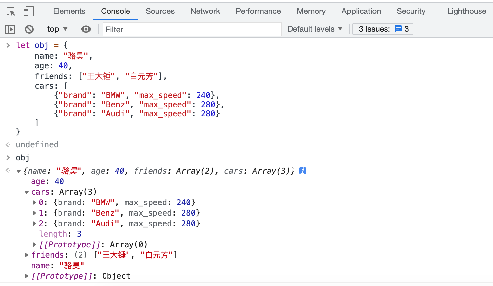

## Object Serialization and Deserialization

### An Overview of JSON

From the explanation above, we already know how to save text data and binary data into files. Then here is another question: if we want to save the data in a list or a dictionary into a file, what should we do? In Python, we can save the data in the program in **JSON** format. JSON is the short form of "JavaScript Object Notation". It was originally a literal syntax for creating objects in the JavaScript language, and now it has been widely used in cross-language and cross-platform data exchange. The reason for using JSON is very simple, because it has a compact structure and it is plain text. Any operating system and programming language can handle plain text, and this is the prerequisite for **cross-language and cross-platform data exchange**. At present, JSON has basically replaced XML, eXtensible Markup Language, as the **de facto standard for exchanging data between heterogeneous systems**. You can find more knowledge about JSON on [the official JSON website](https://www.json.org/json-en.html). This website also provides tools or third-party libraries that each language can use to handle JSON data format.

```javascript
{
    name: "Luo Hao",
    age: 40,
    friends: ["Wang Dachui", "Bai Yuanfang"],
    cars: [
        {"brand": "BMW", "max_speed": 240},
        {"brand": "Benz", "max_speed": 280},
        {"brand": "Audi", "max_speed": 280}
    ]
}
```

The above is a simple example of JSON. You may have already noticed that it is very similar to a dictionary in Python, and it supports nested structure too, just like the value in a Python dictionary can be another dictionary. We can try to type the code below into the browser console. For Chrome, for example, you can find the "Developer Tools" submenu through the "More Tools" menu, and then open the browser console. The browser console provides an interactive environment for running JavaScript code, similar to Python's interactive environment. The code below will help us create a JavaScript object, and we assign it to a variable named `obj`.

```javascript
let obj = {
    name: "Luo Hao",
    age: 40,
    friends: ["Wang Dachui", "Bai Yuanfang"],
    cars: [
        {"brand": "BMW", "max_speed": 240},
        {"brand": "Benz", "max_speed": 280},
        {"brand": "Audi", "max_speed": 280}
    ]
}
```



The `obj` above is a JavaScript object. We can get the value corresponding to `name` in two ways, `obj.name` or `obj["name"]`, as shown below. You can notice that the way `obj["name"]` gets data is exactly the same as the index operation of getting a value by key from a Python dictionary. In Python, the module named `json` also provides support for two-way conversion between dictionaries and JSON.


It is also easy to find the corresponding relationship between the data types used in JSON and the data types used in Python. You can look at the two tables below.

Table 1: JavaScript data types (values) and their corresponding Python data types (values)

| JSON         | Python       |
| ------------ | ------------ |
| `object`      | `dict` |
| `array`      | `list` |
| `string`     | `str` |
| `number` | `int` / `float` |
| `number` (real)   | `float` |
| `boolean` (`true` / `false`) | `bool` (`True` / `False`) |
| `null`       | `None` |

Table 2: Python data types (values) and their corresponding JavaScript data types (values)

| Python                      | JSON                         |
| --------------------------- | ---------------------------- |
| `dict`                      | `object`                     |
| `list` / `tuple`            | `array`                      |
| `str`                       | `string`                     |
| `int` / `float`             | `number`                     |
| `bool` (`True` / `False`)   | `boolean` (`true` / `false`) |
| `None`                      | `null`                       |

### Reading and Writing JSON Data

In Python, if we want to turn a dictionary into JSON format, in other words, make it exist as a string, we can use the `dumps` function from the `json` module, as shown below.

```python
import json

my_dict = {
    'name': 'Luo Hao',
    'age': 40,
    'friends': ['Wang Dachui', 'Bai Yuanfang'],
    'cars': [
        {'brand': 'BMW', 'max_speed': 240},
        {'brand': 'Audi', 'max_speed': 280},
        {'brand': 'Benz', 'max_speed': 280}
    ]
}
print(json.dumps(my_dict))
```

When the code above runs, the output is shown below. Notice that the Chinese characters in the original data are displayed using Unicode escapes.

```json
{"name": "\u9a86\u660a", "age": 40, "friends": ["\u738b\u5927\u9524", "\u767d\u5143\u82b3"], "cars": [{"brand": "BMW", "max_speed": 240}, {"brand": "Audi", "max_speed": 280}, {"brand": "Benz", "max_speed": 280}]}
```

If we want to turn a dictionary into JSON format and write it into a text file, we only need to replace `dumps` with `dump` and pass in a file object, as shown below.

```python
import json

my_dict = {
    'name': 'Luo Hao',
    'age': 40,
    'friends': ['Wang Dachui', 'Bai Yuanfang'],
    'cars': [
        {'brand': 'BMW', 'max_speed': 240},
        {'brand': 'Audi', 'max_speed': 280},
        {'brand': 'Benz', 'max_speed': 280}
    ]
}
with open('data.json', 'w') as file:
    json.dump(my_dict, file)
```

After running the code above, a file named `data.json` is created, and its contents are the same as the output shown earlier.

There are four especially important functions in the `json` module:

- `dump`: serialize a Python object to a file in JSON format
- `dumps`: turn a Python object into a JSON-formatted string
- `load`: deserialize JSON data from a file into an object
- `loads`: deserialize the contents of a string into a Python object

Two concepts appear here. One is serialization, and the other is deserialization. The explanation on Wikipedia is that serialization is converting a data structure or object state into a form that can be stored or transmitted, so that it can be restored to the original state when needed. Also, when bytes are obtained again from the serialized data, these bytes can be used to produce a copy of the original object. The action opposite to this process, that is, extracting a data structure from a series of bytes, is deserialization.

We can use the following code to read the `data.json` file created above and restore the JSON data into a Python dictionary.

```python
import json

with open('data.json', 'r') as file:
    my_dict = json.load(file)
    print(type(my_dict))
    print(my_dict)
```

### The Package Management Tool `pip`

The `json` module in the Python standard library is not very ideal in performance when doing data serialization and deserialization. To solve this problem, we can use the third-party library `ujson` to replace `json`. A so-called third-party library means a Python module that is not developed and used inside the company, and is not from the official standard library either. These modules are usually developed by other companies, organizations, or individuals, so they are called third-party libraries. Although the standard library of Python has already provided many modules to make our development convenient, for a powerful language, its ecosystem must also be very prosperous.

When you installed the Python interpreter earlier, the option to install `pip` was checked by default. You can verify whether `pip` is available by running `pip --version` in a terminal or command prompt. Pip is Python's package management tool. Through pip, we can search for, install, uninstall, and update third-party libraries or tools. For example, if we want to install `ujson` as a replacement for the `json` module, we can run the following command.

```bash
pip install ujson
```

By default, pip accesses `https://pypi.org/simple/` to retrieve data about third-party packages. For users in mainland China, access to that site is often not ideal, so users there can use mirrors provided by Douban or Tsinghua University instead, and then install packages as usual.

```bash
pip config set global.index-url https://pypi.doubanio.com/simple
pip install ujson
```

We can use `pip search` to look for packages by name, `pip list` to see packages that are already installed, `pip install -U` or `pip install --upgrade` to update a package, and `pip uninstall` to remove one.

Search for the `ujson` package:

```bash
pip search ujson

micropython-cpython-ujson (0.2)  - MicroPython module ujson ported to CPython
pycopy-cpython-ujson (0.2)       - Pycopy module ujson ported to CPython
ujson (3.0.0)                    - Ultra fast JSON encoder and decoder for Python
ujson-bedframe (1.33.0)          - Ultra fast JSON encoder and decoder for Python
ujson-segfault (2.1.57)          - Ultra fast JSON encoder and decoder for Python. Continuing
                                   development.
ujson-ia (2.1.1)                 - Ultra fast JSON encoder and decoder for Python (Internet
                                   Archive fork)
ujson-x (1.37)                   - Ultra fast JSON encoder and decoder for Python
ujson-x-legacy (1.35.1)          - Ultra fast JSON encoder and decoder for Python
drf_ujson (1.2)                  - Django Rest Framework UJSON Renderer
drf-ujson2 (1.6.1)               - Django Rest Framework UJSON Renderer
ujsonDB (0.1.0)                  - A lightweight and simple database using ujson.
fast-json (0.3.2)                - Combines best parts of json and ujson for fast serialization
decimal-monkeypatch (0.4.3)      - Python 2 performance patches: decimal to cdecimal, json to
                                   ujson for psycopg2
```

View the packages that have already been installed:

```bash
pip list

Package                       Version
----------------------------- ----------
aiohttp                       3.5.4
alipay                        0.7.4
altgraph                      0.16.1
amqp                          2.4.2
...                           ...
```

Update the `ujson` package:

```bash
pip install -U ujson
```

Uninstall the `ujson` package:

```bash
pip uninstall -y ujson
```

> **Tip**: If you want to upgrade `pip` itself, on macOS you can use `pip install -U pip`. On Windows, you can use `python -m pip install -U --user pip`.

### Getting Data Through Network APIs

If we want to display information such as weather, road conditions, and flights in our own program, we do not have the ability to provide this information by ourselves, so we must use network data services. At present, most network data services, or network APIs, provide JSON format data based on HTTP or HTTPS. We can use a Python program to send an HTTP request to a specified URL, and this URL is the so-called network API. If the request succeeds, it returns an HTTP response, and in the body of the HTTP response there is the JSON format data we need. For related knowledge of HTTP, you can read Ruan Yifeng's article *Introduction to the HTTP Protocol*.

There are many websites in China that provide network API services, such as Juhe Data and Baidu AI Cloud. These sites offer both free and paid data interfaces. Outside China, the site [{API}Search](http://apis.io/) provides similar services. If you are interested, you can explore them on your own. The following example demonstrates how to use the third-party library [`requests`](http://docs.python-requests.org/zh_CN/latest/) to access a network API, fetch domestic news, and display the news titles and links. In this example, we use the domestic-news API provided by Tian API. Its identity credential, the API key, must be requested by registering on the website. After registering, an API key is assigned automatically, but to access the API you still need to verify your email or phone and then apply for the specific interface you want to use.


When using Python to access network resources through a URL, we recommend the third-party library `requests`. It is simple and powerful, but it needs to be installed separately.

```bash
pip install requests
```

Fetch domestic news and display the title and link.

```python
import requests

resp = requests.get('http://api.tianapi.com/guonei/?key=APIKey&num=10')
if resp.status_code == 200:
    data_model = resp.json()
    for news in data_model['newslist']:
        print(news['title'])
        print(news['url'])
        print('-' * 60)
```

The code above sends a request to the domestic news API of Tian API through the `get` function of the `requests` module. If there is no problem in the request process, the `get` function returns a `Response` object. Through the `status_code` attribute of this object, we can see the HTTP response status code. If you do not understand it, that is okay. You only need to care about its value. If the value is equal to `200` or another value starting with `2`, then our request is successful. Through the `json()` method of the `Response` object, we can directly turn the returned JSON format data into a Python dictionary. This is very convenient. The JSON format data returned by the Tian API domestic news interface, partly, is shown below.


> **Tip**: Replace `APIKey` in the code above with the API key you applied for from the Tian API website. The site also provides many other interesting APIs, such as garbage classification and dream interpretation. You can call those interfaces by following the same pattern as above. Each API has its own documentation explaining how to use it in detail.

### Summary

In Python, besides the `json` module, we can also use modules such as `pickle` and `shelve` to perform serialization and deserialization. However, those two modules use Python-specific serialization protocols, so the data they produce can only be recognized by Python. Handling JSON data is clearly a skill every programmer must master, because whether you are calling a network API or providing one for others, you need to understand how to work with JSON.
