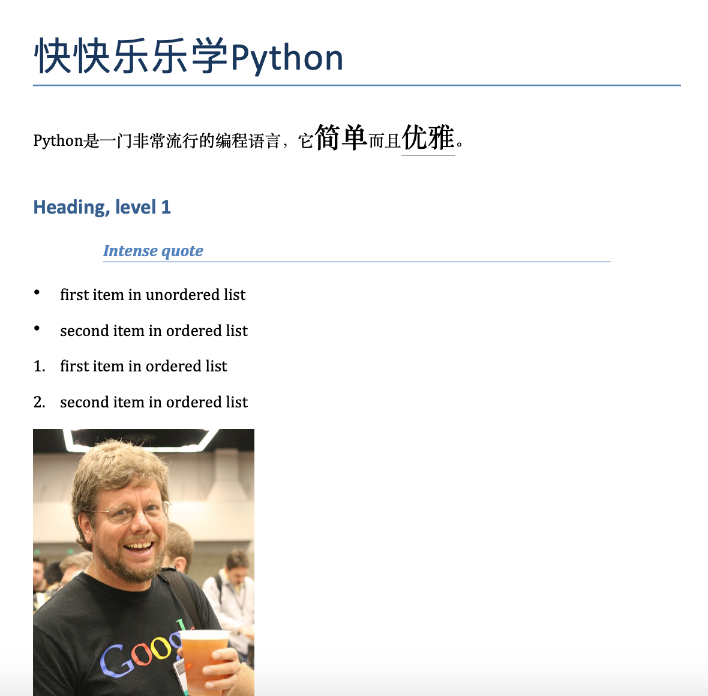
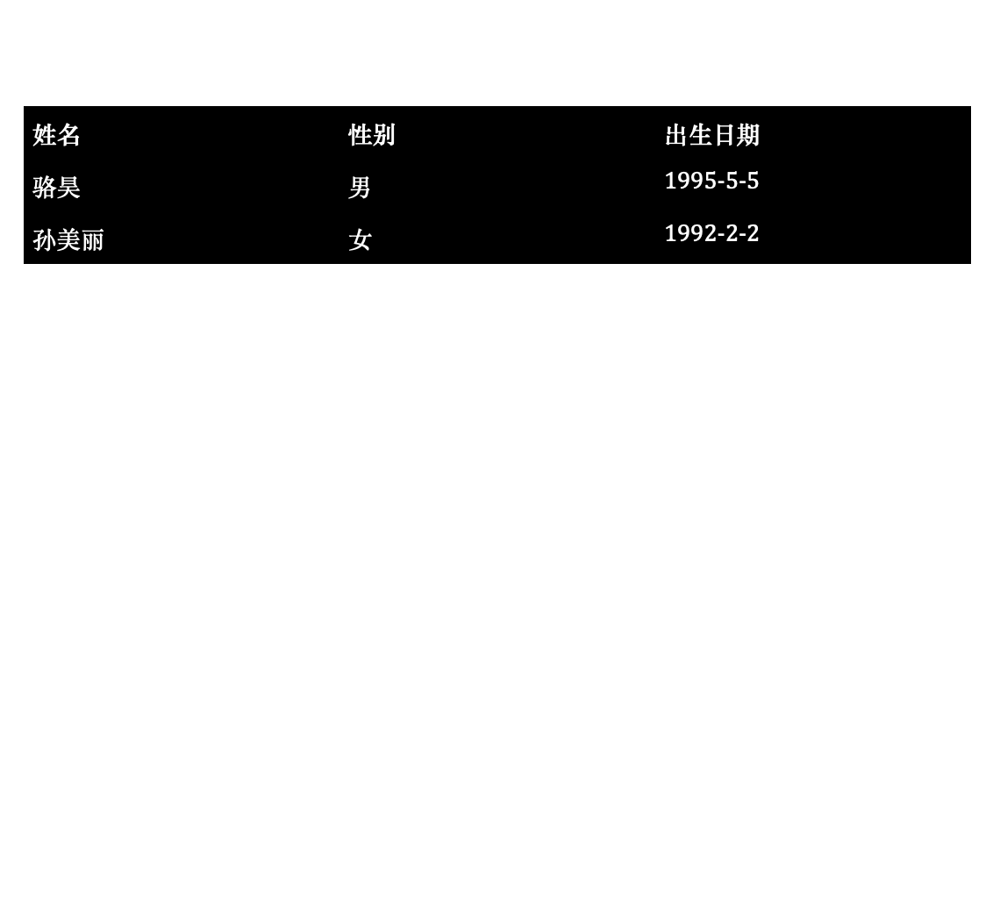
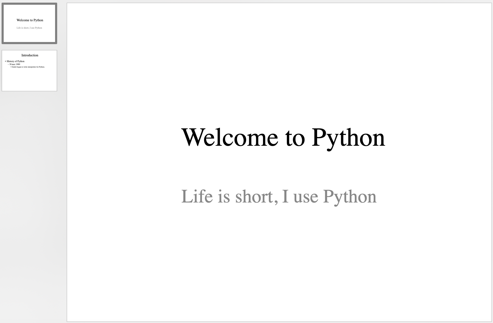

## Working with Word and PowerPoint Files in Python

In daily work, many simple and repeated jobs can actually be fully handed over to Python programs. For example, according to a sample file, a template file, we can generate many Word files or PowerPoint files in batch. Word is the word processing program developed by Microsoft. I believe everyone is familiar with it. Many formal documents in daily office work are written and edited with Word, and now the file extension of Word files is usually `.docx`. PowerPoint is the presentation program developed by Microsoft. It is one part of Microsoft's Office software family, and it is widely used by business people, teachers, students, and other groups. It is also usually called "slides". In Python, we can use the third-party library `python-docx` to operate Word, and use the third-party library `python-pptx` to generate PowerPoint.

### Working with Word Documents

We can first install `python-docx` with the following command.

```bash
pip install python-docx
```

According to the [official documentation](https://python-docx.readthedocs.io/en/latest/), we can use the code below to generate a simple Word document.

```python
from docx import Document
from docx.shared import Cm, Pt

from docx.document import Document as Doc

# Create the Doc object representing a Word document.
document = Document()  # type: Doc
# Add a top-level heading.
document.add_heading('Learn Python Happily', 0)
# Add a paragraph.
p = document.add_paragraph('Python is a very popular programming language. It is ')
run = p.add_run('simple')
run.bold = True
run.font.size = Pt(18)
p.add_run(' and ')
run = p.add_run('elegant')
run.font.size = Pt(18)
run.underline = True
p.add_run('.')

# Add a level-1 heading.
document.add_heading('Heading, level 1', level=1)
# Add a styled paragraph.
document.add_paragraph('Intense quote', style='Intense Quote')
# Add an unordered list.
document.add_paragraph(
    'first item in unordered list', style='List Bullet'
)
document.add_paragraph(
    'second item in ordered list', style='List Bullet'
)
# Add an ordered list.
document.add_paragraph(
    'first item in ordered list', style='List Number'
)
document.add_paragraph(
    'second item in ordered list', style='List Number'
)

# Add an image. Make sure the path and image exist.
document.add_picture('resources/guido.jpg', width=Cm(5.2))

# Add a section break.
document.add_section()

records = (
    ('Luo Hao', 'Male', '1995-5-5'),
    ('Sun Meili', 'Female', '1992-2-2')
)
# Add a table.
table = document.add_table(rows=1, cols=3)
table.style = 'Dark List'
hdr_cells = table.rows[0].cells
hdr_cells[0].text = 'Name'
hdr_cells[1].text = 'Gender'
hdr_cells[2].text = 'Date of Birth'
# Add rows to the table.
for name, sex, birthday in records:
    row_cells = table.add_row().cells
    row_cells[0].text = name
    row_cells[1].text = sex
    row_cells[2].text = birthday

# Add a page break.
document.add_page_break()

# Save the document.
document.save('demo.docx')
```

> **Tip**: The comment `# type: Doc` in the code above is used to get code completion hints in PyCharm, because if the concrete data type of the object is not clear, PyCharm cannot give code completion hints for the `Doc` object in the later code.

After running the code above, open the generated Word document. The effect is shown below.

&nbsp;&nbsp;

For an existing Word file, we can iterate over all its paragraphs and get the corresponding content with the code below.

```python
from docx import Document
from docx.document import Document as Doc

doc = Document('resources/resignation_certificate.docx')  # type: Doc
for no, p in enumerate(doc.paragraphs):
    print(no, p.text)
```

> **Tip**: If you need the Word file in the code above, you can download it from the Baidu Netdisk link below. Link: https://pan.baidu.com/s/1rQujl5RQn9R7PadB2Z5g_g  Password: `e7b4`.

The content read out is shown below.

```text
0
1 Resignation Certificate
2
3 This is to certify that Wang Dachui, ID number: 100200199512120001, worked in our Development Department as a Java Development Engineer from August 7, 2018 to June 28, 2020. During the employment period there was no bad behavior. Because of personal reasons, the labor contract was ended and removed from June 28, 2020. All financial fees have now been settled, and the procedures for ending the labor relationship have been completed. There is no labor dispute between the two sides.
4
5 Hereby certify!
6
7
8 Company name (seal): Chengdu Fengcheche Technology Co., Ltd.
9             June 28, 2020
```

Speaking of this, I believe many readers have already thought of it. We can make the resignation certificate above into a template file, and replace information such as name, ID number, start date, and end date with placeholders. Then by replacing the placeholders, we can write the corresponding real information according to actual needs. In this way, we can batch-generate Word documents.

Following the idea above, we first edit a resignation certificate template file, as shown below.


```python
from docx import Document
from docx.document import Document as Doc

# Store the real data as dictionaries inside a list.
employees = [
    {
        'name': 'Luo Hao',
        'id': '100200198011280001',
        'sdate': 'March 1, 2008',
        'edate': 'February 29, 2012',
        'department': 'Product R&D',
        'position': 'Architect',
        'company': 'Chengdu Huawei Technologies Co., Ltd.'
    },
    {
        'name': 'Wang Dachui',
        'id': '510210199012125566',
        'sdate': 'January 1, 2019',
        'edate': 'April 30, 2021',
        'department': 'Product R&D',
        'position': 'Python Engineer',
        'company': 'Chengdu Gudao Technology Co., Ltd.'
    },
    {
        'name': 'Li Yuanfang',
        'id': '2102101995103221599',
        'sdate': 'May 10, 2020',
        'edate': 'March 5, 2021',
        'department': 'Product R&D',
        'position': 'Java Engineer',
        'company': 'Tongcheng Enterprise Management Group Co., Ltd.'
    },
]
# Iterate through the list and generate Word documents in batches.
for emp_dict in employees:
    # Read the resignation-certificate template.
    doc = Document('resources/resignation_template.docx')  # type: Doc
    # Iterate over all paragraphs and look for placeholders.
    for p in doc.paragraphs:
        if '{' not in p.text:
            continue
        # We cannot modify the entire paragraph directly, otherwise styling is lost.
        # So we iterate over runs inside the paragraph and replace the text there.
        for run in p.runs:
            if '{' not in run.text:
                continue
            # Replace the placeholder with actual content.
            start, end = run.text.find('{'), run.text.find('}')
            key, place_holder = run.text[start + 1:end], run.text[start:end + 1]
            run.text = run.text.replace(place_holder, emp_dict[key])
    # Save one Word document for each person.
    doc.save(f'{emp_dict["name"]} Resignation Certificate.docx')
```

After running the code above, three Word documents will be generated in the current path, as shown below.


### Generating PowerPoint Files

First we need to install the third-party library `python-pptx` with the command below.

```bash
pip install python-pptx
```

Using Python to operate PowerPoint content is not a very common actual application scene, so I do not plan to say too much here. Interested readers can read the [official documentation](https://python-pptx.readthedocs.io/en/latest/) of `python-pptx` by themselves. Below I only show one piece of code from the official documentation.

```python
from pptx import Presentation

# Create a presentation object.
pres = Presentation()

# Choose a layout and add a slide.
title_slide_layout = pres.slide_layouts[0]
slide = pres.slides.add_slide(title_slide_layout)
# Get the title box and subtitle box.
title = slide.shapes.title
subtitle = slide.placeholders[1]
# Edit the title and subtitle.
title.text = "Welcome to Python"
subtitle.text = "Life is short, I use Python"

# Choose a layout and add another slide.
bullet_slide_layout = pres.slide_layouts[1]
slide = pres.slides.add_slide(bullet_slide_layout)
# Get all shapes on the slide.
shapes = slide.shapes
# Get the title and body.
title_shape = shapes.title
body_shape = shapes.placeholders[1]
# Edit the title.
title_shape.text = 'Introduction'
# Edit the body text.
tf = body_shape.text_frame
tf.text = 'History of Python'
# Add a first-level paragraph.
p = tf.add_paragraph()
p.text = 'X\'mas 1989'
p.level = 1
# Add a second-level paragraph.
p = tf.add_paragraph()
p.text = 'Guido began to write interpreter for Python.'
p.level = 2

# Save the presentation.
pres.save('test.pptx')
```

Run the code above, and the generated PowerPoint file is shown below.



### Summary

Using Python programs to solve office automation problems is really very cool. It can free us from tedious and boring work. Writing this kind of code is doing one thing once and then using it forever. Even if the process of writing code is not very happy, when using this code, you should be very happy.
