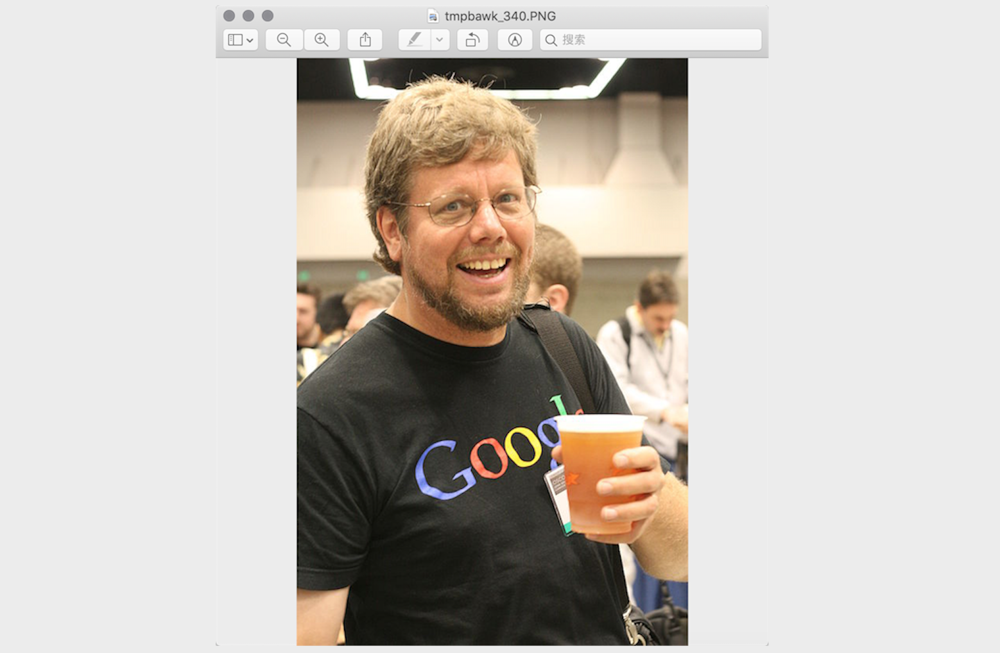
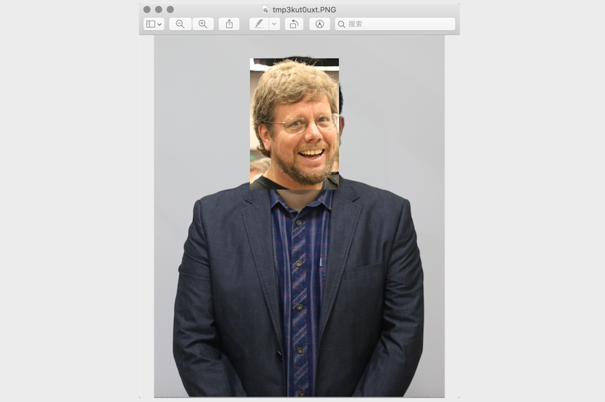
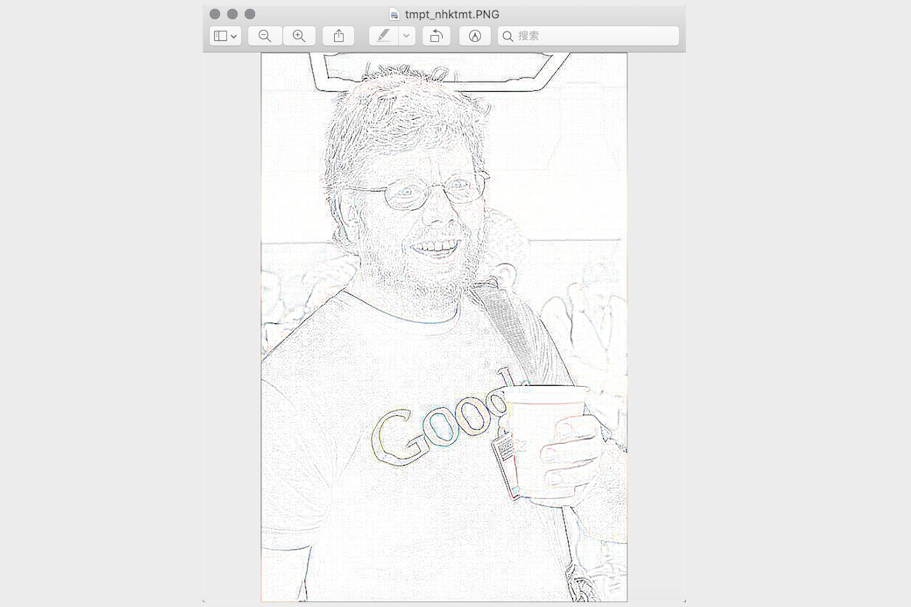
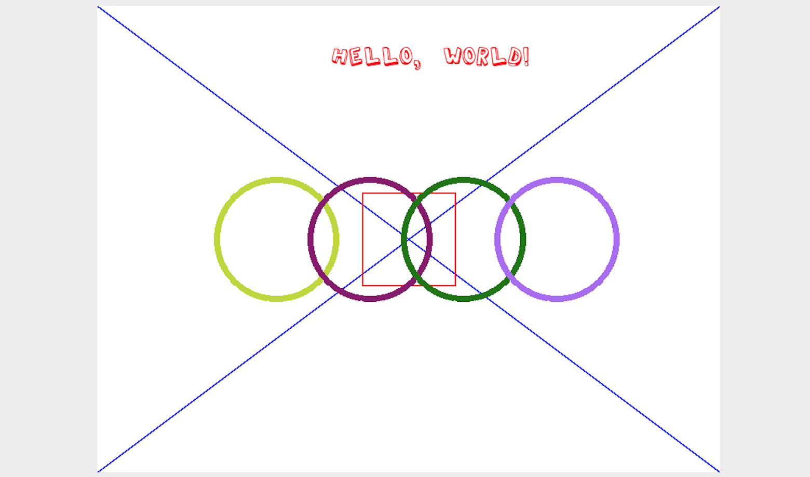

## Image Processing in Python

### Basic Concepts

1. Color. If you have ever painted with pigments, you know that mixing red, yellow, and blue paint can produce other colors. In art, these are the three primary colors, meaning they cannot be broken down further. In computers, however, we form colors by combining red, green, and blue light in different proportions, so these are the three additive primary colors of light. In computer systems, we usually represent a color as an RGB value or an RGBA value, where `A` stands for the alpha channel, which determines transparency.

   | Name | RGB Value | Name | RGB Value |
   | :---------: | :-------------: | :----------: | :-----------: |
   | White | `(255, 255, 255)` | Red | `(255, 0, 0)` |
   | Green | `(0, 255, 0)` | Blue | `(0, 0, 255)` |
   | Gray | `(128, 128, 128)` | Yellow | `(255, 255, 0)` |
   | Black | `(0, 0, 0)` | Purple | `(128, 0, 128)` |

2. Pixel. For an image represented by a digital sequence, the smallest unit is the small square of a single color in the image. These small squares all have a clear position and assigned color value, and the color and position of these small squares decide the final appearance of the image. They are indivisible units, and we usually call them pixels. Every image contains a certain number of pixels, and these pixels decide the size the image shows on the screen. If everyone likes taking photos or selfies, the word pixel is not unfamiliar.

### Processing Images with Pillow

Pillow is a branch that evolved from PIL, the famous Python image-processing library. With Pillow, we can perform image compression and many other types of image manipulation. Install Pillow with the command below.

```bash
pip install pillow
```

The most important thing in Pillow is the `Image` class. We can use the `open` function from the `Image` module to read an image and obtain an `Image` object.

1. Read and display an image

   ```python
   from PIL import Image

   # Read the image and get an Image object
   image = Image.open('guido.jpg')
   # Get the image format
   print(image.format)  # JPEG
   # Get the image size
   print(image.size)    # (500, 750)
   # Get the image mode
   print(image.mode)    # RGB
   # Display the image
   image.show()
   ```

   

2. Crop an image

   ```python
   # Crop the image with the specified region
   image.crop((80, 20, 310, 360)).show()
   ```

   

3. Generate a thumbnail

   ```python
   # Generate a thumbnail with the specified size
   image.thumbnail((128, 128))
   image.show()
   ```

   

4. Resize and paste an image

   ```python
   # Read Luo Hao's photo
   luohao_image = Image.open('luohao.png')
   # Read Guido's photo
   guido_image = Image.open('guido.jpg')
   # Crop Guido's head from the photo
   guido_head = guido_image.crop((80, 20, 310, 360))
   width, height = guido_head.size
   # Resize the image, then paste Guido's head onto Luo Hao's photo
   luohao_image.paste(guido_head.resize((int(width / 1.5), int(height / 1.5))), (172, 40))
   luohao_image.show()
   ```

   

5. Rotate and flip

   ```python
   image = Image.open('guido.jpg')
   # Rotate the image
   image.rotate(45).show()
   # Flip the image
   # Image.FLIP_LEFT_RIGHT means horizontal flip
   # Image.FLIP_TOP_BOTTOM means vertical flip
   image.transpose(Image.FLIP_TOP_BOTTOM).show()
   ```

   

6. Manipulate pixels

   ```python
   for x in range(80, 310):
       for y in range(20, 360):
           # Modify the specified pixel
           image.putpixel((x, y), (128, 128, 128))
   image.show()
   ```

   

7. Filter effects

   ```python
   from PIL import ImageFilter

   # Apply a filter to the image
   # ImageFilter contains many built-in filters, and custom filters are also possible
   image.filter(ImageFilter.CONTOUR).show()
   ```

   

### Drawing with Pillow

Pillow includes a module named `ImageDraw`. The `Draw` function in that module returns an `ImageDraw` object. Through that object, methods such as `arc`, `line`, `rectangle`, `ellipse`, and `polygon` can be used to draw arcs, lines, rectangles, ellipses, and polygons on an image, and the `text` method can be used to add text.



To draw an image like the example in the lesson, the complete code is shown below.

```python
import random

from PIL import Image, ImageDraw, ImageFont


def random_color():
    """Generate a random color"""
    red = random.randint(0, 255)
    green = random.randint(0, 255)
    blue = random.randint(0, 255)
    return red, green, blue


width, height = 800, 600
# Create an 800x600 image with a white background
image = Image.new(mode='RGB', size=(width, height), color=(255, 255, 255))
# Create an ImageDraw object
drawer = ImageDraw.Draw(image)
# Get an ImageFont object with the specified font and size
font = ImageFont.truetype('Kongxin.ttf', 32)
# Draw text
drawer.text((300, 50), 'Hello, world!', fill=(255, 0, 0), font=font)
# Draw two diagonal lines
drawer.line((0, 0, width, height), fill=(0, 0, 255), width=2)
drawer.line((width, 0, 0, height), fill=(0, 0, 255), width=2)
xy = width // 2 - 60, height // 2 - 60, width // 2 + 60, height // 2 + 60
# Draw a rectangle
drawer.rectangle(xy, outline=(255, 0, 0), width=2)
# Draw ellipses
for i in range(4):
    left, top, right, bottom = 150 + i * 120, 220, 310 + i * 120, 380
    drawer.ellipse((left, top, right, bottom), outline=random_color(), width=8)
# Show the image
image.show()
# Save the image
image.save('result.png')
```

> **Note**: The font file used in the code above should be prepared according to your own environment. You can pick a font file you like and place it in the code directory.

### Summary

When using Python language for development, besides using Pillow to process images, we can also use the more powerful OpenCV library to complete image processing. OpenCV, Open Source Computer Vision Library, is a cross-platform computer vision library. It can be used to develop real-time image processing, computer vision, and pattern recognition programs. In our daily work, many tedious and boring tasks can actually be handled through Python programs. The purpose of programming is to let the computer help us solve problems and reduce repeated boring work. Through learning this chapter, I believe everyone has already felt the fun of drawing and editing images with Python programs. In fact, Python can do far more than these. Continue your learning.
