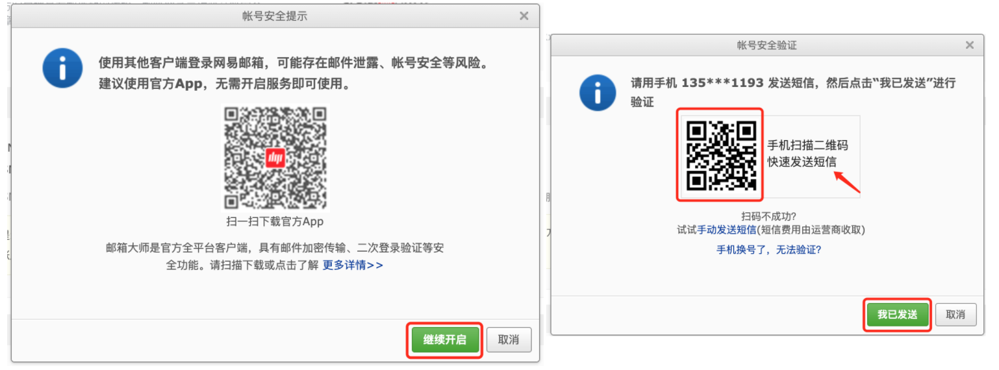
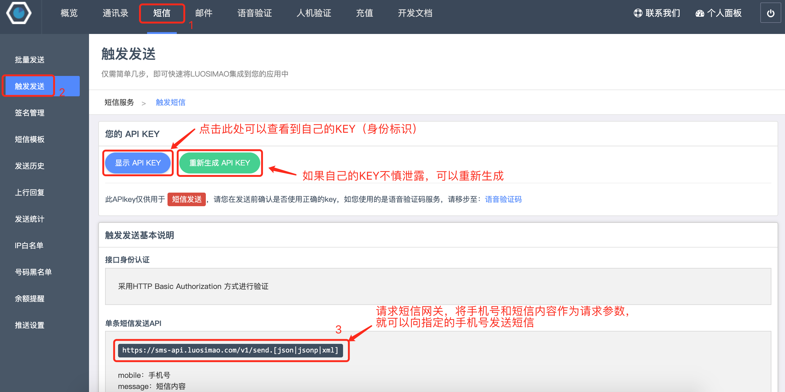

## Sending Email and SMS with Python

In the previous lessons, we already showed everyone how to use Python programs to generate Excel, Word, and PDF documents automatically. Next, we can go a step further by emailing those generated documents to specified recipients, and then using SMS to notify them that the email has been sent. These tasks can also be handled quite easily with Python.

### Sending Email

Even in an age when instant-messaging software is so widespread, email is still one of the most widely used applications on the internet. Company job offers to applicants, website account-activation links, and promotional messages from banks are all commonly delivered by email, and tasks like these should really be completed automatically by programs.

We can use HTTP, the Hypertext Transfer Protocol, to access website resources. HTTP is an application-layer protocol built on top of TCP, the Transmission Control Protocol, which provides reliable data-transfer services for many application-layer protocols. To send email, we need SMTP, the Simple Mail Transfer Protocol, which is also an application-layer protocol built on top of TCP. It defines how a mail sender communicates with a mail server. Python simplifies these operations through the `smtplib` module. Using an `SMTP_SSL` object from that module, together with its `login` and `sendmail` methods, is enough to send mail.

Let us first try to send a very simple email. This email does not contain attachments, images, or other hypertext content. To send email, we first need to connect to a mail server. We can set up a mail server by ourselves. This thing is not very friendly to beginners, but we can choose to use a third-party mail service. For example, if we have already registered an account on `126.com`, after logging in successfully, we can turn on SMTP service in the settings. Then it is equal to getting a mail server. The specific operation is shown below.




By scanning the QR code above with a mobile phone, we can get an authorization code by sending an SMS. After the SMS is sent successfully, click "I have sent" and then you can get the authorization code. The authorization code should be kept carefully, because once it is leaked, other people can pretend to be you to send email. Next, we can write the code for sending email, as shown below.

```python
import smtplib
from email.header import Header
from email.mime.multipart import MIMEMultipart
from email.mime.text import MIMEText

# Create the email object
email = MIMEMultipart()
# Set the sender, recipients, and subject
email['From'] = 'xxxxxxxxx@126.com'
email['To'] = 'yyyyyy@qq.com;zzzzzz@1000phone.com'
email['Subject'] = Header('上半年工作情况汇报', 'utf-8')
# Add the email body
content = """据德国媒体报道，当地时间9日，德国火车司机工会成员进行了投票，
定于当地时间10日起进行全国性罢工，货运交通方面的罢工已于当地时间10日19时开始。
此后，从11日凌晨2时到13日凌晨2时，德国全国范围内的客运和铁路基础设施将进行48小时的罢工。"""
email.attach(MIMEText(content, 'plain', 'utf-8'))

# Create an SMTP_SSL object and connect to the mail server
smtp_obj = smtplib.SMTP_SSL('smtp.126.com', 465)
# Log in with the username and authorization code
smtp_obj.login('xxxxxxxxx@126.com', 'mail-server-authorization-code')
# Send the email
smtp_obj.sendmail(
    'xxxxxxxxx@126.com',
    ['yyyyyy@qq.com', 'zzzzzz@1000phone.com'],
    email.as_string()
)
```

If we want to send email with attachments, we only need to process the attachment content into Base64 encoding, and then it is almost no different from normal text content. Base64 is a representation method based on 64 printable characters to represent binary data. It is often used in situations where binary data needs to be represented, transmitted, and stored, and email is one of them. If you do not understand this encoding way, I recommend reading [Notes on Base64](http://www.ruanyifeng.com/blog/2008/06/base64.html). In previous content, we also mentioned that the `base64` module in the Python standard library provides support for Base64 encoding and decoding.

The code below demonstrates how to send an email with an attachment.

```python
import smtplib
from email.header import Header
from email.mime.multipart import MIMEMultipart
from email.mime.text import MIMEText
from urllib.parse import quote

# Create the email object
email = MIMEMultipart()
# Set the sender, recipient, and subject
email['From'] = 'xxxxxxxxx@126.com'
email['To'] = 'zzzzzzzz@1000phone.com'
email['Subject'] = Header('请查收离职证明文件', 'utf-8')
# Add HTML content as the email body
content = """<p>亲爱的前同事：</p>
<p>你需要的离职证明在附件中，请查收！</p>
<br>
<p>祝，好！</p>
<hr>
<p>孙美丽 即日</p>"""
email.attach(MIMEText(content, 'html', 'utf-8'))
# Read the file that will be sent as an attachment
with open('resources/王大锤离职证明.docx', 'rb') as file:
    attachment = MIMEText(file.read(), 'base64', 'utf-8')
    # Set the content type
    attachment['content-type'] = 'application/octet-stream'
    # Percent-encode the filename
    filename = quote('王大锤离职证明.docx')
    # Specify how the content should be handled
    attachment['content-disposition'] = f'attachment; filename="{filename}"'
    email.attach(attachment)

# Create an SMTP_SSL object and connect to the mail server
smtp_obj = smtplib.SMTP_SSL('smtp.126.com', 465)
# Log in with the username and authorization code
smtp_obj.login('xxxxxxxxx@126.com', 'mail-server-authorization-code')
# Send the email
smtp_obj.sendmail(
    'xxxxxxxxx@126.com',
    'zzzzzzzz@1000phone.com',
    email.as_string()
)
```

To make it convenient for everyone to use Python to send email, I wrapped the code above into a function. When using it, everyone only needs to adjust the mail server domain name, port, username, and authorization code.

```python
import smtplib
from email.header import Header
from email.mime.multipart import MIMEMultipart
from email.mime.text import MIMEText
from urllib.parse import quote

# Mail server domain
EMAIL_HOST = 'smtp.126.com'
# Mail server port, usually 465
EMAIL_PORT = 465
# Account used to log in to the mail server
EMAIL_USER = 'xxxxxxxxx@126.com'
# SMTP authorization code
EMAIL_AUTH = '邮件服务器的授权码'


def send_email(*, from_user, to_users, subject='', content='', filenames=[]):
    """Send an email

    :param from_user: sender
    :param to_users: recipients, separated by semicolons
    :param subject: email subject
    :param content: email body
    :param filenames: file paths for attachments
    """
    email = MIMEMultipart()
    email['From'] = from_user
    email['To'] = to_users
    email['Subject'] = subject

    message = MIMEText(content, 'plain', 'utf-8')
    email.attach(message)
    for filename in filenames:
        with open(filename, 'rb') as file:
            pos = filename.rfind('/')
            display_filename = filename[pos + 1:] if pos >= 0 else filename
            display_filename = quote(display_filename)
            attachment = MIMEText(file.read(), 'base64', 'utf-8')
            attachment['content-type'] = 'application/octet-stream'
            attachment['content-disposition'] = f'attachment; filename="{display_filename}"'
            email.attach(attachment)

    smtp = smtplib.SMTP_SSL(EMAIL_HOST, EMAIL_PORT)
    smtp.login(EMAIL_USER, EMAIL_AUTH)
    smtp.sendmail(from_user, to_users.split(';'), email.as_string())
```

### Sending SMS

Sending SMS is also a common feature in projects. Website registration codes, verification codes, and marketing messages are often delivered by SMS. Sending SMS requires support from a third-party platform. Here we use the [Luosimao platform](https://luosimao.com/) as an example to introduce how to send SMS with a Python program. We will not describe the details of registering an account and buying SMS service here. You can ask the platform customer service.



Next, we can send an HTTP request to the SMS gateway provided by the platform through the `requests` library. By passing the recipient's mobile number and the message content as parameters, we can send the message. The code is shown below.

```python
import random

import requests


def send_message_by_luosimao(tel, message):
    """Send SMS through the Luosimao SMS gateway"""
    resp = requests.post(
        url='http://sms-api.luosimao.com/v1/send.json',
        auth=('api', 'key-your-platform-key'),
        data={
            'mobile': tel,
            'message': message
        },
        timeout=10,
        verify=False
    )
    return resp.json()


def gen_mobile_code(length=6):
    """Generate a mobile verification code of the given length"""
    return ''.join(random.choices('0123456789', k=length))


def main():
    code = gen_mobile_code()
    message = f'您的短信验证码是{code}，打死也不能告诉别人哟！【Python小课】'
    print(send_message_by_luosimao('13500112233', message))


if __name__ == '__main__':
    main()
```

The request to Luosimao's SMS gateway, `http://sms-api.luosimao.com/v1/send.json`, returns JSON format data. If it returns `{'error': 0, 'msg': 'OK'}`, it means the SMS has been sent successfully. If the value of `error` is not `0`, you can check the official [development documentation](https://luosimao.com/docs/api/) to know which part had a problem. The common error types of the Luosimao platform are shown in the figure below.


At present, most SMS platforms require the SMS content to include a signature. The figure below shows the SMS signature `【Python小课】` that was configured on the Luosimao platform. Some SMS messages involving sensitive content also need to configure an SMS template in advance. Interested readers can study it by themselves. In general, to prevent SMS from being stolen and used, the platform also asks to set an "IP whitelist". If you do not know how to configure it, you can ask the platform customer service.


Of course, there are many SMS platforms to choose from. Readers can select one according to their own needs, usually considering factors such as budget, delivery rate, and ease of use. If you need SMS service in a commercial project, purchasing a package from an SMS platform is usually recommended.

### Summary

In fact, just like SMS, email can also be sent through third-party services. In real commercial projects, either setting up your own mail server or purchasing a reliable third-party service is the more dependable choice.
