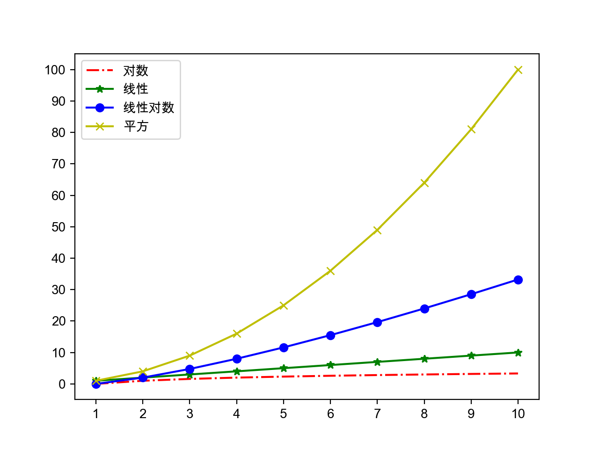

## Advanced Python Topics

### Important Knowledge Points

- Comprehensions

  ```python
  prices = {
      'AAPL': 191.88,
      'GOOG': 1186.96,
      'IBM': 149.24,
      'ORCL': 48.44,
      'ACN': 166.89,
      'FB': 208.09,
      'SYMC': 21.29
  }
  prices2 = {key: value for key, value in prices.items() if value > 100}
  print(prices2)
  ```

  > Comprehensions can be used to build lists, sets, and dictionaries.

- A pitfall with nested lists

  ```python
  names = ['Guan Yu', 'Zhang Fei', 'Zhao Yun', 'Ma Chao', 'Huang Zhong']
  courses = ['Chinese', 'Math', 'English']
  # Wrong:
  # scores = [[None] * len(courses)] * len(names)
  scores = [[None] * len(courses) for _ in range(len(names))]
  for row, name in enumerate(names):
      for col, course in enumerate(courses):
          scores[row][col] = float(input(f'Enter {name}\'s {course} score: '))
          print(scores)
  ```

  [Python Tutor](http://pythontutor.com/) is helpful for visualizing this behavior.

- The `heapq` module

  ```python
  import heapq

  list1 = [34, 25, 12, 99, 87, 63, 58, 78, 88, 92]
  list2 = [
      {'name': 'IBM', 'shares': 100, 'price': 91.1},
      {'name': 'AAPL', 'shares': 50, 'price': 543.22},
      {'name': 'FB', 'shares': 200, 'price': 21.09},
      {'name': 'HPQ', 'shares': 35, 'price': 31.75},
      {'name': 'YHOO', 'shares': 45, 'price': 16.35},
      {'name': 'ACME', 'shares': 75, 'price': 115.65}
  ]
  print(heapq.nlargest(3, list1))
  print(heapq.nsmallest(3, list1))
  print(heapq.nlargest(2, list2, key=lambda x: x['price']))
  print(heapq.nlargest(2, list2, key=lambda x: x['shares']))
  ```

- The `itertools` module

  ```python
  import itertools

  itertools.permutations('ABCD')
  itertools.combinations('ABCDE', 3)
  itertools.product('ABCD', '123')
  itertools.cycle(('A', 'B', 'C'))
  ```

- The `collections` module

  Common utility classes:

  - `namedtuple`: a factory for creating tuple-like classes with named fields
  - `deque`: a double-ended queue, usually better than lists for fast appends/pops at both ends
  - `Counter`: counts occurrences of elements
  - `OrderedDict`: remembers insertion order
  - `defaultdict`: provides default values via a factory function

  ```python
  from collections import Counter

  words = [
      'look', 'into', 'my', 'eyes', 'look', 'into', 'my', 'eyes',
      'the', 'eyes', 'the', 'eyes', 'the', 'eyes', 'not', 'around',
      'the', 'eyes', "don't", 'look', 'around', 'the', 'eyes',
      'look', 'into', 'my', 'eyes', "you're", 'under'
  ]
  counter = Counter(words)
  print(counter.most_common(3))
  ```

### Data Structures and Algorithms

- An **algorithm** is the method and sequence of steps used to solve a problem.
- Common evaluation criteria:
  - time complexity
  - space complexity

#### Big-O Time Complexity

- `O(c)`: constant time, e.g. Bloom filters, hash-based lookup
- `O(log n)`: logarithmic time, e.g. binary search
- `O(n)`: linear time, e.g. sequential search
- `O(n log n)`: log-linear time, e.g. merge sort, quicksort
- `O(n^2)`: quadratic time, e.g. selection sort, insertion sort, bubble sort
- `O(n^3)`: cubic time, e.g. Floyd algorithm, matrix multiplication
- `O(2^n)`: exponential time, e.g. Tower of Hanoi
- `O(n!)`: factorial time, e.g. traveling salesman brute force




#### Sorting and Searching Algorithms

Selection sort:

```python
def select_sort(items, comp=lambda x, y: x < y):
    items = items[:]
    for i in range(len(items) - 1):
        min_index = i
        for j in range(i + 1, len(items)):
            if comp(items[j], items[min_index]):
                min_index = j
        items[i], items[min_index] = items[min_index], items[i]
    return items
```

Bubble sort:

```python
def bubble_sort(items, comp=lambda x, y: x > y):
    items = items[:]
    for i in range(len(items) - 1):
        swapped = False
        for j in range(len(items) - 1 - i):
            if comp(items[j], items[j + 1]):
                items[j], items[j + 1] = items[j + 1], items[j]
                swapped = True
        if not swapped:
            break
    return items
```

Cocktail sort:

```python
def bubble_sort(items, comp=lambda x, y: x > y):
    items = items[:]
    for i in range(len(items) - 1):
        swapped = False
        for j in range(len(items) - 1 - i):
            if comp(items[j], items[j + 1]):
                items[j], items[j + 1] = items[j + 1], items[j]
                swapped = True
        if swapped:
            swapped = False
            for j in range(len(items) - 2 - i, i, -1):
                if comp(items[j - 1], items[j]):
                    items[j], items[j - 1] = items[j - 1], items[j]
                    swapped = True
        if not swapped:
            break
    return items
```

Merge sort:

```python
def merge(items1, items2, comp=lambda x, y: x < y):
    items = []
    index1, index2 = 0, 0
    while index1 < len(items1) and index2 < len(items2):
        if comp(items1[index1], items2[index2]):
            items.append(items1[index1])
            index1 += 1
        else:
            items.append(items2[index2])
            index2 += 1
    items += items1[index1:]
    items += items2[index2:]
    return items


def merge_sort(items, comp=lambda x, y: x < y):
    return _merge_sort(list(items), comp)


def _merge_sort(items, comp):
    if len(items) < 2:
        return items
    mid = len(items) // 2
    left = _merge_sort(items[:mid], comp)
    right = _merge_sort(items[mid:], comp)
    return merge(left, right, comp)
```

Sequential search:

```python
def seq_search(items, key):
    for index, item in enumerate(items):
        if item == key:
            return index
    return -1
```

Binary search:

```python
def bin_search(items, key):
    start, end = 0, len(items) - 1
    while start <= end:
        mid = (start + end) // 2
        if key > items[mid]:
            start = mid + 1
        elif key < items[mid]:
            end = mid - 1
        else:
            return mid
    return -1
```

#### Common Algorithmic Strategies

- brute force
- greedy algorithms
- divide and conquer
- backtracking
- dynamic programming

Example: brute force for the hundred chickens problem:

```python
for x in range(20):
    for y in range(33):
        z = 100 - x - y
        if 5 * x + 3 * y + z // 3 == 100 and z % 3 == 0:
            print(x, y, z)
```
