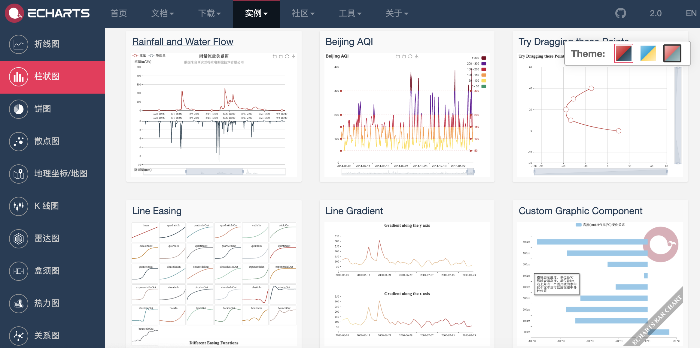

## Introduction to Web Frontend

> **Note**: Some of the illustrations used in this lesson come from Jon Duckett's *[HTML and CSS: Design and Build Websites](https://www.amazon.cn/dp/1118008189/ref=sr_1_5?__mk_zh_CN=%E4%BA%9A%E9%A9%AC%E9%80%8A%E7%BD%91%E7%AB%99&keywords=html+%26+css&qid=1554609325&s=gateway&sr=8-5)*. It is an excellent book for frontend beginners, and interested readers can look for it on Amazon or other sites.

HTML is a language used to describe web pages. Its full name is HyperText Markup Language. The text, buttons, images, videos, and other elements you see when browsing a page are all written in HTML and rendered by the browser.

### A Brief History of HTML

1. October 1991: an informal CERN document first made 18 HTML tags public. The author of that document was physicist Tim Berners-Lee, who is therefore the inventor of the World Wide Web and also the chairman of the W3C.
2. November 1995: HTML 2.0 was released as RFC 1866.
3. January 1997: HTML 3.2 was released as a W3C recommendation.
4. December 1997: HTML 4.0 was released as a W3C recommendation.
5. December 1999: HTML 4.01 was released as a W3C recommendation.
6. January 2008: HTML5 was published by the W3C as a working draft.
7. May 2011: the W3C advanced HTML5 to the Last Call stage.
8. December 2012: the W3C designated HTML5 as a Candidate Recommendation.
9. October 2014: HTML5 was released as a stable W3C recommendation, which meant the standardization of HTML5 had been completed.

#### New Features in HTML5

1. Native multimedia support through the `audio` and `video` tags
2. Programmable content through the `canvas` tag
3. Semantic web tags such as `article`, `aside`, `details`, `figure`, `footer`, `header`, `nav`, `section`, and `summary`
4. New form controls such as calendars, email inputs, search boxes, and sliders
5. Better support for offline storage through `localStorage` and `sessionStorage`
6. Support for geolocation, drag and drop, WebSocket, background tasks, and more

### Using Tags to Carry Content


#### Structure

- `html`
  - `head`
    - `title`
    - `meta`
  - `body`

#### Text

- Headings and paragraphs
  - `h1` to `h6`
  - `p`
- Superscript and subscript
  - `sup`
  - `sub`
- Whitespace collapse
- Line breaks and horizontal rules
  - `br`
  - `hr`
- Semantic tags
  - bold and emphasis: `strong`
  - quotations: `blockquote`
  - abbreviations and acronyms: `abbr` / `acronym`
  - citations: `cite`
  - contact information: `address`
  - inserted and deleted content: `ins` / `del`

#### Lists

- Ordered lists: `ol` / `li`
- Unordered lists: `ul` / `li`
- Definition lists: `dl` / `dt` / `dd`

#### Links

- Page links
- Anchor links
- Action links

#### Images

- Where images are stored

  
- Image size and dimensions
- Choosing the correct image format
  - JPEG
  - GIF
  - PNG
- Vector graphics
- Semantic tags: `figure` / `figcaption`

#### Tables

- Basic table structure: `table` / `tr` / `td` / `th`
- Table titles: `caption`
- Row and column spanning: `rowspan` / `colspan`
- Long tables: `thead` / `tbody` / `tfoot`

#### Forms

- Important attributes: `action` / `method` / `enctype`
- Form controls through the `input` tag and its `type` attribute
  - text box: `text` / password box: `password` / number box: `number`
  - email: `email` / phone: `tel` / date: `date` / slider: `range` / URL: `url` / search: `search`
  - radio buttons: `radio` / checkboxes: `checkbox`
  - file upload: `file` / hidden field: `hidden`
  - submit button: `submit` / image button: `image` / reset button: `reset`
- Drop-down lists: `select` / `option`
- Text areas: `textarea`
- Grouping form elements: `fieldset` / `legend`

#### Audio and Video

- Video formats and players
- Video hosting services
- Preparation work for adding video
- `video` tags and attributes: `autoplay` / `controls` / `loop` / `muted` / `preload` / `src`
- `audio` tags and attributes: `autoplay` / `controls` / `loop` / `muted` / `preload` / `src` / `width` / `height` / `poster`

#### Frames

- Framesets, now obsolete and not recommended: `frameset` / `frame`
- Inline frames: `iframe`

#### Other Basics

- Document types

  ```html
  <!doctype html>
  ```

  ```html
  <!DOCTYPE HTML PUBLIC "-//W3C//DTD HTML 4.01//EN" "http://www.w3.org/TR/html4/strict.dtd">
  ```

  ```html
  <!DOCTYPE HTML PUBLIC "-//W3C//DTD HTML 4.01 Transitional//EN" "http://www.w3.org/TR/html4/loose.dtd">
  ```

- Comments

  ```html
  <!-- This is a comment, and comments cannot be nested -->
  ```

- Attributes
  - `id`: a unique identifier
  - `class`: the class an element belongs to, used to distinguish different elements
  - `title`: extra information for the element, shown as tooltip text on hover
  - `tabindex`: tab-order control
  - `contenteditable`: whether the element is editable
  - `draggable`: whether the element can be dragged

- Block-level elements / inline elements

- Character entities

  

### Using CSS to Render Pages

#### Introduction

- What CSS does
- How CSS works
- Rules, properties, and values

  
- Common selectors

  

#### Color

- How to specify colors
- Color terminology and contrast
- Background colors

#### Text and Fonts

- Text size and font families: `font-size` / `font-family`

  

  
- Weight, style, stretch, and decoration: `font-weight` / `font-style` / `font-stretch` / `text-decoration`

  
- Line height, letter spacing, and word spacing: `line-height` / `letter-spacing` / `word-spacing`
- Alignment and indentation: `text-align` / `text-indent`
- Link styles: `:link` / `:visited` / `:active` / `:hover`
- New CSS3 properties
  - text shadows: `text-shadow`
  - first letter and first line: `:first-letter` / `:first-line`
  - responsive interaction

#### The Box Model

- Controlling box size: `width` / `height`

  
- Borders, margins, and padding: `border` / `margin` / `padding`

  
- Showing and hiding boxes: `display` / `visibility`
- New CSS3 properties
  - border images: `border-image`
  - shadows: `border-shadow`
  - rounded corners: `border-radius`

#### Lists, Tables, and Forms

- List bullets: `list-style`
- Table borders and backgrounds: `border-collapse`
- The appearance of form controls
- Alignment of form controls
- Browser developer tools

#### Images

- Controlling image size with `display: inline-block`
- Aligning images
- Background images: `background` / `background-image` / `background-repeat` / `background-position`

#### Layout

- Controlling element position with `position` / `z-index`
  - normal flow
  - relative positioning
  - absolute positioning
  - fixed positioning
  - floating elements: `float` / `clear`
- Website layout
  - HTML5 layout

    
- Adapting to screen size
  - fixed-width layouts
  - fluid layouts
  - layout grids

### Using JavaScript to Control Behavior

#### Basic JavaScript Syntax

- Statements and comments
- Variables and data types
  - declaration and assignment
  - primitive and complex data types
  - naming rules
- Expressions and operators
  - assignment operators
  - arithmetic operators
  - comparison operators
  - logical operators: `&&`, `||`, `!`
- Branching
  - `if...else...`
  - `switch...case...default...`
- Loops
  - `for`
  - `while`
  - `do...while`
- Arrays
  - creating arrays
  - operating on array elements
- Functions
  - declaring functions
  - calling functions
  - arguments and return values
  - anonymous functions
  - immediately invoked functions

#### Object-Oriented JavaScript

- The concept of objects
- Literal syntax for creating objects
- Member access operators
- Constructor syntax for creating objects
  - the `this` keyword
- Adding and deleting properties
  - the `delete` keyword
- Standard built-in objects
  - `Number` / `String` / `Boolean` / `Symbol` / `Array` / `Function`
  - `Date` / `Error` / `Math` / `RegExp` / `Object` / `Map` / `Set`
  - `JSON` / `Promise` / `Generator` / `Reflect` / `Proxy`

#### BOM

- Properties and methods of the `window` object
- The `history` object
  - `forward()` / `back()` / `go()`
- The `location` object
- The `navigator` object
- The `screen` object

#### DOM

- The DOM tree
- Accessing elements
  - `getElementById()` / `querySelector()`
  - `getElementsByClassName()` / `getElementsByTagName()` / `querySelectorAll()`
  - `parentNode` / `previousSibling` / `nextSibling` / `children` / `firstChild` / `lastChild`
- Operating on elements
  - `nodeValue`
  - `innerHTML` / `textContent` / `createElement()` / `createTextNode()` / `appendChild()` / `insertBefore()` / `removeChild()`
  - `className` / `id` / `hasAttribute()` / `getAttribute()` / `setAttribute()` / `removeAttribute()`
- Event handling
  - event types
    - UI events: `load` / `unload` / `error` / `resize` / `scroll`
    - keyboard events: `keydown` / `keyup` / `keypress`
    - mouse events: `click` / `dbclick` / `mousedown` / `mouseup` / `mousemove` / `mouseover` / `mouseout`
    - focus events: `focus` / `blur`
    - form events: `input` / `change` / `submit` / `reset` / `cut` / `copy` / `paste` / `select`
  - event binding
    - HTML event handlers, not recommended because markup and code are not separated
    - traditional DOM event handlers, which can attach only one callback
    - event listeners, unsupported in very old browsers
  - event flow: capture / bubbling
  - event objects
    - `target`, though some browsers use `srcElement`
    - `type`
    - `cancelable`
    - `preventDefault()`
    - `stopPropagation()`, with `cancelBubble` in older IE
  - mouse-event coordinates
    - screen position: `screenX` and `screenY`
    - page position: `pageX` and `pageY`
    - client position: `clientX` and `clientY`
  - keyboard events
    - the `keyCode` property, or `which` in some browsers
    - `String.fromCharCode(event.keyCode)`
  - HTML5 events
    - `DOMContentLoaded`
    - `hashchange`
    - `beforeunload`

#### JavaScript APIs

- Client storage: `localStorage` and `sessionStorage`

  ```javascript
  localStorage.colorSetting = '#a4509b';
  localStorage['colorSetting'] = '#a4509b';
  localStorage.setItem('colorSetting', '#a4509b');
  ```

- Geolocation

  ```javascript
  navigator.geolocation.getCurrentPosition(function(pos) {
      console.log(pos.coords.latitude)
      console.log(pos.coords.longitude)
  })
  ```

- Fetch API for getting data from a server
- The `<canvas>` API for drawing graphics
- The `<audio>` and `<video>` APIs for multimedia

### Frontend Frameworks

#### A Progressive Framework: [Vue.js](https://cn.vuejs.org/)

This is the framework of choice for frontend rendering in frontend-backend separated development.

##### Quick Start

1. Include Vue's JavaScript file. We still recommend loading it from a CDN.

   ```html
   <script src="https://cdn.jsdelivr.net/npm/vue"></script>
   ```

2. Data binding, also called declarative rendering.

   ```html
   <div id="app">
       <h1>{{ product }} inventory information</h1>
   </div>

   <script src="https://cdn.jsdelivr.net/npm/vue"></script>
   <script>
       const app = new Vue({
           el: '#app',
           data: {
               product: 'iPhone X'
           }
       });
   </script>
   ```

3. Conditions and loops.

   ```html
   <div id="app">
       <h1>Inventory information</h1>
       <hr>
       <ul>
           <li v-for="product in products">
               {{ product.name }} - {{ product.quantity }}
               <span v-if="product.quantity === 0">
                   Sold out
               </span>
           </li>
       </ul>
   </div>
   
   <script src="https://cdn.jsdelivr.net/npm/vue"></script>
   <script>
       const app = new Vue({
           el: '#app',
           data: {
               products: [
                   {"id": 1, "name": "iPhone X", "quantity": 20},
                   {"id": 2, "name": "Huawei Mate20", "quantity": 0},
                   {"id": 3, "name": "Xiaomi Mix3", "quantity": 50}
               ]
           }
       });
   </script>
   ```

4. Computed properties.

   ```html
   <div id="app">
       <h1>Inventory information</h1>
       <hr>
       <ul>
           <li v-for="product in products">
               {{ product.name }} - {{ product.quantity }}
               <span v-if="product.quantity === 0">
                   Sold out
               </span>
           </li>
       </ul>
       <h2>Total inventory: {{ totalQuantity }}</h2>
   </div>

   <script src="https://cdn.jsdelivr.net/npm/vue"></script>
   <script>
       const app = new Vue({
           el: '#app',
           data: {
               products: [
                   {"id": 1, "name": "iPhone X", "quantity": 20},
                   {"id": 2, "name": "Huawei Mate20", "quantity": 0},
                   {"id": 3, "name": "Xiaomi Mix3", "quantity": 50}
               ]
           },
           computed: {
               totalQuantity() {
                   return this.products.reduce((sum, product) => {
                       return sum + product.quantity
                   }, 0);
               }
           }
       });
   </script>
   ```

5. Handling events.

   ```html
   <div id="app">
       <h1>Inventory information</h1>
       <hr>
       <ul>
           <li v-for="product in products">
               {{ product.name }} - {{ product.quantity }}
               <span v-if="product.quantity === 0">
                   Sold out
               </span>
               <button @click="product.quantity += 1">
                   Increase inventory
               </button>
           </li>
       </ul>
       <h2>Total inventory: {{ totalQuantity }}</h2>
   </div>

   <script src="https://cdn.jsdelivr.net/npm/vue"></script>
   <script>
       const app = new Vue({
           el: '#app',
           data: {
               products: [
                   {"id": 1, "name": "iPhone X", "quantity": 20},
                   {"id": 2, "name": "Huawei Mate20", "quantity": 0},
                   {"id": 3, "name": "Xiaomi Mix3", "quantity": 50}
               ]
           },
           computed: {
               totalQuantity() {
                   return this.products.reduce((sum, product) => {
                       return sum + product.quantity
                   }, 0);
               }
           }
       });
   </script>
   ```

6. User input.

   ```html
   <div id="app">
       <h1>Inventory information</h1>
       <hr>
       <ul>
           <li v-for="product in products">
               {{ product.name }} -
               <input type="number" v-model.number="product.quantity" min="0">
               <span v-if="product.quantity === 0">
                   Sold out
               </span>
               <button @click="product.quantity += 1">
                   Increase inventory
               </button>
           </li>
       </ul>
       <h2>Total inventory: {{ totalQuantity }}</h2>
   </div>

   <script src="https://cdn.jsdelivr.net/npm/vue"></script>
   <script>
       const app = new Vue({
           el: '#app',
           data: {
               products: [
                   {"id": 1, "name": "iPhone X", "quantity": 20},
                   {"id": 2, "name": "Huawei Mate20", "quantity": 0},
                   {"id": 3, "name": "Xiaomi Mix3", "quantity": 50}
               ]
           },
           computed: {
               totalQuantity() {
                   return this.products.reduce((sum, product) => {
                       return sum + product.quantity
                   }, 0);
               }
           }
       });
   </script>
   ```

7. Load JSON data through the network.

   ```html
   <div id="app">
       <h2>Inventory information</h2>
       <ul>
           <li v-for="product in products">
               {{ product.name }} - {{ product.quantity }}
               <span v-if="product.quantity === 0">
                   Sold out
               </span>
           </li>
       </ul>
   </div>

   <script src="https://cdn.jsdelivr.net/npm/vue"></script>
   <script>
       const app = new Vue({
           el: '#app',
           data: {
               products: []
           },
           created() {
               fetch('https://jackfrued.top/api/products')
                   .then(response => response.json())
                   .then(json => {
                       this.products = json
                   });
           }
       });
   </script>
   ```

##### Using the Scaffolding Tool - `vue-cli`

Vue provides the very convenient scaffolding tool `vue-cli` for commercial project development. Through this tool, we can skip the steps of manually configuring the development environment, test environment, and run environment, and let developers only need to care about the problem to be solved.

1. Install the scaffolding tool.
2. Create the project.
3. Install dependency packages.
4. Run the project.

#### UI Framework - [Element](http://element-cn.eleme.io/#/zh-CN)

Desktop component library based on Vue 2.0, used to build user interface, and supports responsive layout.

1. Import the CSS and JavaScript files of Element.

   ```html
   <!-- Import style -->
   <link rel="stylesheet" href="https://unpkg.com/element-ui/lib/theme-chalk/index.css">
   <!-- Import component library -->
   <script src="https://unpkg.com/element-ui/lib/index.js"></script>
   ```

2. A simple example.

   ```html
   <!DOCTYPE html>
   <html>
       <head>
           <meta charset="UTF-8">
           <link rel="stylesheet" href="https://unpkg.com/element-ui/lib/theme-chalk/index.css">
       </head>
       <body>
           <div id="app">
               <el-button @click="visible = true">Click me</el-button>
               <el-dialog :visible.sync="visible" title="Hello world">
                   <p>Start using Element</p>
               </el-dialog>
           </div>
       </body>
       <script src="https://unpkg.com/vue/dist/vue.js"></script>
       <script src="https://unpkg.com/element-ui/lib/index.js"></script>
       <script>
           new Vue({
               el: '#app',
               data: {
                   visible: false,
               }
           })
       </script>
   </html>
   ```

3. Use components.

   ```html
   <!DOCTYPE html>
   <html>
       <head>
           <meta charset="UTF-8">
           <link rel="stylesheet" href="https://unpkg.com/element-ui/lib/theme-chalk/index.css">
       </head>
       <body>
           <div id="app">
               <el-table :data="tableData" stripe style="width: 100%">
                   <el-table-column prop="date" label="Date" width="180">
                   </el-table-column>
                   <el-table-column prop="name" label="Name" width="180">
                   </el-table-column>
                   <el-table-column prop="address" label="Address">
                   </el-table-column>
               </el-table>
           </div>
       </body>
       <script src="https://unpkg.com/vue/dist/vue.js"></script>
       <script src="https://unpkg.com/element-ui/lib/index.js"></script>
       <script>
           new Vue({
               el: '#app',
               data: {
                   tableData:  [
                       {
                           date: '2016-05-02',
                           name: 'Wang Yiba',
                           address: 'Lane 1518, Jinshajiang Road, Putuo District, Shanghai'
                       },
                       {
                           date: '2016-05-04',
                           name: 'Liu Ergou',
                           address: 'Lane 1517, Jinshajiang Road, Putuo District, Shanghai'
                       },
                       {
                           date: '2016-05-01',
                           name: 'Yang Sanmeng',
                           address: 'Lane 1519, Jinshajiang Road, Putuo District, Shanghai'
                       },
                       {
                           date: '2016-05-03',
                           name: 'Chen Sichui',
                           address: 'Lane 1516, Jinshajiang Road, Putuo District, Shanghai'
                       }
                   ]
               }
           })
       </script>
   </html>
   ```

#### Chart Framework - [ECharts](https://echarts.baidu.com)

An open source visualization library made by Baidu, often used to generate many types of charts.



#### CSS Framework Based on Flexbox - [Bulma](https://bulma.io/)

Bulma is a modern CSS framework based on Flexbox. Its original intention is mobile first, modular design. It can be easily used to implement many simple or complex content layouts. Even developers who do not understand CSS can use it to customize beautiful pages.

```html
<!DOCTYPE html>
<html lang="en">
<head>
    <meta charset="UTF-8">
    <title>Bulma</title>
    <link href="https://cdn.bootcss.com/bulma/0.7.4/css/bulma.min.css" rel="stylesheet">
    <style type="text/css">
        div { margin-top: 10px; }
        .column { color: #fff; background-color: #063; margin: 10px 10px; text-align: center; }
    </style>
</head>
<body>
    <div class="columns">
        <div class="column">1</div>
        <div class="column">2</div>
        <div class="column">3</div>
        <div class="column">4</div>
    </div>
    <div>
        <a class="button is-primary">Primary</a>
        <a class="button is-link">Link</a>
        <a class="button is-info">Info</a>
        <a class="button is-success">Success</a>
        <a class="button is-warning">Warning</a>
        <a class="button is-danger">Danger</a>
    </div>
    <div>
        <progress class="progress is-danger is-medium" max="100">60%</progress>
    </div>
    <div>
        <table class="table is-hoverable">
            <tr>
                <th>One</th>
                <th>Two</th>
            </tr>
            <tr>
                <td>Three</td>
                <td>Four</td>
            </tr>
            <tr>
                <td>Five</td>
                <td>Six</td>
            </tr>
            <tr>
                <td>Seven</td>
                <td>Eight</td>
            </tr>
            <tr>
                <td>Nine</td>
                <td>Ten</td>
            </tr>
            <tr>
                <td>Eleven</td>
                <td>Twelve</td>
            </tr>
        </table>
    </div>
</body>
</html>
```

#### Responsive Layout Framework - [Bootstrap](http://www.bootcss.com/)

Frontend framework used to quickly develop Web applications, and it supports responsive layout.

1. Features
   - Supports mainstream browsers and mobile devices
   - Easy to get started
   - Responsive design

2. Content
   - Grid system
   - Wrapped CSS
   - Ready-made components
   - JavaScript plugins

3. Visualization

   
