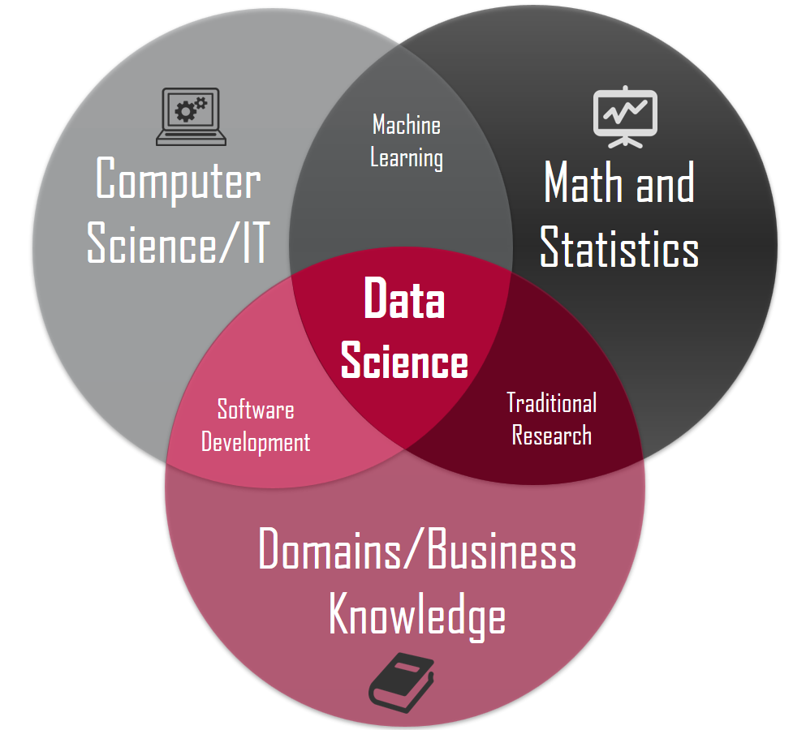

## Overview of Data Analysis

In today's world, every industry depends more and more on information technology. A huge amount of data is produced every day. We often feel that there is more and more data, but it is harder and harder to find useful information from it. The information mentioned here can be understood as the result after processing a dataset. It is something extracted from the dataset that can support and guide decision-making. The process of **extracting valuable information from raw data** is called **data analysis**, and it is an important part of data science.

> **Definition 1**: Data analysis is the science of purposefully collecting, processing, organizing, exploring, analyzing, presenting, and explaining data by using statistics, mining, and other techniques.
>
> **Definition 2**: Data analysis is the activity of collecting, organizing, and analyzing data, extracting valuable information and insights from it, and using them to support decisions and optimize processes. (GPT-4o)
>
> **Definition 3**: Data analysis is the process of systematically collecting, organizing, processing, examining, and explaining data, extracting valuable information from it, forming conclusions, and supporting decisions. Its core is to use statistics, algorithms, and logical methods to reveal the patterns, trends, or relationships behind the data. (DeepSeek)

For people who want to do data-analysis work, there are two parts of skills that need to be mastered. One is "data thinking" and the other is "analysis tools", as shown in the figure below.

In the figure above, the tools part is actually easier to master. Programming languages such as SQL and Python can be handled by most people after systematic study and a proper amount of practice. Business-intelligence tools such as Power BI and Tableau are even easier to start with, because we can finish data visualization and then produce business insights by using drag-and-drop operations. On the contrary, the data-thinking part is not easy for most beginners. For example, many people have studied courses such as probability and statistics at school, but when they face real business scenarios, they still find it hard to map that knowledge to the business problem and solve real problems. Also, if we do not master basic analysis methods, do not understand common analysis models, and do not have related business knowledge, then even if we get a lot of useful data, we still may not know where to start, let alone discover business insights and business value. So for this data-thinking part, besides systematic study, we also need constant accumulation and practice in real business scenarios.

### Responsibilities of a Data Analyst

When HR publishes job requirements, positions such as data engineering, data analysis, and data mining are often all called data-analysis positions. But according to the nature of the work, they can still be divided into **data governance**, which is more engineering-oriented, **business analysis**, which is more business-oriented, **data mining**, which is more algorithm-oriented, **data development**, which is more application-oriented, and **data product manager**, which is more product-oriented. When we usually say "data analyst", we mostly mean **business data analyst**. Many data analysts start their career from this role, and this role is also the one with the largest number of openings.

Some companies place business data analysts inside a specific business department, such as marketing, operations, or product. Some companies have a dedicated data department, such as a data-analysis team or data-science team. Some companies let data analysts directly serve top-level decision-making, so they belong to the corporate strategy department. Because of this, when you see titles such as **data operations**, **business analyst**, or **BI engineer** on job websites, you should not feel surprised. Usually, the job description for a business data analyst looks like this:

1. Be responsible for producing related reports.
2. Build and optimize the metric system.
3. Monitor data fluctuations and anomalies, and find problems.
4. Optimize and drive the business and promote digital operations.
5. Find the possible room for market and product growth.

From the description above, we can see that the work of a business data analyst is not to give a simple and shallow conclusion. It is to combine the company's business with work such as **monitoring data**, **finding anomalies**, **finding reasons**, and **exploring trends**. No matter whether you use Python, Excel, Tableau, SPSS, or some other business-intelligence tool, the tool is only a means to reach the goal. **Data thinking is the core skill**, and starting from a real business problem and finally **finding the business value in data** is the final goal.

In many companies, data analyst is only an entry-level position. A data analyst who understands the business very well can develop toward management positions such as **data analysis manager** or **director of data operations**. A data analyst who is familiar with machine-learning algorithms can develop toward **data mining engineer** or **algorithm expert**. These roles not only need related mathematics and statistics knowledge, but also require stronger programming ability than an ordinary data analyst, and may also need experience in big-data storage and processing.

Let me also briefly mention several other directions. A data-governance position mainly helps a company build a data warehouse or data lake, so that data can be moved from business systems, tracking systems, and logging systems into the data warehouse or data lake, providing infrastructure for later data analysis and mining. These positions have high requirements for SQL and HiveSQL, require skilled use of ETL tools, and also need a good understanding of the Hadoop ecosystem. As for a data product manager, besides the traditional product-manager skill stack, they also need strong technical ability. For example, they should understand common recommendation algorithms and machine-learning models, be able to provide a basis for improving algorithms, and be able to set rules and standards for tracking points. They do not need to be experts in every algorithm, but they need to think about the implementation of data models, metrics, and algorithms from the product side.

### Skill Stack of a Data Analyst

The skill stack of a data analyst also includes hard skills and soft skills. The following is only my own understanding of this role, for reference only.

1. Computer science (data-analysis tools, programming languages, databases)
2. Mathematics and statistics (data thinking, statistical thinking)
3. Artificial intelligence (machine-learning and deep-learning algorithms)
4. Ability to understand the business (communication, expression, experience)
5. Ability to summarize and present (summary, reporting, business PPT)

Of course, for a beginner, it is impossible to master the whole skill stack in a short time. But as the work goes deeper, you will more or less touch all the things mentioned above. You can go deeper into one or some of these skills according to the actual needs of your work.

### General Process of Data Analysis

When we mention data analysis, many times we actually mean **data analysis in a narrow sense**. The main goal of this kind of work is to generate visual reports and use these reports to discover problems in the business. This type of work is usually lagging. **Data analysis in a broad sense** also includes the data-mining part. It not only uses data to monitor and analyze the business, but also uses machine-learning algorithms to find the knowledge hidden behind the data, and then uses that knowledge to support future decisions, so it has some forward-looking value.

Basic data-analysis work usually includes the following parts, although they may differ a little because of different industries and job contents.

1. Determine the goal (input): understand the business and determine the metric definition.
2. Get data: data warehouse, spreadsheets, third-party interfaces, web crawlers, open datasets, and so on.
3. Clean data: deal with missing values, duplicated values, outliers, and other preprocessing tasks such as formatting, discretization, and binarization.
4. Pivot data: sorting, statistics, group aggregation, crosstabs, pivot tables, and so on.
5. Present data (output): data visualization and publishing work results, such as a data-analysis report.
6. Analysis and insight (follow-up): explain data changes and propose corresponding plans.

Deeper data-mining work usually includes the following parts, although they may also differ a little because of different industries and job contents.

1. Determine the goal (input): understand the business and make the mining target clear.
2. Data preparation: data collection, data description, data exploration, quality judgment, and so on.
3. Data processing: extracting data, cleaning data, data transformation, special encoding, dimensionality reduction, feature selection, and so on.
4. Data modeling: model comparison, model selection, and algorithm application.
5. Model evaluation: cross-validation, parameter tuning, and result evaluation.
6. Model deployment (output): putting the model into use, improving the business, monitoring operations, and writing reports.

### Libraries Related to Data Analysis

Using Python for data-analysis work is a very good choice. First, Python is very easy to start with. Second, in the whole Python ecosystem, there are many mature software packages and tool libraries for data science. Unlike some other programming languages for data science, such as Julia and R, Python can be used not only for data science but also for many other things.

#### The classic three great tools

1. [NumPy](https://numpy.org/): supports common array and matrix operations. Through the `ndarray` class, it wraps multidimensional arrays and provides methods and functions to operate on them. Because NumPy has built-in parallel-computing ability, when a multi-core CPU is used, NumPy can automatically do parallel computation.
2. [Pandas](https://pandas.pydata.org/): the core of pandas is its special data structures `DataFrame` and `Series`. This lets pandas handle tables and time series that contain different kinds of data, which NumPy's `ndarray` cannot do. With pandas, we can easily load many forms of data and then do slicing, chunking, reshaping, cleaning, aggregation, and presentation.
3. [Matplotlib](https://matplotlib.org/): matplotlib is a library that contains many plotting modules and can create high-quality charts from the data we provide. In addition, matplotlib also provides the `pylab` module, which contains many plotting components similar to [MATLAB](https://www.mathworks.com/products/matlab.html).

#### Other related libraries

1. [SciPy](https://scipy.org/): improves NumPy and wraps many scientific-computing algorithms, including linear algebra, statistical tests, sparse matrices, signal and image processing, optimization problems, fast Fourier transform, and so on.
2. [Polars](https://pola.rs/): a high-performance data-analysis library designed to provide faster data operations than pandas. It supports large-scale data processing and can use multi-core CPUs to speed up computation. It can replace pandas when working with very large datasets.
3. [Seaborn](https://seaborn.pydata.org/): a graphical visualization tool built on top of matplotlib. Although pretty statistical charts can be made directly with matplotlib, it is still not simple and convenient enough overall. Seaborn can be understood as an extra wrapper over matplotlib, letting users make attractive statistical charts in a simpler and more effective way.
4. [Scikit-learn](https://scikit-learn.org/): originally part of SciPy. It provides many tools that may be needed in machine learning, including data preprocessing, supervised learning (classification and regression), unsupervised learning (clustering), model selection, cross-validation, and so on.
5. [Statsmodels](https://www.statsmodels.org/stable/index.html): a library that contains classic statistics and econometrics algorithms, helping users do tasks such as data exploration, regression analysis, and hypothesis testing.
6. [PySpark](https://spark.apache.org/): the Python version of Apache Spark, a big-data processing engine, used for large-scale data processing and distributed computing. It can efficiently clean, transform, and analyze data in a distributed environment.
7. [TensorFlow](https://www.tensorflow.org/): an open-source deep-learning framework developed by Google. It is mainly used for deep-learning tasks and is often used to build and train machine-learning models, especially complex neural-network models.
8. [Keras](https://keras.io/): a high-level neural-network API mainly used to build and train deep-learning models. Keras is suitable for beginners and researchers in deep learning, because it makes building and training neural networks simpler.
9. [PyTorch](https://pytorch.org/): an open-source deep-learning framework developed by Facebook and widely used in research and production. PyTorch is a very popular framework in deep-learning research and is widely used in fields such as computer vision and natural-language processing.
10. [NLTK](https://www.nltk.org/) / [SpaCy](https://spacy.io/): libraries for natural-language processing (NLP).
