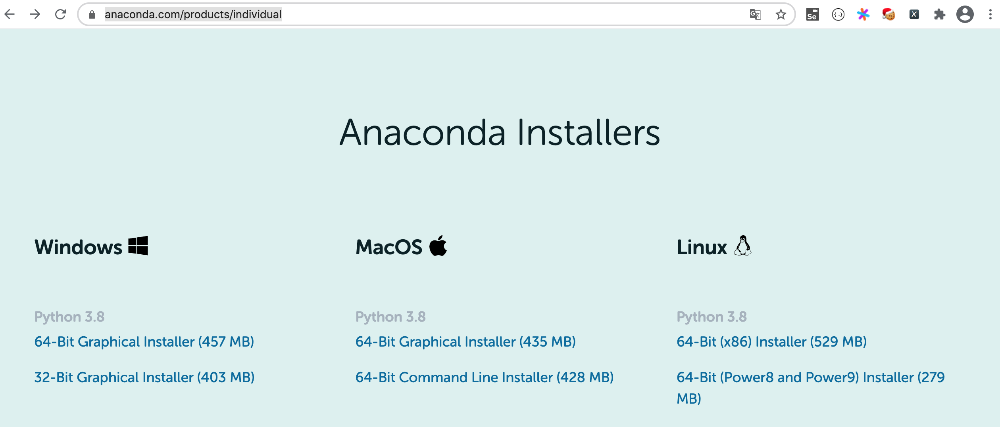
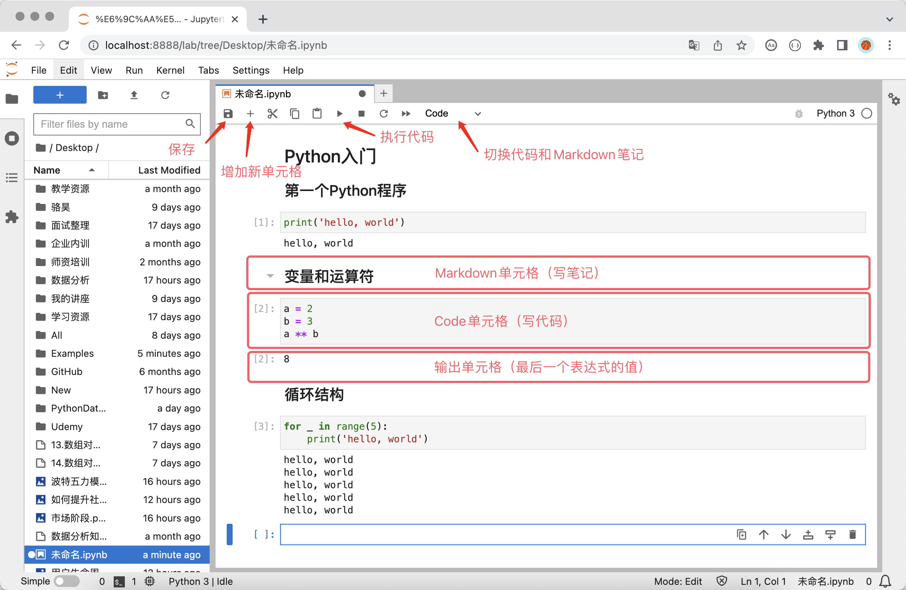
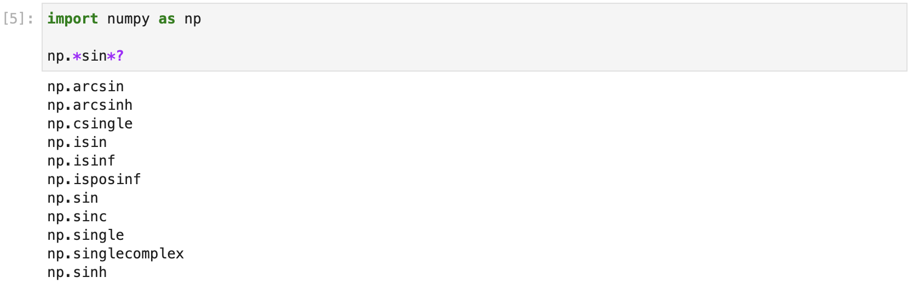

## Environment Setup

If you want to quickly start using Python for data-science related work, it is recommended that you directly install Anaconda, and then use the Notebook or JupyterLab tool integrated in Anaconda to write code. For beginners, installing the official Python interpreter first and then installing the third-party libraries needed for work one by one is quite troublesome. Especially on Windows, installation often fails because build tools or DLL files are missing, and beginners usually cannot take the correct action according to the error message, so they can easily feel frustrated. If you already have a Python environment on your computer, you can also directly use Python's package-management tool `pip` to install Jupyter, and then install third-party libraries according to actual work needs. This method is more suitable for users with some experience.

### Installing and Using Anaconda

For individual users, you can download the "Individual Edition" installer from the [official Anaconda website](https://www.anaconda.com/). After installation, your computer will have not only a Python environment and Spyder, which is similar to an IDE like PyCharm, but also nearly 200 tool packages related to data-science work, including the three great tools of Python data analysis mentioned above. Besides that, Anaconda also provides a package-management tool called `conda`. With this tool, you can not only manage Python packages, but also create virtual environments for running Python programs.



As shown in the picture above, you can use the download link provided on the Anaconda website to choose an installer suitable for your operating system. It is recommended that you choose the graphical installer. After downloading, double-click the installer to start the installation. During installation, the default settings are usually fine. After installation is complete, macOS users can find an application named `Anaconda-Navigator` in Applications or Launchpad. Running this application will show an interface like the one below, where we can choose the action we want to perform.


For Windows users, it is recommended to follow the prompts and suggested options in the installation wizard when installing Anaconda. There is basically nothing to choose except the installation path. After installation, you can find `Anaconda3` in the Start Menu.

> **Tip**: You can choose Miniconda as an alternative to Anaconda. Miniconda only installs the Python interpreter and some necessary tools, while other third-party libraries are installed by the user when needed. **Actually, I personally do not like Anaconda very much, because it is made for beginner users. Once we already have a Python environment, we can completely install the third-party libraries we need according to our own wishes.**

#### `conda` commands

For users who are not beginners, if you want to use `conda` to manage dependencies or create virtual environments for projects, you can use `conda` commands in the terminal or command prompt. Windows users can find `Anaconda3` in the Start Menu, then click `Anaconda Prompt` or `Anaconda PowerShell` to start a command-line environment that supports `conda`. If beginner users want to create new virtual environments or manage third-party libraries, it is recommended that they directly use `Environments` in `Anaconda-Navigator` to manage virtual environments and dependencies visually.

1. Version and help information.

   - Check the version: `conda -V` or `conda --version`
   - Get help: `conda -h` or `conda --help`
   - Related information: `conda list`

2. Virtual-environment related commands.

   - Show all virtual environments: `conda env list`
   - Create a virtual environment: `conda create --name venv`
   - Create a virtual environment with a specified Python version: `conda create --name venv python=3.7`
   - Create a virtual environment with a specified Python version and install specified dependencies: `conda create --name venv python=3.7 numpy pandas`
   - Create a virtual environment by cloning an existing one: `conda create --name venv2 --clone venv`
   - Share a virtual environment and redirect it to a specified file: `conda env export > environment.yml`
   - Create a virtual environment from the shared environment file: `conda env create -f environment.yml`
   - Activate a virtual environment: `conda activate venv`
   - Leave a virtual environment: `conda deactivate`
   - Delete a virtual environment: `conda remove --name venv --all`

   > **Note**: In the commands above, `venv` and `venv2` are the folder names of the virtual environments. You can replace them with any name you like, but it is **strongly recommended** to use English names and not use special characters.

3. Package management.

   - Show installed packages: `conda list`
   - Search for a package: `conda search matplotlib`
   - Install a package: `conda install matplotlib`
   - Update a package: `conda update matplotlib`
   - Remove a package: `conda remove matplotlib`

   > **Note**: When searching, installing, or updating packages, `conda` connects to the official website by default. If the speed is not good enough, you can replace the official source with a domestic mirror site. The Tsinghua University open-source mirror is a common choice. The commands for changing the default source are `conda config --add channels https://mirrors.tuna.tsinghua.edu.cn/anaconda/pkgs/free/` and `conda config --add channels https://mirrors.tuna.tsinghua.edu.cn/anaconda/pkgs/main`. If you want to switch back to the default source, you can use `conda config --remove-key channels`.

### Installing and Using JupyterLab

#### Install and start

If Anaconda is already installed, you can start Notebook or JupyterLab directly from `Anaconda-Navigator` as mentioned above. According to the official statement, JupyterLab is the next generation of Notebook. It provides a friendlier interface and stronger functions, so we also recommend that everyone use JupyterLab. Windows users can also open `Anaconda Prompt` or `Anaconda PowerShell` from the Start Menu. Because the default Anaconda virtual environment is already activated, you only need to enter the command `jupyter lab` to start JupyterLab. On macOS, after installing Anaconda, the default Anaconda environment is automatically activated each time you open the terminal, so you can also start JupyterLab by entering `jupyter lab`.

For users who have installed Python but not Anaconda, you can use Python's package-management tool `pip` to install JupyterLab. After the installation succeeds, execute the command `jupyter lab` in the terminal or command prompt to start JupyterLab, as shown below.

Install JupyterLab:

```bash
pip install jupyterlab
```

Install the three great tools of Python data analysis:

```bash
pip install numpy pandas matplotlib
```

Start JupyterLab:

```bash
jupyter lab
```

JupyterLab is a web-based application for interactive computing. It can be used for code development, document writing, code execution, and result presentation. Simply speaking, you can directly **write code** and **run code** in the web page, and the result of the code will also be shown directly under the code cell. If you need to write explanatory documents while writing code, you can write them in Markdown on the same page and directly see the rendered effect. In addition, Notebook was originally designed to provide a working environment that can support many programming languages. At present, it supports more than 40 programming languages, including Python, R, Julia, Scala, and so on.

First, we can create a Notebook for writing Python code, as shown below.


Next, we can write code, write documents, and run programs, as shown below.



#### Usage tips

If you use Python for engineering-style project development, PyCharm is definitely a very good choice. It provides almost all the functions that an integrated development environment should have. Smart hints, code completion, and automatic error correction all make developers feel very comfortable. If you use Python for data-science related work, JupyterLab is not worse than PyCharm. JupyterLab is even better at presenting data and charts. Because of this, JetBrains also developed a new tool called DataSpell to compare with JupyterLab. Interested readers can learn about it by themselves. Below we will introduce some usage tips for JupyterLab, hoping they can help improve your work efficiency.

1. Auto-completion. When writing code in JupyterLab, pressing the `Tab` key gives code hints and completion.

2. Get help. If you want to know related information or usage of an object such as a variable, class, or function, you can put `?` after the object and run the code. The corresponding information will be shown below the window, helping us understand the object, as shown below.

   

3. Search by name. If you only remember part of the name of a class or function, you can use the wildcard `*` together with `?` to search, as shown below.

   

4. Run commands. In JupyterLab, we can execute system commands by putting `!` before the system command.

5. Magic commands. There are many interesting and useful magic commands in JupyterLab. For example, you can use `%timeit` to test how long a statement takes to run, and `%pwd` to check the current working directory. If you want to see all magic commands, you can use `%lsmagic`. If you want to understand how magic commands are used, you can use `%magic`, as shown below.

   

   Common magic commands are shown below.

   | Magic Command                                | Description |
   | -------------------------------------------- | ----------- |
   | `%pwd`                                       | Show the current working directory |
   | `%ls`                                        | List the contents of the current or specified folder |
   | `%cat`                                       | Show the contents of the specified file |
   | `%hist`                                      | Show input history |
   | `%matplotlib inline`                         | Embed matplotlib output charts in the page |
   | `%config Inlinebackend.figure_format='svg'`  | Set charts to use SVG format |
   | `%run`                                       | Run the specified program |
   | `%load`                                      | Load the specified file into a cell |
   | `%quickref`                                  | Show the IPython quick reference |
   | `%timeit`                                    | Run code many times and count execution time |
   | `%prun`                                      | Run code with `cProfile.run` and show profiler output |
   | `%who` / `%whos`                             | Show variables in the namespace |
   | `%xdel`                                      | Delete an object and clear all references to it |

6. Shortcuts. Many operations in JupyterLab can be done with shortcuts, and using shortcuts can improve efficiency. JupyterLab shortcuts can be divided into shortcuts in command mode and shortcuts in edit mode. Edit mode means the mode where you are entering code or writing documents. Press `Esc` in edit mode to go back to command mode. Press `Enter` in command mode to enter edit mode.

   Shortcuts in command mode:

   | Shortcut                                     | Description |
   | -------------------------------------------- | ----------- |
   | `Alt` + `Enter`                              | Run the current cell and insert a new cell below |
   | `Shift` + `Enter`                            | Run the current cell and select the cell below |
   | `Ctrl` + `Enter`                             | Run the current cell |
   | `j` / `k`, `Shift` + `j` / `Shift` + `k`     | Select the cell below / above, or select cells continuously |
   | `a` / `b`                                    | Insert a new cell above / below |
   | `c` / `x`                                    | Copy a cell / cut a cell |
   | `v` / `Shift` + `v`                          | Paste a cell below / above |
   | `dd` / `z`                                   | Delete a cell / restore a deleted cell |
   | `Shift` + `l`                                | Show or hide line numbers for the current or all cells |
   | `Space` / `Shift` + `Space`                  | Scroll the page down / up |

   Shortcuts in edit mode:

   | Shortcut                     | Description |
   | ---------------------------- | ----------- |
   | `Shift` + `Tab`              | Show hint information |
   | `Ctrl` + `]` / `Ctrl` + `[`  | Increase / decrease indentation |
   | `Alt` + `Enter`              | Run the current cell and insert a new cell below |
   | `Shift` + `Enter`            | Run the current cell and select the cell below |
   | `Ctrl` + `Enter`             | Run the current cell |
   | `Ctrl` + `Left` / `Right`    | Move the cursor to the start / end of the line |
   | `Ctrl` + `Up` / `Down`       | Move the cursor to the start / end of the code |
   | `Up` / `Down`                | Move the cursor up / down one line or to the previous / next cell |

   > **Note**: On macOS, you can replace the `Alt` key with `Option`, and replace the `Ctrl` key with `Command`.
