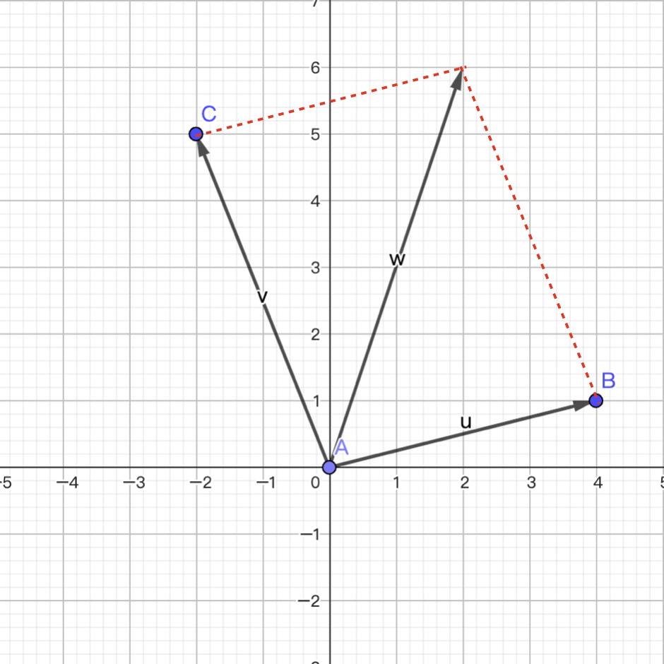

## NumPy Applications - 4

### Vectors

A **vector** is also called a **directed quantity**. It is a geometric object that has both magnitude and direction and satisfies the parallelogram law. The concept opposite to a vector is a **scalar**, which only has magnitude and in most cases has no direction. We usually use a line segment with an arrow to represent a vector. Vectors in the Cartesian plane are shown below. It should be noted that a vector expresses magnitude and direction, and it does not specify a start point or end point, so the same vector can be drawn at any position. For example, the two vectors $\small{\boldsymbol{w}}$ and $\small{\boldsymbol{u}}$ in the figure below are actually no different.


There are many algebraic ways to represent a vector. For a vector in two-dimensional space, the following notations are all acceptable:

$$
\boldsymbol{a} = \langle a_1, a_2 \rangle = (a_1, a_2) = \begin{pmatrix} a_1 \\\\ a_2 \end{pmatrix} = \begin{bmatrix} a_1 \\\\ a_2 \end{bmatrix}
$$

The size of a vector is called its norm, and it is a scalar. For a vector in two-dimensional space, its norm can be calculated with the formula below:

$$
\lvert \boldsymbol{a} \rvert = \sqrt{a_{1}^{2} + a_{2}^{2}}
$$

Notice that $\small{\lvert \boldsymbol{a} \rvert}$ here is not an absolute value. You can call it the Euclidean norm, or the 2-norm, of vector $\small{\boldsymbol{a}}$. This is an example of symbol reuse in mathematics. The notation and concept above can be extended to $\small{n}$-dimensional space. We usually use $\small{\boldsymbol{R^{n}}}$ to represent $\small{n}$-dimensional space. The two-dimensional space just mentioned can be written as $\small{\boldsymbol{R^{2}}}$, and three-dimensional space can be written as $\small{\boldsymbol{R^{3}}}$. Although it is hard for us, who live in three-dimensional space, to imagine four-dimensional space or five-dimensional space, that does not stop us from discussing higher-dimensional space. In machine learning, we often call a training sample with $\small{n}$ features an $\small{n}$-dimensional vector.

#### Vector addition

Vectors of the same dimension can be added to produce a new vector. The operation is to add the corresponding components of the vectors, as shown below:

$$
\boldsymbol{u} = \begin{bmatrix} u_1 \\\\ u_2 \\\\ \vdots \\\\ u_n \end{bmatrix}, \quad
\boldsymbol{v} = \begin{bmatrix} v_1 \\\\ v_2 \\\\ \vdots \\\\ v_n \end{bmatrix}, \quad
\boldsymbol{u} + \boldsymbol{v} = \begin{bmatrix} u_1 + v_1 \\\\ u_2 + v_2 \\\\ \vdots \\\\ u_n + v_n \end{bmatrix}
$$

Vector addition satisfies the parallelogram law. In other words, if vectors $\small{\boldsymbol{u}}$ and $\small{\boldsymbol{v}}$ form two adjacent sides of a parallelogram, their sum is the diagonal of that parallelogram, as shown below.



#### Scalar multiplication of a vector

A vector $\small{\boldsymbol{v}}$ can be multiplied by a scalar $\small{k}$. The operation is to multiply each component in the vector by that scalar, as shown below:

$$
\boldsymbol{v} = \begin{bmatrix} v_1 \\\\ v_2 \\\\ \vdots \\\\ v_n \end{bmatrix}, \quad
k \cdot \boldsymbol{v} = \begin{bmatrix} k \cdot v_1 \\\\ k \cdot v_2 \\\\ \vdots \\\\ k \cdot v_n \end{bmatrix}
$$

We can use NumPy arrays to represent vectors. Vector addition can be done by adding two arrays, and scalar multiplication of a vector can be done by multiplying an array by a scalar, so we will not repeat that here.

#### Dot product of vectors

The dot product is one of the most important operations between two vectors. The operation is to multiply corresponding components and then add the products together, so the result of a dot product is a scalar. Geometrically, it is equal to the product of the norms of the two vectors multiplied by the cosine of the angle between them.

$$
\boldsymbol{u} = \begin{bmatrix} u_1 \\\\ u_2 \\\\ \vdots \\\\ u_n \end{bmatrix}, \quad
\boldsymbol{v} = \begin{bmatrix} v_1 \\\\ v_2 \\\\ \vdots \\\\ v_n \end{bmatrix}
$$

$$
\boldsymbol{u} \cdot \boldsymbol{v} = \sum_{i=1}^{n}{u_iv_i} = \lvert \boldsymbol{u} \rvert \lvert \boldsymbol{v} \rvert cos\theta
$$

Suppose we use a three-dimensional vector to represent a user's preference for comedy, romance, and action movies. We use numbers from 1 to 5 to represent the degree of liking, where 5 means like very much, 4 means like, 3 means neutral, 2 means dislike, and 1 means strongly dislike. Then the vector below represents a user who likes comedy very much, strongly dislikes romance, and feels neutral about action movies.

$$
\boldsymbol{u} = \begin{pmatrix} 5 \\\\ 1 \\\\ 3 \end{pmatrix}
$$

Now suppose two movies are released. One is a romantic comedy, and the other is a comedy action movie. We also represent these two movies with 3-dimensional vectors, as shown below:

$$
\boldsymbol{m_1} = \begin{pmatrix} 4 \\\\ 5 \\\\ 1 \end{pmatrix}, \quad \boldsymbol{m_2} = \begin{pmatrix} 5 \\\\ 1 \\\\ 5 \end{pmatrix}
$$

If we need to recommend one movie to this user, which one should we recommend? We can compute the dot product of the user vector $\small{\boldsymbol{u}}$ with the movie vectors $\small{\boldsymbol{m_{1}}}$ and $\small{\boldsymbol{m_{2}}}$, and then divide by the vector norms to get the cosine of the angle between the vectors. The closer the cosine value is to 1, the closer the angle is to 0 degrees, which means the two vectors are more similar. Obviously, we should recommend the movie whose vector is more similar to the user's viewing preference.

$$
cos\theta_1 = \frac{\boldsymbol{u} \cdot \boldsymbol{m1}}{|\boldsymbol{u}||\boldsymbol{m1}|} \approx \frac{4 \times 5 + 5 \times 1 + 3 \times 1}{5.92 \times 6.48} \approx 0.73
$$

$$
cos\theta_2 = \frac{\boldsymbol{u} \cdot \boldsymbol{m2}}{|\boldsymbol{u}||\boldsymbol{m2}|} \approx \frac{5 \times 5 + 1 \times 1 + 3 \times 5}{5.92 \times 7.14} \approx 0.97
$$

Some people may say that even by looking at it, the movie represented by vector $\small{\boldsymbol{m_{2}}}$ is obviously a better match for the user. That is true. For a three-dimensional vector, we can still rely on intuition to give the correct answer. But for an $\small{n}$-dimensional vector, when the value of $\small{n}$ becomes very large, can you still confidently rely on your eyes and intuition to give the right answer? The dot product of vectors can be calculated with the `dot` function, and the norm of a vector can be calculated with the `norm` function in NumPy's `linalg` module, as shown below.

```python
u = np.array([5, 1, 3])
m1 = np.array([4, 5, 1])
m2 = np.array([5, 1, 5])
print(np.dot(u, m1) / (np.linalg.norm(u) * np.linalg.norm(m1)))  # 0.7302967433402214
print(np.dot(u, m2) / (np.linalg.norm(u) * np.linalg.norm(m2)))  # 0.9704311900788593
```

#### Cross product of vectors

In two-dimensional space, the cross product of two vectors is defined like this:

$$
\boldsymbol{A} = \begin{pmatrix} a_{1} \\\\ a_{2} \end{pmatrix}, \quad \boldsymbol{B} = \begin{pmatrix} b_{1} \\\\ b_{2} \end{pmatrix}
$$

$$
\boldsymbol{A} \times \boldsymbol{B} = \begin{vmatrix} a_{1} \quad a_{2} \\\\ b_{1} \quad b_{2} \end{vmatrix} = a_{1}b_{2} - a_{2}b_{1}
$$

For three-dimensional space, the cross product of two vectors is itself a vector:

$$
\boldsymbol{A} = \begin{pmatrix} a_{1} \\\\ a_{2} \\\\ a_{3} \end{pmatrix}, \quad \boldsymbol{B} = \begin{pmatrix} b_{1} \\\\ b_{2} \\\\ b_{3} \end{pmatrix}
$$

$$
\boldsymbol{A} \times \boldsymbol{B} = \begin{vmatrix} \boldsymbol{\hat{i}} \quad \boldsymbol{\hat{j}} \quad \boldsymbol{\hat{k}} \\\\ a_{1} \quad a_{2} \quad a_{3} \\\\ b_{1} \quad b_{2} \quad b_{3} \end{vmatrix}
$$

Since the result of a cross product is a vector, the results of $\small{\boldsymbol{A} \times \boldsymbol{B}}$ and $\small{\boldsymbol{B} \times \boldsymbol{A}}$ are not the same. In fact:

$$
\boldsymbol{A} \times \boldsymbol{B} = -(\boldsymbol{B} \times \boldsymbol{A})
$$

In NumPy, we can use the `cross` function to calculate the cross product of vectors, as shown below.

```python
print(np.cross(u, m1))  # [-14   7  21]
print(np.cross(m1, u))  # [ 14  -7 -21]
```

### Determinants

A **determinant** is usually written as $\small{det(\boldsymbol{A})}$ or $\small{\lvert \boldsymbol{A} \rvert}$, where $\small{\boldsymbol{A}}$ is an $\small{n}$-order square matrix. A determinant can be understood as a generalization of signed area or signed volume in Euclidean space, or in other words, it describes the effect of a linear transformation on "volume".

Below are several important properties of determinants.

1. If one row or one column of $\small{det(\boldsymbol{A})}$ is all zeros, then $\small{det(\boldsymbol{A}) = 0}$.
2. If one row or one column of $\small{det(\boldsymbol{A})}$ has a common factor $\small{k}$, then $\small{k}$ can be factored out.
3. If every element in one row or one column is a sum of two numbers, the determinant can be split into the sum of two determinants.
4. If two rows or two columns are proportional, then $\small{det(\boldsymbol{A}) = 0}$.
5. If two rows or two columns are swapped, the determinant changes sign.
6. Adding $\small{k}$ times one row or column to another row or column does not change the value of the determinant.
7. Transposing a determinant does not change its value.
8. For square matrices $\small{\boldsymbol{A}}$ and $\small{\boldsymbol{B}}$, $\small{det(\boldsymbol{A}\boldsymbol{B}) = det(\boldsymbol{A})det(\boldsymbol{B})}$.
9. If $\small{\boldsymbol{A}}$ is invertible, then $\small{det(\boldsymbol{A}^{-1}) = (det(\boldsymbol{A}))^{-1}}$.

#### Computing determinants

For a second-order determinant:

$$
\begin{vmatrix} a_{11} \quad a_{12} \\\\ a_{21} \quad a_{22} \end{vmatrix} = a_{11}a_{22} - a_{12}a_{21}
$$

For a third-order determinant:

$$
\begin{vmatrix} a_{11} \quad a_{12} \quad a_{13} \\\\ a_{21} \quad a_{22} \quad a_{23} \\\\ a_{31} \quad a_{32} \quad a_{33} \end{vmatrix}
= a_{11}a_{22}a_{33} + a_{12}a_{23}a_{31} + a_{13}a_{21}a_{32} - a_{11}a_{23}a_{32} - a_{12}a_{21}a_{33} - a_{13}a_{22}a_{31}
$$

Higher-order determinants can be expanded into lower-order determinants by cofactors.

### Matrices

A **matrix** is a rectangular array made by arranging a series of elements. The elements in a matrix can be numbers, symbols, or mathematical formulas. Matrices can perform **addition**, **subtraction**, **scalar multiplication**, **transpose**, **matrix multiplication**, and other operations, as shown below.


One operation worth mentioning is matrix multiplication. It is defined only when the number of columns of the first matrix $\small{\boldsymbol{A}}$ is equal to the number of rows of the second matrix $\small{\boldsymbol{B}}$. If $\small{\boldsymbol{A}}$ is an $\small{m \times n}$ matrix and $\small{\boldsymbol{B}}$ is an $\small{n \times k}$ matrix, then their product is an $\small{m \times k}$ matrix.


For example:

$$
\begin{bmatrix} 1 & 0 & 2 \\\\ -1 & 3 & 1 \end{bmatrix} \times \begin{bmatrix} 3 & 1 \\\\ 2 & 1 \\\\ 1 & 0 \end{bmatrix} = \begin{bmatrix} 5 & 1 \\\\ 4 & 2 \end{bmatrix}
$$

Matrix multiplication satisfies associativity and distributivity over matrix addition:

Associativity: $\small{(\boldsymbol{AB})\boldsymbol{C} = \boldsymbol{A}(\boldsymbol{BC})}$.

Left distributive law: $\small{(\boldsymbol{A} + \boldsymbol{B})\boldsymbol{C} = \boldsymbol{AC} + \boldsymbol{BC}}$.

Right distributive law: $\small{\boldsymbol{C}(\boldsymbol{A} + \boldsymbol{B}) = \boldsymbol{CA} + \boldsymbol{CB}}$.

**Matrix multiplication does not satisfy the commutative law.** In general, the product $\small{\boldsymbol{AB}}$ may exist while $\small{\boldsymbol{BA}}$ may not. Even if both exist, most of the time $\small{\boldsymbol{AB} \neq \boldsymbol{BA}}$.

One basic application of matrix multiplication is in systems of linear equations. A system of linear equations can be written in vector form as:

$$
\boldsymbol{Ax} = \boldsymbol{b}
$$

where $\small{\boldsymbol{A}}$ is the coefficient matrix, $\small{\boldsymbol{x}}$ is the vector of unknowns, and $\small{\boldsymbol{b}}$ is the constant vector.

Matrices are also a convenient way to express linear transformations. If the discussion above feels hard to understand, I recommend the video series [The Essence of Linear Algebra](https://www.bilibili.com/video/BV1ib411t7YR/), which can give you a better understanding of linear algebra.


#### Matrix objects

NumPy provides a module for linear algebra and also a `matrix` type for representing matrices. Of course, we can also use a two-dimensional array to represent a matrix. Officially, using the `matrix` class is not recommended. It is better to use two-dimensional arrays, and the `matrix` class may be removed in future versions. Still, with these wrapped classes and functions, we can perform many matrix operations very easily.

We can create `matrix` objects with the following code:

```python
m1 = np.matrix('1 2 3; 4 5 6')
m1
```

> **Note**: The `matrix` constructor can accept either an array-like object or a string.

```python
m2 = np.asmatrix(np.array([[1, 1], [2, 2], [3, 3]]))
m2
```

> **Note**: The `asmatrix` function can also be replaced with the `mat` function. They are actually the same function.

```python
m1 * m2
```

> **Note**: Be careful about the difference between multiplication of `matrix` objects and `ndarray` objects. The `*` operator for a `matrix` object means matrix multiplication. If you want to do matrix multiplication with two two-dimensional arrays, you should use the `@` operator or the `matmul` function, not the `*` operator.

Useful properties of matrix objects are shown below.

| Property | Description |
| -------- | ----------- |
| `A`      | Get the corresponding `ndarray` object |
| `A1`     | Get the flattened `ndarray` object |
| `I`      | The inverse matrix of an invertible matrix |
| `T`      | The transpose of the matrix |
| `H`      | The conjugate transpose of the matrix |
| `shape`  | The shape of the matrix |
| `size`   | The number of elements in the matrix |

#### Linear algebra module

NumPy's `linalg` module contains a group of standard matrix decomposition operations, and functions such as inverse and determinant. The table below lists some commonly used linear-algebra-related functions in `numpy` and `linalg`.

| Function      | Description |
| ------------- | ----------- |
| `diag`        | Return the diagonal elements of a square matrix as a one-dimensional array, or turn a one-dimensional array into a square matrix with zeros off the diagonal |
| `matmul`      | Matrix multiplication |
| `trace`       | Compute the sum of diagonal elements |
| `norm`        | Compute the norm of a matrix or vector |
| `det`         | Compute the determinant |
| `matrix_rank` | Compute the rank of a matrix |
| `eig`         | Compute eigenvalues and eigenvectors |
| `inv`         | Compute the inverse of a non-singular square matrix |
| `pinv`        | Compute the Moore-Penrose generalized inverse |
| `qr`          | QR decomposition |
| `svd`         | Singular value decomposition |
| `solve`       | Solve the linear system $\small{\boldsymbol{Ax}=\boldsymbol{b}}$ where $\small{\boldsymbol{A}}$ is a square matrix |
| `lstsq`       | Compute the least-squares solution of $\small{\boldsymbol{Ax}=\boldsymbol{b}}$ |

Below we simply try several of the functions above. Let us first try finding an inverse matrix.

```python
m3 = np.array([[1., 2.], [3., 4.]])
m4 = np.linalg.inv(m3)
m4
```

```python
np.around(m3 @ m4)
```

> **Note**: The `around` function rounds array elements. By default, the number of decimal places is `0`.

> **Note**: A matrix multiplied by its inverse matrix gives the identity matrix.

Let us compute the determinant:

```python
m5 = np.array([[1, 3, 5], [2, 4, 6], [4, 7, 9]])
np.linalg.det(m5)
```

Let us compute the rank of the matrix:

```python
np.linalg.matrix_rank(m5)
```

Let us solve a linear system:

$$
\begin{cases}
x_1 + 2x_2 + x_3 = 8 \\\\
3x_1 + 7x_2 + 2x_3 = 23 \\\\
2x_1 + 2x_2 + x_3 = 9
\end{cases}
$$

For the system above, we can write it in matrix form as:

$$
\boldsymbol{A} = \begin{bmatrix}
1 & 2 & 1 \\\\
3 & 7 & 2 \\\\
2 & 2 & 1
\end{bmatrix}, \quad
\boldsymbol{x} = \begin{bmatrix}
x_1 \\\\
x_2 \\\\
x_3
\end{bmatrix}, \quad
\boldsymbol{b} = \begin{bmatrix}
8 \\\\
23 \\\\
9
\end{bmatrix}
$$

$$
\boldsymbol{Ax} = \boldsymbol{b}
$$

The condition for a system of linear equations to have a unique solution is that the rank of the coefficient matrix $\small{\boldsymbol{A}}$ is equal to the rank of the augmented matrix $\small{\boldsymbol{Ab}}$, and both are equal to the number of unknowns.

```python
A = np.array([[1, 2, 1], [3, 7, 2], [2, 2, 1]])
b = np.array([8, 23, 9]).reshape(-1, 1)
print(np.linalg.matrix_rank(A))
print(np.linalg.matrix_rank(np.hstack((A, b))))
```

> **Note**: When reshaping an array object, if one argument is `-1`, the number of elements in that dimension is computed automatically from the total number of elements and the other dimension sizes.

```python
np.linalg.solve(A, b)
```

> **Note**: The result above shows that the solution to the linear system is $\small{x_1 = 1, x_2 = 2, x_3 = 3}$.

There is another way to solve the linear system. You can stop and think about why:

$$
\boldsymbol{x} = \boldsymbol{A}^{-1} \cdot \boldsymbol{b}
$$

```python
np.linalg.inv(A) @ b
```

### Polynomials

Besides arrays, NumPy also wraps a data type for doing **polynomial** operations. A polynomial is a sum of products of coefficients and integer powers of a variable, in the form:

$$
f(x)=a_nx^n + a_{n-1}x^{n-1} + \cdots + a_1x^{1} + a_0x^{0}
$$

Before NumPy 1.4, we could use the `poly1d` type to represent polynomials. It is still available now, but NumPy officially provides the newer `numpy.polynomial` module. In addition to ordinary power-series polynomials, it also supports Chebyshev polynomials, Laguerre polynomials, and others.

#### Creating polynomial objects

Create a `poly1d` object, for example $\small{f(x)=3x^{2}+2x+1}$:

```python
p1 = np.poly1d([3, 2, 1])
p2 = np.poly1d([1, 2, 3])
print(p1)
print(p2)
```

#### Operations on polynomials

**Get the coefficients of a polynomial**

```python
print(p1.coefficients)
print(p2.coeffs)
```

**Four basic operations between two polynomials**

```python
print(p1 + p2)
print(p1 * p2)
```

**Substitute a value of $\small{x}$ and evaluate the polynomial**

```python
print(p1(3))
print(p2(3))
```

**Differentiate and integrate a polynomial**

```python
print(p1.deriv())
print(p1.integ())
```

**Find the roots of a polynomial**

For example, given $\small{f(x)=x^2+3x+2}$, the roots of the polynomial are the solutions of the quadratic equation $\small{x^2+3x+2=0}$.

```python
p3 = np.poly1d([1, 3, 2])
print(p3.roots)
```

If we use the `Polynomial` class from the `numpy.polynomial` module to represent polynomial objects, then the corresponding operations are as follows:

```python
from numpy.polynomial import Polynomial

p3 = Polynomial((2, 3, 1))
print(p3)           # print the polynomial
print(p3(3))        # let x=3 and evaluate the polynomial
print(p3.roots())   # compute the roots of the polynomial
print(p3.degree())  # get the degree of the polynomial
```
