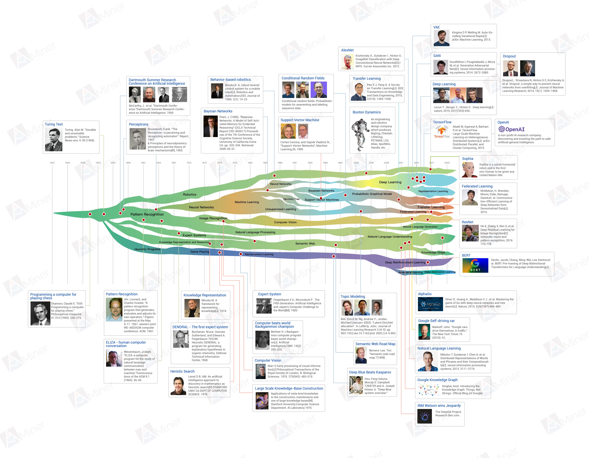
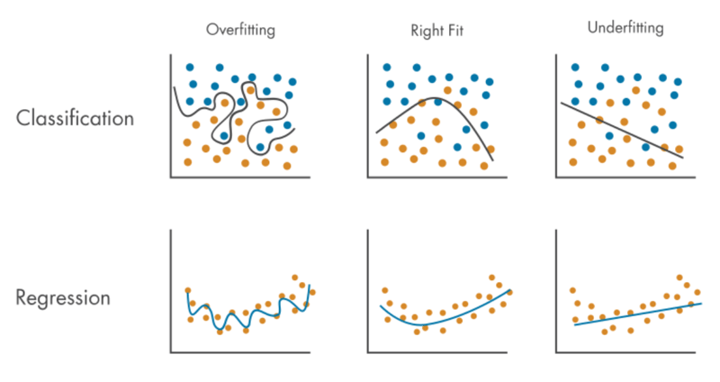

## Talking Briefly About Machine Learning

Artificial intelligence is without doubt one of the hottest words in recent years. From AlphaGo defeating top human Go players in 2016, to NLP models based on the Transformer architecture in 2017, to ChatGPT based on GPT-4 in 2023, and then to the deeper use of AI in medicine, autonomous driving, and other fields, the AI wave has reached a height not seen since the Dartmouth Conference in 1956. It can be said that almost everyone's life has been affected by artificial intelligence in one way or another.

Artificial intelligence is an important branch of computer science. It involves the ability of computers to simulate intelligent behavior and the ability of machines to imitate human intelligent behavior. The main goal of AI research is to develop systems that can make decisions independently, so that they can help humans work more efficiently in medicine, engineering, finance, education, research, public service, and many other fields. The English name of artificial intelligence is *artificial intelligence*, so it is usually shortened to *AI*. AI contains many things. Machine learning, deep learning, natural language processing, computer vision, reinforcement learning, data mining, expert systems, industrial robots, and autonomous driving all belong to the scope of AI.

This lesson mainly discusses machine learning. Machine learning is a subfield of artificial intelligence. It focuses on how to make computer systems learn from experience through data and algorithms and then make predictions or decisions. Simply speaking, machine learning is one way to realize artificial intelligence, and many AI systems are developed through machine learning technology. In some situations, people also use the term data mining to refer to machine learning. Data mining means extracting useful information and knowledge from data, analyzing and explaining patterns and trends in data, and finally achieving the goal of predicting future trends and behavior. Still, the focus of these two terms is a little different. Data mining pays more attention to knowledge discovery, while machine learning pays more attention to building and optimizing predictive models. At present, another very hot concept is deep learning, which is a subfield of machine learning. It especially focuses on using multi-layer neural networks to process and learn from data.

### A Brief History of Artificial Intelligence

To study a subject well, it is useful to first look at its history. Let us briefly review milestone events in the history of artificial intelligence.



1. In 1950, Alan Turing published a landmark paper. In it, he predicted the possibility of creating intelligent machines and proposed the famous Turing Test.
2. In 1956, the Dartmouth Conference was held. It is regarded as the birth of artificial intelligence.
3. In 1957, Frank Rosenblatt proposed the perceptron model, one of the earliest neural network models.
4. In 1958, John McCarthy developed the LISP programming language, which became a main language for early AI research.
5. In 1980, Carnegie Mellon University built an expert system named XCON for DEC and saved the company about 40 million dollars per year.
6. In 1982, John Hopfield proved that a new kind of neural network could learn and process information in a new way.
7. In 1986, Geoffrey Hinton and his team proposed backpropagation, solving the training problem of deep neural networks.
8. In 1997, IBM's chess program Deep Blue defeated world champion Garry Kasparov.
9. In 2011, IBM's Watson defeated top contestants in the quiz show *Jeopardy!*.
10. In 2012, deep convolutional neural networks achieved great success in the ImageNet competition, marking the rise of deep learning.
11. In 2016, AlphaGo defeated world champion Lee Sedol.
12. In 2017, Google's researchers proposed the Transformer model, changing the field of natural language processing.
13. In 2018, OpenAI Five defeated semi-professional and professional teams in *Dota 2*.
14. In 2019, OpenAI released GPT-2 and DeepMind released AlphaStar.
15. In 2020, OpenAI released GPT-3, and DeepMind's AlphaFold 2 made a major breakthrough in protein structure prediction.
16. In 2021, OpenAI released DALL-E and Codex.
17. In 2023, OpenAI launched ChatGPT based on GPT-4, and large language model products quickly spread everywhere.
18. In 2024, OpenAI introduced Sora, and Cognition AI introduced Devin.

### What Machine Learning Is

Humans learn mainly through memory and induction. With memory we accumulate single facts, and with induction we derive new facts from old facts. Machine learning gives machines the ability to learn knowledge from data. This process does not require humans to give explicit rules. In other words, machine learning focuses on learning a pattern from data, even when the data itself contains noise. This is also the most fundamental difference between machine learning algorithms and traditional algorithms.

Traditional algorithms require humans to first know the best solution and then tell the computer how to find the answer. Machine learning algorithms do not need humans to tell the model the best solution. Instead, we provide sample data related to the problem.

Of course, machine learning is not perfect. When we train a model with data, we still need preprocessed and cleaned data. If the quality of the data itself is very poor, it is hard to train a good model. This is what people often call GIGO, garbage in garbage out. We also need to determine whether there is some kind of relationship among variables. Machine learning cannot deal with data that has no relationship at all. Most of the time, a machine learning model outputs a series of numbers and metrics, and humans still need to interpret those numbers, decide whether the model is good, and decide how to put it into an actual business scenario.

### Application Fields of Machine Learning

Even if people are not very familiar with the concept of machine learning, its achievements have already spread widely into production and daily life. The following scenes should be familiar to you:

1. Search engines optimize the next search result according to search and usage habits.
2. E-commerce websites automatically recommend products you may be interested in according to your browsing history.
3. Financial products evaluate your loan application according to your recent financial activities.
4. Video and live-streaming platforms automatically identify whether there is harmful content in pictures and videos.
5. Smart appliances and smart cars respond to voice commands.

More generally, machine learning can be applied to fields such as:

- computer vision
- natural language processing
- recommendation systems
- finance and risk control
- medicine and healthcare
- intelligent manufacturing
- smart transportation

### Categories of Machine Learning

Machine learning can be classified in different ways.

#### By learning style

1. Supervised learning
   - classification
   - regression
2. Unsupervised learning
   - clustering
   - dimensionality reduction
   - association rule learning
3. Semi-supervised learning
4. Reinforcement learning

#### By model complexity

1. Linear models
2. Non-linear models

#### By model structure

1. Generative models
2. Discriminative models

If you do not fully understand the classification above, that is fine. The later lessons will cover many of those algorithms.

### Steps of Machine Learning

The implementation of machine learning usually goes through several stages, from defining the problem, to preparing data, to deploying and maintaining the model. Each step is important.

1. Define the problem.
2. Collect data.
3. Clean data.
4. Split data.
5. Select a model.
6. Train the model.
7. Evaluate the model.
8. Deploy the model.
9. Maintain the model.

During evaluation, we need to pay attention to overfitting and underfitting.



### The First Machine Learning Example

Below, we use a very simple example to begin the first machine-learning trip. We collected 50 samples about the relationship between monthly income and monthly online-shopping expense for a type of consumers in a certain city. These historical data are stored in two lists:

```python
x = [9558, 8835, 9313, 14990, 5564, 11227, 11806, 10242, 11999, 11630,
     6906, 13850, 7483, 8090, 9465, 9938, 11414, 3200, 10731, 19880,
     15500, 10343, 11100, 10020, 7587, 6120, 5386, 12038, 13360, 10885,
     17010, 9247, 13050, 6691, 7890, 9070, 16899, 8975, 8650, 9100,
     10990, 9184, 4811, 14890, 11313, 12547, 8300, 12400, 9853, 12890]
y = [3171, 2183, 3091, 5928, 182, 4373, 5297, 3788, 5282, 4166,
     1674, 5045, 1617, 1707, 3096, 3407, 4674, 361, 3599, 6584,
     6356, 3859, 4519, 3352, 1634, 1032, 1106, 4951, 5309, 3800,
     5672, 2901, 5439, 1478, 1424, 2777, 5682, 2554, 2117, 2845,
     3867, 2962,  882, 5435, 4174, 4948, 2376, 4987, 3329, 5002]
```

If we assume both monthly income and monthly shopping expense come from normal populations, then we can calculate the Pearson correlation coefficient to judge whether there is a relationship between them.

```python
import numpy as np

np.corrcoef(x, y)
```

We can also use `stats.pearsonr` from SciPy.

```python
from scipy import stats

stats.pearsonr(x, y)
```

Once we know there is a strong positive correlation, a natural idea is to use monthly income to predict monthly shopping expense. We can call `X` the feature and `y` the target. **The key of machine learning is to learn how to map from feature to target through historical data.**

#### The kNN idea

One of the simplest ways is to use k-nearest neighbors. We will formally study this in the next lesson.

#### Regression model

Another way is to plot the historical data points and fit a line to them. We call the equation of this line $\small{y = aX + b}$ a regression equation or regression model.


To evaluate the quality of the regression model, we can use mean squared error:

$$
MSE = \frac{1}{n}{\sum_{i=1}^{n}(y_{i} - \hat{y_{i}})^{2}}
$$

The values of $\small{a}$ and $\small{b}$ that minimize the MSE are called the least-squares solution of the regression equation.
