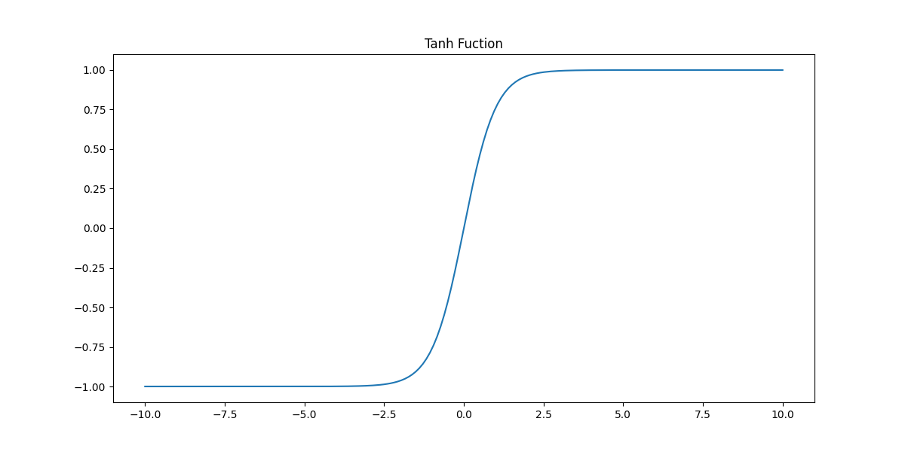

## Neural Network Models

In the human brain, neurons are the units responsible for transmitting and processing information. They communicate through chemical and electrical signals, which is the basis of memory, perception, movement, and many other functions. Popular science articles often say that neural networks are computational models that imitate the neurons in the brain. That statement is useful as an analogy, but there is no evidence that the learning mechanism of the brain is the same as the mechanism of neural-network models. For beginners, taking the analogy too literally often makes the topic more confusing instead of less.

### Basic Structure

Neural networks are usually composed of several layers, including an input layer, one or more hidden layers, and an output layer. Neurons in each layer are connected to neurons in the previous layer. With weights and activation functions, the data is passed layer by layer and transformed into features that the model can use.

1. **Input layer**: receives the input data. Each neuron usually corresponds to one input feature.
2. **Hidden layer**: the core part of the network. It is responsible for feature extraction and transformation. A network may have one hidden layer or many.
3. **Output layer**: turns the processed result into the final output. The activation function here depends on the task. For example, classification may use sigmoid or softmax, while regression may output a numeric value directly.
4. **Neuron**: each neuron receives inputs from the previous layer, performs a weighted sum, and then passes the result through an activation function.


The training process usually relies on backpropagation and gradient descent to optimize weights and biases so that the prediction error becomes smaller.

### How It Works

Let us begin with the simplest possible network. Suppose the network has only an input layer and an output layer, and it predicts a target `y` from the input `X` with the formula:

$$
y = aX_{1} + bX_{2} + cX_{3} + d
$$

Here `a`, `b`, `c`, and `d` are model parameters. This simplest neural-network model is actually no different from linear regression. The interesting change appears when we add a hidden layer between input and output. With hidden layers and nonlinear activation functions, the model can represent much more complex relationships.


If we add a hidden layer between the input layer and the output layer, it starts to look more like a "network". The hidden layer can handle nonlinear relationships, and there can be more than one hidden layer.


The computation performed by one neuron can be written as:

$$
y = f \left( \sum_{i=1}^{n}w_{i}x_{i} + b \right)
$$

Here `x_1, x_2, \dots, x_n` are input features, `w_1, w_2, \dots, w_n` are their weights, `b` is the bias term, and `f` is an activation function such as Sigmoid, ReLU, or Tanh.

Activation functions matter for two reasons:

- they introduce nonlinearity, which greatly increases the expressive power of the network;
- they make gradient-based training meaningful, because the network is no longer just a stack of linear operations.

Some commonly used activation functions are:

1. **Sigmoid**

$$
f(x) = \frac{1}{1 + e^{-x}}
$$


- Strength: suitable for probability-like outputs because the result stays in `(0, 1)`.
- Weakness: gradients become very small for large positive or negative inputs, which leads to the vanishing-gradient problem.

2. **Tanh**

$$
f(x) = tanh(x) = \frac{e^{x} - e^{-x}}{e^{x} + e^{-x}}
$$



- Strength: output is centered at zero, which often makes optimization easier than sigmoid.
- Weakness: it can still suffer from vanishing gradients near the extremes.

3. **ReLU**

$$
f(x) = max(0, x)
$$

- Strength: simple to compute and much less vulnerable to vanishing gradients in deep networks.
- Weakness: neurons can “die” if their inputs stay negative for a long time.

4. **Leaky ReLU**

$$
f(x) = \begin{cases} x & (x \gt 0) \\\\ {\alpha}x & (x \le 0)\end{cases}
$$

- Strength: keeps a small gradient on the negative side, which helps with the dead-neuron problem.
- Weakness: the extra slope still needs to be chosen, and the gain is not always dramatic.

For a network with multiple layers, information is passed forward layer by layer. If the output of layer `l` is `a^[l]`, then:

$$
\mathbf{a}^{[l]} = f \left( \mathbf{W}^{[l]} \mathbf{a}^{[l-1]} + \mathbf{b}^{[l]} \right)
$$

This process is called **forward propagation**.

The other essential operation is **backpropagation**. It updates the parameters by computing gradients of the loss function with respect to weights and biases:

$$
\theta^{\prime} = \theta - \eta \nabla L(\theta)
$$

Here `\eta` is the learning rate and `\nabla L(\theta)` is the gradient of the loss function.

### A First Example with `scikit-learn`

We can build a neural-network model with `scikit-learn`'s `MLPClassifier`. Using the iris dataset again:

```python
from sklearn.datasets import load_iris
from sklearn.model_selection import train_test_split
from sklearn.neural_network import MLPClassifier
from sklearn.metrics import classification_report

iris = load_iris()
X, y = iris.data, iris.target
X_train, X_test, y_train, y_test = train_test_split(X, y, train_size=0.8, random_state=3)

model = MLPClassifier(
    solver='lbfgs',
    learning_rate='adaptive',
    activation='relu',
    hidden_layer_sizes=(1,)
)
model.fit(X_train, y_train)
y_pred = model.predict(X_test)
print(classification_report(y_test, y_pred))
```

Output:

```
              precision    recall  f1-score   support

           0       1.00      0.10      0.18        10
           1       0.00      0.00      0.00        10
           2       0.34      1.00      0.51        10

    accuracy                           0.37        30
   macro avg       0.45      0.37      0.23        30
weighted avg       0.45      0.37      0.23        30
```

> **Note**: Because `random_state` is not set when creating `MLPClassifier`, the result may be different each time you run the code.

The result of this model is usually poor, because the network is too small. The parameter `hidden_layer_sizes=(1,)` means the network has only one hidden layer with only one neuron. That is far too limited to learn a useful mapping.

If we increase the capacity of the network, the result usually improves:

```python
from sklearn.datasets import load_iris
from sklearn.model_selection import train_test_split
from sklearn.neural_network import MLPClassifier
from sklearn.metrics import classification_report

iris = load_iris()
X, y = iris.data, iris.target
X_train, X_test, y_train, y_test = train_test_split(X, y, train_size=0.8, random_state=3)

model = MLPClassifier(
    solver='lbfgs',
    learning_rate='adaptive',
    activation='relu',
    hidden_layer_sizes=(32, 32, 32)
)
model.fit(X_train, y_train)
y_pred = model.predict(X_test)
print(classification_report(y_test, y_pred))
```

Important hyperparameters of `MLPClassifier` include:

1. `hidden_layer_sizes`: the number of neurons in each hidden layer.
2. `activation`: the activation function used in hidden layers.
3. `solver`: the optimization algorithm, such as `'lbfgs'`, `'sgd'`, or `'adam'`.
4. `alpha`: L2 regularization strength.
5. `batch_size`: the batch size used in training.
6. `learning_rate`: how the learning rate changes during training.
7. `learning_rate_init`: the initial learning rate.
8. `max_iter`: the maximum number of optimization iterations.
9. `tol`: the stopping tolerance for optimization.

### Using PyTorch

Besides `scikit-learn`, we can also use libraries such as TensorFlow, PyTorch, and MXNet. These frameworks usually support GPU or TPU acceleration and provide better tools for building deeper models.

Below is a simple PyTorch example for iris classification:

```python
import torch
import torch.nn as nn
import torch.optim as optim
from sklearn import datasets
from sklearn.model_selection import train_test_split
from sklearn.preprocessing import StandardScaler
from sklearn.metrics import accuracy_score, classification_report

iris = datasets.load_iris()
X, y = iris.data, iris.target

scaler = StandardScaler()
X_scaled = scaler.fit_transform(X)

X_train, X_test, y_train, y_test = train_test_split(X_scaled, y, train_size=0.8, random_state=3)
X_train_tensor, X_test_tensor, y_train_tensor, y_test_tensor = (
    torch.tensor(X_train, dtype=torch.float32),
    torch.tensor(X_test, dtype=torch.float32),
    torch.tensor(y_train, dtype=torch.long),
    torch.tensor(y_test, dtype=torch.long)
)


class IrisNN(nn.Module):
    """Neural network model for iris classification."""

    def __init__(self):
        super(IrisNN, self).__init__()
        self.fc1 = nn.Linear(4, 32)
        self.fc2 = nn.Linear(32, 3)

    def forward(self, x):
        x = torch.relu(self.fc1(x))
        x = self.fc2(x)
        return x


model = IrisNN()
loss_function = nn.CrossEntropyLoss()
optimizer = optim.Adam(model.parameters(), lr=0.001)

for _ in range(256):
    model.train()
    optimizer.zero_grad()
    output = model(X_train_tensor)
    loss = loss_function(output, y_train_tensor)
    loss.backward()
    optimizer.step()

model.eval()
with torch.no_grad():
    output = model(X_test_tensor)
    _, y_pred_tensor = torch.max(output, 1)
    print(f'Accuracy: {accuracy_score(y_test_tensor, y_pred_tensor):.2%}')
    print(classification_report(y_test_tensor, y_pred_tensor))
```

> **Note**: If PyTorch is not installed yet, you can install it with `pip install torch`.

We can also use neural networks for regression tasks. Here we still use the Auto MPG dataset from the earlier regression lesson, and use a neural network model to solve the regression task.

```python
import ssl

import pandas as pd
import torch
import torch.nn as nn
import torch.optim as optim
from sklearn.metrics import mean_squared_error, r2_score
from sklearn.model_selection import train_test_split
from sklearn.preprocessing import StandardScaler

ssl._create_default_https_context = ssl._create_unverified_context


def load_prep_data():
    """Load and prepare data."""
    df = pd.read_csv('https://archive.ics.uci.edu/static/public/9/data.csv')
    df.drop(columns=['car_name'], inplace=True)
    df.dropna(inplace=True)
    df['origin'] = df['origin'].astype('category')
    df = pd.get_dummies(df, columns=['origin'], drop_first=True).astype('f8')
    scaler = StandardScaler()
    return scaler.fit_transform(df.drop(columns='mpg').values), df['mpg'].values


class MLPRegressor(nn.Module):
    """Neural network model."""

    def __init__(self, n):
        super(MLPRegressor, self).__init__()
        self.fc1 = nn.Linear(n, 64)
        self.fc2 = nn.Linear(64, 64)
        self.fc3 = nn.Linear(64, 1)

    def forward(self, x):
        x = torch.relu(self.fc1(x))
        x = torch.relu(self.fc2(x))
        x = self.fc3(x)
        return x


def main():
    X, y = load_prep_data()
    X_train, X_test, y_train, y_test = train_test_split(X, y, train_size=0.8, random_state=3)
    X_train_tensor, X_test_tensor, y_train_tensor, y_test_tensor = (
        torch.tensor(X_train, dtype=torch.float32),
        torch.tensor(X_test, dtype=torch.float32),
        torch.tensor(y_train, dtype=torch.float32).view(-1, 1),
        torch.tensor(y_test, dtype=torch.float32).view(-1, 1)
    )

    model = MLPRegressor(X_train.shape[1])
    criterion = nn.MSELoss()
    optimizer = optim.Adam(model.parameters(), lr=0.001)

    epochs = 256
    for epoch in range(epochs):
        y_pred_tensor = model(X_train_tensor)
        loss = criterion(y_pred_tensor, y_train_tensor)
        optimizer.zero_grad()
        loss.backward()
        optimizer.step()

        if (epoch + 1) % 16 == 0:
            print(f'Epoch [{epoch + 1} / {epochs}], Loss: {loss.item():.4f}')

    model.eval()
    with torch.no_grad():
        y_pred = model(X_test_tensor)
        test_loss = mean_squared_error(y_test, y_pred.numpy())
        r2 = r2_score(y_test, y_pred.numpy())
    print(f'Test MSE: {test_loss:.4f}')
    print(f'Test R2: {r2:.4f}')


if __name__ == '__main__':
    main()
```

Output:

```
Epoch [16 / 256], Loss: 588.2971
Epoch [32 / 256], Loss: 530.0340
Epoch [48 / 256], Loss: 429.9081
Epoch [64 / 256], Loss: 286.5121
Epoch [80 / 256], Loss: 133.6717
Epoch [96 / 256], Loss: 44.3843
Epoch [112 / 256], Loss: 30.3168
Epoch [128 / 256], Loss: 24.0182
Epoch [144 / 256], Loss: 19.5326
Epoch [160 / 256], Loss: 16.4941
Epoch [176 / 256], Loss: 14.2642
Epoch [192 / 256], Loss: 12.5515
Epoch [208 / 256], Loss: 11.2248
Epoch [224 / 256], Loss: 10.1825
Epoch [240 / 256], Loss: 9.3600
Epoch [256 / 256], Loss: 8.7116
Test MSE: 8.7226
Test R2: 0.8569
```

From the output above, we can see that as forward propagation and backpropagation continue, the loss becomes smaller and smaller, and the model fit becomes better.

### Strengths and Weaknesses

One lovely thing about neural networks is that you can keep extending the model boundary almost like building with blocks. They can learn very complex mappings, automatically adjust to many kinds of input data, and often outperform traditional machine-learning algorithms when the dataset is large and the computing power is strong enough. That is why people often describe deep learning as the style of “brute force creates miracles.”

But neural networks also have clear drawbacks:

- they often behave like black boxes and are hard to interpret;
- they need a lot of computation, especially for deep models and high-dimensional data;
- hyperparameter tuning is difficult, because depth, width, learning rate, activation choice, and many other settings all affect performance.

### Summary

Neural-network models learn from large amounts of data in a way that is different from traditional machine-learning algorithms. Although the models are weak in interpretability, they have already achieved remarkable results in image processing, speech recognition, and natural-language processing. At the same time, training neural-network models needs a lot of resources. In real applications, it is still necessary to weigh their strengths and weaknesses and choose a proper model and training method according to the task.
