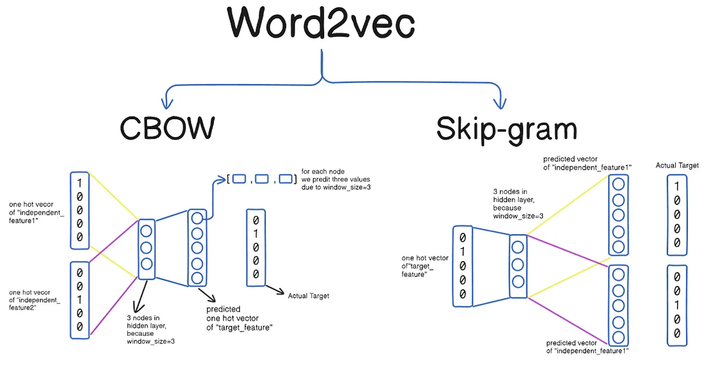
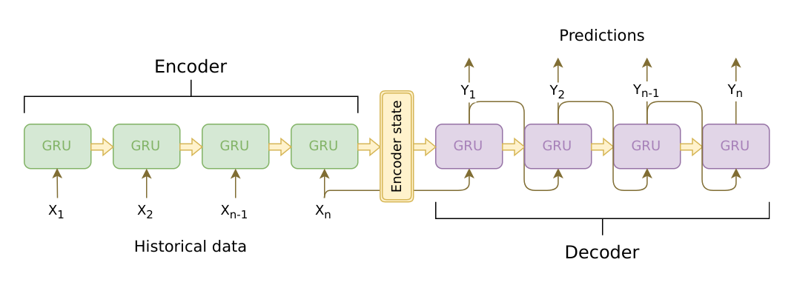

## Introduction to Natural Language Processing

Natural Language Processing (NLP) is an important branch of computer science and artificial intelligence. Its goal is to enable computers to understand, generate, and interact with human language. NLP has a wide range of application scenarios, including text classification, sentiment analysis, machine translation, speech recognition, chatbots, and many others. With the rapid development of deep learning, NLP research has gradually moved from traditional machine-learning methods to deep-learning methods. Classical NLP methods depend heavily on feature engineering and model design, while modern deep-learning methods depend more on data-driven learning and automatic feature extraction.

### Bag-of-Words

The Bag-of-Words model is one of the simplest ways to represent text in NLP. It treats every word in a text as part of a “bag,” ignores word order and grammar, and only considers how often each word appears. In simple terms, the model represents a text as a term-frequency vector. Building a Bag-of-Words model usually has two very simple steps:

1. **Build a vocabulary.** Scan all documents and list all words that appear in the texts. Repeated words are kept only once.
2. **Vectorize each document.** Map the words in each document into the vocabulary and count how many times each word appears.

Suppose we have these three documents:

1. `I love programming.`
2. `I love machine learning.`
3. `I love apple.`

Then the vocabulary becomes `['I', 'love', 'programming', 'machine', 'learning', 'apple']`, and the three documents can be represented as:

1. `[1, 1, 1, 0, 0, 0]`
2. `[1, 1, 0, 1, 1, 0]`
3. `[1, 1, 0, 0, 0, 1]`

`scikit-learn` provides the `CountVectorizer` class for building a bag-of-words model:

```python
from sklearn.feature_extraction.text import CountVectorizer

documents = [
    'I love programming.',
    'I love machine learning.',
    'I love apple.'
]

cv = CountVectorizer()
X = cv.fit_transform(documents)

print('Vocabulary:\n', cv.get_feature_names_out())
print('Term-frequency vectors:\n', X.toarray())
```

Output:

```
Vocabulary:  ['apple' 'learning' 'love' 'machine' 'programming']
Term-frequency vectors:
[[0 0 1 0 1]
 [0 1 1 1 0]
 [1 0 1 0 0]]
```

Note that the word `'I'` does not appear in the output vocabulary above, because it is treated as a stop word and ignored. Stop words are high-frequency words that usually contribute little to a text-analysis task.

For Chinese documents, word segmentation is needed before vectorization. The original lesson uses the third-party `jieba` library to split sentences into words and then build the term-frequency vectors.

```python
import jieba
from sklearn.feature_extraction.text import CountVectorizer

documents = [
    '我在四川大学读书',
    '四川大学是四川最好的大学',
    '大学校园里面有很多学生',
]

cv = CountVectorizer(
    tokenizer=lambda x: jieba.cut(x),
    token_pattern=None
)
X = cv.fit_transform(documents)

print('Vocabulary:\n', cv.get_feature_names_out())
print('Term-frequency vectors:\n', X.toarray())
```

> **Note**: If the Chinese word-segmentation library is not installed yet, you can install it with `pip install jieba`.

Output:

```
Vocabulary:
 ['四川' '四川大学' '在' '大学' '大学校园' '学生' '很多' '我' '是' '最好' '有' '的' '读书' '里面']
Term-frequency vectors:
 [[0 1 1 0 0 0 0 1 0 0 0 0 1 0]
  [1 1 0 1 0 0 0 0 1 1 0 1 0 0]
  [0 0 0 0 1 1 1 0 0 0 1 0 0 1]]
```

If you want to remove common Chinese stop words, you can pass a stop-word list through the `stop_words` parameter when creating the `CountVectorizer`.

```python
import jieba
from sklearn.feature_extraction.text import CountVectorizer

with open('哈工大停用词表.txt') as file_obj:
    stop_words_list = file_obj.read().split('\n')

documents = [
    '我在四川大学读书',
    '四川大学是四川最好的大学',
    '大学校园里面有很多学生',
]

cv = CountVectorizer(
    tokenizer=lambda x: jieba.lcut(x),
    token_pattern=None,
    stop_words=stop_words_list
)
X = cv.fit_transform(documents)

print('Vocabulary:\n', cv.get_feature_names_out())
print('Term-frequency vectors:\n', X.toarray())
```

Output:

```
Vocabulary:
 ['四川' '四川大学' '大学' '大学校园' '学生' '很多' '最好' '读书' '里面']
Term-frequency vectors:
 [[0 1 0 0 0 0 0 1 0]
  [1 1 1 0 0 0 1 0 0]
  [0 0 0 1 1 1 0 0 1]]
```

### Word Embeddings

Unlike the Bag-of-Words model, **word embeddings** map each word into a dense vector space, which lets the computer handle text in a more semantic way. These vectors can capture relationships between words and their contexts. For example, the relationship between `'king'` and `'queen'`, or between `'cat'` and `'dog'`, should appear in that vector space.

Common word-embedding models include:

1. **Word2Vec**
   It learns word vectors with a shallow neural network and has two main architectures:
   - **CBOW (Continuous Bag of Words)**: predict the center word from the surrounding context words.
   - **Skip-Gram**: predict the surrounding context words from the center word.
2. **GloVe**
   It is based on factorizing a word co-occurrence matrix and can capture global statistical information about words.

The basic idea behind learning word vectors can be summarized with three key elements:

1. **Inputs and targets**. In Skip-Gram, the input is the center word and the target is its context. In CBOW, the input is the context and the target is the center word.
2. **Neural-network model**. The input layer starts from one-hot vectors, the hidden layer holds the dense word vectors, and the output layer gives a probability distribution over the target words.
3. **Training process**. The model adjusts the word vectors based on word co-occurrence so that words with similar meaning end up closer together.

    

Once word vectors are trained, we can examine the relation between two words through cosine similarity:

$$
\text{Cosine Similarity}(\mathbf{A}, \mathbf{B}) = \frac{\mathbf{A} \cdot \mathbf{B}}{\lVert \mathbf{A} \rVert \lVert \mathbf{B} \rVert}
$$

The value ranges from `-1` to `1`. A larger value means the words are more similar.

A famous example is:

$$
\text{king} - \text{man} + \text{woman} \approx \text{queen}
$$

This expression shows that vector arithmetic can capture semantic relationships such as gender.

The original lesson demonstrates this with `gensim` and the IMDB dataset loaded through Hugging Face `datasets`:

```bash
pip install gensim
pip install datasets
```

```python
import re

from datasets import load_dataset
from gensim.models import Word2Vec
from sklearn.metrics.pairwise import cosine_similarity

imdb = load_dataset('imdb')
temp = [imdb['unsupervised'][i]['text'] for i in range(50000)]
corpus = [re.sub(r'[^\w\s]', '', x) for x in temp]

sentences = [sentence.lower().split() for sentence in corpus]
model = Word2Vec(sentences, vector_size=100, window=10, min_count=2, workers=4, seed=3)

king_vec, queen_vec = model.wv['king'], model.wv['queen']
cos_similarity = cosine_similarity([king_vec], [queen_vec])
print(f'Cosine similarity between king and queen: {cos_similarity[0, 0]:.2f}')

man_vec, woman_vec = model.wv['man'], model.wv['woman']
result_vec = king_vec - man_vec + woman_vec
similar_words = model.wv.similar_by_vector(result_vec, topn=3)
print(f'Words most similar to king - man + woman:\n {similar_words}')

dog_similar_words = model.wv.most_similar('dog', topn=5)
print(f'Words most similar to dog:\n {dog_similar_words}')
```

Output:

```
Cosine similarity between king and queen: 0.43
Words most similar to king - man + woman:
 [('queen', 0.7126370668411255), ('princess', 0.6760246753692627), ('mary', 0.5891180038452148)]
Words most similar to dog:
 [('cat', 0.7801533937454224), ('sheep', 0.6783771514892578), ('pet', 0.6658452749252319), 
  ('doll', 0.655034065246582), ('dude', 0.6548768877983093)]
```

### NPLM and RNN

Word2Vec helps us capture relationships between words, but it cannot handle long-distance dependencies well, and it also struggles with unknown words. Because of these limitations, researchers proposed the **Neural Probabilistic Language Model** (NPLM), which uses a neural network to predict the next word in a sequence. Later, researchers proposed the **Recurrent Neural Network** (RNN), which can handle sequence data by passing the hidden state from one time step to the next.

RNN can model time dependence in text, but traditional RNN also has well-known problems, especially vanishing gradients and exploding gradients. To deal with this, improved models such as **LSTM** and **GRU** were proposed. They introduce gating mechanisms and can capture longer dependencies, but they still have drawbacks such as lower computational efficiency and difficulty with parallel training.

### Seq2Seq

At first, researchers tried to use a single RNN to solve machine translation, text summarization, speech recognition, and similar tasks, but the result was not ideal. Later, Google proposed the **Seq2Seq** model. The basic idea is to learn a mapping from an input sequence to an output sequence.

Seq2Seq usually contains:

- an **encoder**, which reads the input sequence and turns it into a context vector;
- a **decoder**, which generates the target sequence based on that context vector.



Simple Seq2Seq compresses the whole input sequence into a fixed-size context vector, which can lose information, especially for long sequences. Because of that, the **attention mechanism** was introduced. Attention lets the decoder focus on different parts of the encoder output at each decoding step instead of depending on one fixed context vector.

### Transformer

To go further beyond the limitations of LSTM and GRU on long sequences, the Google Brain team proposed the **Transformer** architecture in the 2017 paper [*Attention Is All You Need*](https://arxiv.org/pdf/1706.03762). This architecture quickly became the mainstream method in NLP and completely changed the field. Famous models such as GPT and BERT are both based on the Transformer architecture.


The core of Transformer is the **self-attention mechanism**, which assigns different weights to different elements in the input sequence so the model can better capture internal dependencies. Transformer abandons the recurrent structure used in RNN and LSTM and adopts a new encoder-decoder architecture that can process input in parallel, which makes training much faster.

Some core components of Transformer are:

1. **Embedding layer**: maps discrete words into dense vectors.
2. **Positional encoding**: injects word-order information into the model.
3. **Self-attention**: computes contextual representations using queries, keys, and values.
4. **Multi-head attention**: allows the model to capture different relations with several attention heads at the same time.
5. **Feed-forward network**: applies nonlinear transformations to each position.
6. **Residual connection and layer normalization**: help stabilize training and make optimization easier.

In self-attention, the attention score is computed as:

$$
\text{Attention Score}(Q, K) = \frac{Q \cdot K^{T}}{\sqrt{d_{k}}}
$$

and the output is:

$$
\text{Output} = \sum_{i} \text{softmax} \left( \frac{Q \cdot K^{T}}{\sqrt{d_{k}}} \right) \cdot V_{i}
$$

So the final representation of a word contains not only its own meaning, but also its relation to the other words in the sequence.

### Summary

From rule-based and statistical methods to deep learning and Transformer architectures, researchers have never stopped exploring NLP. With the rise of GPT, BERT, and today's large language models, computers can now understand and generate human language at a much higher level than before. This has changed the way we interact with machines and opened a whole new space for finding, understanding, and exchanging information.
