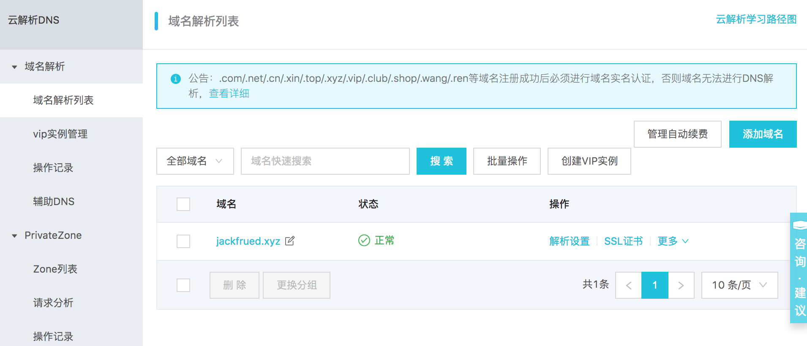
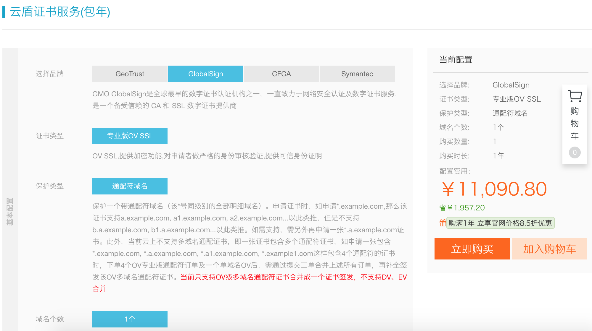

## Project Deployment and Going-Live Guide

### Preparing to Go Live

1. Check the project before going live.

```shell
python manage.py check --deploy
```

2. Set `DEBUG` to `False` and configure `ALLOWED_HOSTS`.

```python
DEBUG = False
ALLOWED_HOSTS = ['*']
```

3. Security-related configuration.

```python
# How long to keep HTTPS connections
SECURE_HSTS_SECONDS = 3600
SECURE_HSTS_INCLUDE_SUBDOMAINS = True
SECURE_HSTS_PRELOAD = True

# Automatically redirect to secure connections
SECURE_SSL_REDIRECT = True

# Avoid letting the browser guess the content type by itself
SECURE_CONTENT_TYPE_NOSNIFF = True

# Avoid cross-site scripting attacks
SECURE_BROWSER_XSS_FILTER = True

# Cookies can only be sent through HTTPS
SESSION_COOKIE_SECURE = True
CSRF_COOKIE_SECURE = True

# Prevent clickjacking by changing the HTTP response header
# The current website does not allow loading with an <iframe> tag
X_FRAME_OPTIONS = 'DENY'
```

4. Put sensitive information into environment variables or files.

```python
SECRET_KEY = os.environ['SECRET_KEY']

DB_USER = os.environ['DB_USER']
DB_PASS = os.environ['DB_PASS']

REDIS_AUTH = os.environ['REDIS_AUTH']
```

### Update the Python Environment on the Server to 3.x

> Note: If you need to remove a previous installation, just delete the related files and folders.

1. Install low-level dependency libraries.

```shell
yum -y install zlib-devel bzip2-devel openssl-devel ncurses-devel sqlite-devel readline-devel tk-devel gdbm-devel libdb4-devel libpcap-devel xz-devel libffi-devel libxml2
```

2. Download Python source code.

```shell
wget https://www.python.org/ftp/python/3.7.6/Python-3.7.6.tar.xz
```

3. Verify the downloaded file.

```bash
md5sum Python-3.7.6.tar.xz
```

4. Unzip and extract.

```shell
xz -d Python-3.7.6.tar.xz
tar -xvf Python-3.7.6.tar
```

5. Run configuration before installation and generate the `Makefile`.

```shell
cd Python-3.7.6
./configure --prefix=/usr/local/python37 --enable-optimizations
```

6. Build and install.

```shell
make && make install
```

7. Configure the `PATH` environment variable and activate it.

```shell
vim ~/.bash_profile
vim /etc/profile
```

```ini
export PATH=$PATH:/usr/local/python37/bin
```

```shell
source ~/.bash_profile
source /etc/profile
```

8. Register a soft link. This step is not required, but it is often useful.

```shell
ln -s /usr/local/python37/bin/python3 /usr/bin/python3
```

9. Test whether the Python environment was updated successfully. Installing Python 3 must not damage the original Python 2.

```shell
python3 --version
python --version
```

### Project Directory Structure

Suppose the project folder is `project`. The five subdirectories `code`, `conf`, `logs`, `stat`, and `venv` are used to save project code, configuration files, log files, static resources, and the virtual environment. The subdirectory `cert` under `conf` stores the certificate and key used for HTTPS. The project code under `code` can be checked out from a code repository by a version control tool. The virtual environment can be created with tools such as `venv`, `virtualenv`, and `pyenv`.

```text
project
├── code
│   └── fangtx
│       ├── api
│       ├── common
│       ├── fangtx
│       ├── forum
│       ├── rent
│       ├── user
│       ├── manage.py
│       ├── README.md
│       ├── static
│       └── templates
├── conf
│   ├── cert
│   ├── nginx.conf
│   └── uwsgi.ini
├── logs
├── stat
└── venv
```

Below, Aliyun is used as an example to briefly explain how to register a domain name, resolve the domain name, and buy a certificate issued by an authority.

1. [Register a domain name](https://wanwang.aliyun.com/domain/)


2. [Domain record filing](https://beian.aliyun.com/)


3. [Domain name resolution](https://dns.console.aliyun.com/#/dns/domainList)




4. [Buy a certificate](https://www.aliyun.com/product/cas)



You can use a tool similar to `sftp` to upload the certificate to the `conf/cert` directory, and then use `git clone` to put the project code into the `code` directory.

```shell
cd code
git clone <url>
```

Go back to the project directory, create the virtual environment, and activate it.

```shell
python3 -m venv venv
source venv/bin/activate
```

Rebuild project dependencies.

```shell
pip install -r code/teamproject/requirements.txt
```

### uWSGI Configuration

1. Install `uWSGI`.

```shell
pip install uwsgi
```

2. Modify the `uWSGI` configuration file `/root/project/conf/uwsgi.ini`.

```ini
[uwsgi]
# Base path
base=/root/project
# Project name
name=teamproject
# Daemon process
master=true
# Number of processes
processes=4
# Virtual environment
pythonhome=%(base)/venv
# Project path
chdir=%(base)/code/%(name)
# Python interpreter
pythonpath=%(pythonhome)/bin/python
# uwsgi file
module=%(name).wsgi
# Address and port for communication
socket=172.18.61.250:8000
# Log file path
logto=%(base)/logs/uwsgi.log
```

> Note: You can first change the item before the equals sign for communication address and port from `socket` to `http` for testing. If there is no problem, change it back to `socket`, and then use Nginx to separate dynamic and static content. Static resources are handled by Nginx, and dynamic content is handled by uWSGI.

3. Start the server.

```shell
nohup uwsgi --ini conf/uwsgi.ini &
```

### Nginx Configuration

1. Install Nginx.

```shell
yum -y install nginx
```

2. Modify the global configuration file `/etc/nginx/nginx.conf`.

```nginx
user nginx;
worker_processes auto;
error_log /var/log/nginx/error.log;
pid /run/nginx.pid;
include /usr/share/nginx/modules/*.conf;

events {
    use epoll;
    worker_connections 1024;
}

http {
    log_format  main  '$remote_addr - $remote_user [$time_local] "$request" '
                      '$status $body_bytes_sent "$http_referer" '
                      '"$http_user_agent" "$http_x_forwarded_for"';
    access_log  /var/log/nginx/access.log  main;
    sendfile            on;
    tcp_nopush          on;
    tcp_nodelay         on;
    keepalive_timeout   30;
    types_hash_max_size 2048;
    include             /etc/nginx/mime.types;
    default_type        application/octet-stream;
    include /etc/nginx/conf.d/*.conf;
    include /root/project/conf/*.conf;
}
```

3. Edit the local configuration file `/root/project/conf/nginx.conf`.

```nginx
server {
    listen      80;
    server_name _;
    access_log /root/project/logs/access.log;
    error_log /root/project/logs/error.log;
    location / {
        include uwsgi_params;
        uwsgi_pass 172.18.61.250:8000;
    }
    location /static/ {
        alias /root/project/stat/;
        expires 30d;
    }
}
server {
    listen      443;
    server_name _;
    ssl         on;
    access_log /root/project/logs/access.log;
    error_log /root/project/logs/error.log;
    ssl_certificate     /root/project/conf/cert/214915882850706.pem;
    ssl_certificate_key /root/project/conf/cert/214915882850706.key;
    ssl_session_timeout 5m;
    ssl_ciphers ECDHE-RSA-AES128-GCM-SHA256:ECDHE:ECDH:AES:HIGH:!NULL:!aNULL:!MD5:!ADH:!RC4;
    ssl_protocols TLSv1 TLSv1.1 TLSv1.2;
    ssl_prefer_server_ciphers on;
    location / {
        include uwsgi_params;
        uwsgi_pass 172.18.61.250:8000;
    }
    location /static/ {
        alias /root/project/static/;
        expires 30d;
    }
}
```

At this point, you can start Nginx to access the application. Both HTTP and HTTPS can work normally. If Nginx is already running, after changing the configuration file, you can restart it with the following command.

4. Restart the Nginx server.

```shell
nginx -s reload
```

or

```shell
systemctl restart nginx
```

> Note: You can use the command `python manage.py collectstatic` in a Django project to collect static resources into a specified directory. To do this, you only need to add `STATIC_ROOT` in the project's `settings.py`.

#### Load Balancing Configuration

In the configuration below, Nginx is used for load balancing and provides reverse proxy service for three other Nginx servers created through Docker.

```shell
docker run -d -p 801:80 --name nginx1 nginx:latest
docker run -d -p 802:80 --name nginx2 nginx:latest
docker run -d -p 803:80 --name nginx3 nginx:latest
```

```nginx
user root;
worker_processes auto;
error_log /var/log/nginx/error.log;
pid /run/nginx.pid;

include /usr/share/nginx/modules/*.conf;

events {
    worker_connections 1024;
}

http {
    upstream xx {
        server 192.168.1.100 weight=2;
        server 192.168.1.101 weight=1;
        server 192.168.1.102 weight=1;
    }

    server {
        listen       80 default_server;
        listen       [::]:80 default_server;
        listen       443 ssl;
        listen       [::]:443 ssl;

        ssl on;
        access_log /root/project/logs/access.log;
        error_log /root/project/logs/error.log;
        ssl_certificate /root/project/conf/cert/214915882850706.pem;
        ssl_certificate_key /root/project/conf/cert/214915882850706.key;
        ssl_session_timeout 5m;
        ssl_ciphers ECDHE-RSA-AES128-GCM-SHA256:ECDHE:ECDH:AES:HIGH:!NULL:!aNULL:!MD5:!ADH:!RC4;
        ssl_protocols TLSv1 TLSv1.1 TLSv1.2;
        ssl_prefer_server_ciphers on;

        location / {
            proxy_set_header Host $host;
            proxy_set_header X-Forwarded-For $remote_addr;
            proxy_buffering off;
            proxy_pass http://fangtx;
        }
    }
}
```

> Note: When Nginx is configured for load balancing, it uses WRR, weighted round robin, by default. In addition, it also supports `ip_hash`, `fair`, and `url_hash`. When configuring the `upstream` module, you can also specify server status values such as `backup`, `down`, `fail_timeout`, `max_fails`, and `weight`.

### Keepalived

When Nginx is used for load balancing, the possibility that the load-balancing server itself may go down must also be considered. For this, Keepalived can be used to switch between the primary and standby load-balancing hosts, so the system can keep high availability. Keepalived configuration is relatively complex and is usually handled by specialized operations staff.

### MySQL Master-Slave Replication

Below, Docker is still used to show how to configure MySQL master-slave replication. First prepare the MySQL configuration files and the directories that save MySQL data and runtime logs. Then use Docker volume mapping to specify where the container configuration, data, and log files are stored.

```text
root
└── mysql
    ├── master
    │   ├── conf
    │   └── data
    ├── slave-1
    │   ├── conf
    │   └── data
    ├── slave-2
    │   ├── conf
    │   └── data
    └── slave-3
        ├── conf
        └── data
```

1. MySQL configuration file. The master and slave configuration files need different `server-id` values.

```ini
[mysqld]
pid-file=/var/run/mysqld/mysqld.pid
socket=/var/run/mysqld/mysqld.sock
datadir=/var/lib/mysql
log-error=/var/log/mysql/error.log
server-id=1
log-bin=/var/log/mysql/mysql-bin.log
expire_logs_days=30
max_binlog_size=256M
symbolic-links=0
```

2. Create and configure the master.

```shell
docker run -d -p 3306:3306 --name mysql-master \
-v /root/mysql/master/conf:/etc/mysql/mysql.conf.d \
-v /root/mysql/master/data:/var/lib/mysql \
-e MYSQL_ROOT_PASSWORD=123456 mysql:5.7

docker exec -it mysql-master /bin/bash
```

```sql
grant replication slave on *.* to 'slave'@'%' identified by 'iamslave';
flush privileges;
show master status;
```

The `-v` parameter used above means mapping a data volume. The directory before the colon is a directory on the host machine, and the directory after the colon is a directory inside the container. This is equal to mounting the directory on the host machine into the container.

3. Back up the data in the master tables if necessary.

```sql
flush table with read lock;
```

```bash
mysqldump -u root -p 123456 -A -B > /root/backup/mysql/mybak$(date +"%Y%m%d%H%M%S").sql
```

```sql
unlock table;
```

4. Create and configure the slaves.

```shell
docker run -d -p 3308:3306 --name mysql-slave-1 \
-v /root/mysql/slave-1/conf:/etc/mysql/mysql.conf.d \
-v /root/mysql/slave-1/data:/var/lib/mysql \
-e MYSQL_ROOT_PASSWORD=123456 \
--link mysql-master:mysql-master mysql:5.7

docker run -d -p 3309:3306 --name mysql-slave-2 \
-v /root/mysql/slave-2/conf:/etc/mysql/mysql.conf.d \
-v /root/mysql/slave-2/data:/var/lib/mysql \
-e MYSQL_ROOT_PASSWORD=123456 \
--link mysql-master:mysql-master mysql:5.7

docker run -d -p 3310:3306 --name mysql-slave-3 \
-v /root/mysql/slave-3/conf:/etc/mysql/mysql.conf.d \
-v /root/mysql/slave-3/data:/var/lib/mysql \
-e MYSQL_ROOT_PASSWORD=123456 \
--link mysql-master:mysql-master mysql:5.7
```

```sql
reset slave;
change master to master_host='mysql-master', master_user='slave', master_password='iamslave', master_log_file='mysql-bin.000003', master_log_pos=590;
start slave;
show slave status\G
```

You can configure `slave2` and `slave3` in the same way, and then build a one-master-three-slaves replication environment. The `--link` parameter used when creating the container is used to configure the host name of the container on the network.

After replication is configured, write operations should be done on the master, and read operations should be done on the slaves. For this reason, in a Django project, `DATABASE_ROUTERS` needs to be configured, and a custom master-slave router class is used to implement read-write separation.

```python
DATABASE_ROUTERS = [
    'common.routers.MasterSlaveRouter',
]
```

```python
class MasterSlaveRouter(object):
    """Master-slave replication router."""

    @staticmethod
    def db_for_read(model, **hints):
        return random.choice(('slave1', 'slave2', 'slave3'))

    @staticmethod
    def db_for_write(model, **hints):
        return 'default'

    @staticmethod
    def allow_relation(obj1, obj2, **hints):
        return None

    @staticmethod
    def allow_migrate(db, app_label, model_name=None, **hints):
        return True
```

### Docker

In fact, the most troublesome thing when a project goes live is configuring the software runtime environment. Differences between environments bring many troubles to software installation and deployment, and Docker can solve this problem. Docker was introduced in previous documents. Here we add some necessary knowledge.

1. Create an image file.

Save a container as an image:

```shell
docker commit -m "..." -a "jackfrued" <container-name> jackfrued/<image-name>
```

Build an image with a Dockerfile:

```dockerfile
FROM centos:latest
MAINTAINER jackfrued
RUN yum -y install gcc
RUN cd ~
RUN mkdir -p project/code
RUN mkdir -p project/logs
COPY ...
EXPOSE ...
CMD ~/init.sh
```

```shell
docker build -t jackfrued/<image-name> .
```

2. Import and export images.

```shell
docker save -o <file-name>.tar <image-name>:<version>
docker load -i <file-name>.tar
```

3. Push to DockerHub.

```shell
docker tag <image-name>:<version> jackfrued/<name>
docker login
docker push jackfrued/<name>
```

4. Communication between containers.

```shell
docker run --link <container-name>:<alias-name>
```

If deployment can be completed inside Docker, and the fully deployed container can be packed into an image file for distribution and installation, then the troubles that may appear when deploying the project on multiple nodes can be solved, and the whole deployment can be finished in a short time.

### Supervisor

[Supervisor](https://github.com/Supervisor/supervisor) is a process management tool written in Python. It can conveniently start, restart, and close processes on Unix-like systems. Supervisor does not currently support Python 3 directly, so Python 2 can be used to install and run Supervisor, and then Supervisor can be used to manage Python 3 programs.

1. Install Supervisor.

```shell
virtualenv -p /usr/bin/python venv
source venv/bin/activate
pip install supervisor
```

2. Check the Supervisor configuration file.

```shell
vim /etc/supervisord.conf
```

```ini
[include]
files = supervisord.d/*.ini
```

This shows that custom management configuration can be put in the `/etc/supervisord.d` directory, and the file name only needs to use the `ini` suffix.

3. Write your own configuration file `fangtx.ini` and place it in `/etc/supervisord.d`.

```ini
[program:project]
command=uwsgi --ini /root/project/conf/uwsgi.ini
stopsignal=QUIT
autostart=true
autorestart=true
redirect_stderr=true

[program:celery]
command=/root/project/venv/bin/celery -A fangtx worker
user=root
numprocs=1
stdout_logfile=/var/log/supervisor/celery.log
stderr_logfile=/var/log/supervisor/celery_error.log
autostart=true
autorestart=true
startsecs=10
killasgroup=true
priority=1000
```

4. Start Supervisor.

```shell
supervisorctl -c /etc/supervisord.conf
```

### Other Services

1. Common open-source software.

| Function | Open-source solution |
| --- | --- |
| Version control tool | Git, Mercurial, SVN |
| Defect management | Redmine, Mantis |
| Load balancing | Nginx, LVS, HAProxy |
| Mail service | Postfix, Sendmail |
| HTTP service | Nginx, Apache |
| Message queue | RabbitMQ, ZeroMQ, Redis, Kafka |
| File system | FastDFS |
| Location-based service | MongoDB, Redis |
| Monitoring service | Nagios, Zabbix |
| Relational database | MySQL, PostgreSQL |
| Non-relational database | MongoDB, Redis, Cassandra, TiDB |
| Search engine | ElasticSearch, Solr |
| Cache service | Memcached, Redis |

2. Common cloud services.

| Function | Available cloud service |
| --- | --- |
| Team collaboration tool | Teambition, DingTalk |
| Code hosting platform | GitHub, Gitee, CODING |
| Mail service | SendCloud |
| Cloud storage (CDN) | Qiniu, OSS, LeanCloud, Bmob, 又拍云, S3 |
| Mobile push | Jiguang, Umeng, Baidu |
| Instant messaging | Huanxin, Rongyun |
| SMS service | Yunpian, Jiguang, Luosimao, 又拍云 |
| Third-party login | Umeng, ShareSDK |
| Website monitoring and statistics | Aliyun Monitoring, 监控宝, Baidu Cloud Observation, Xiaoniaoyun |
